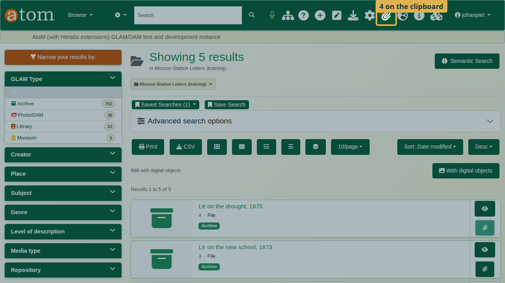
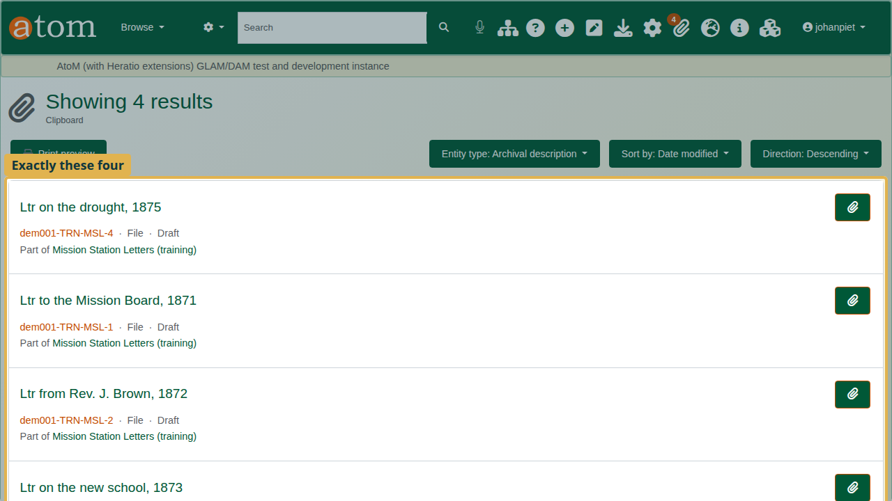
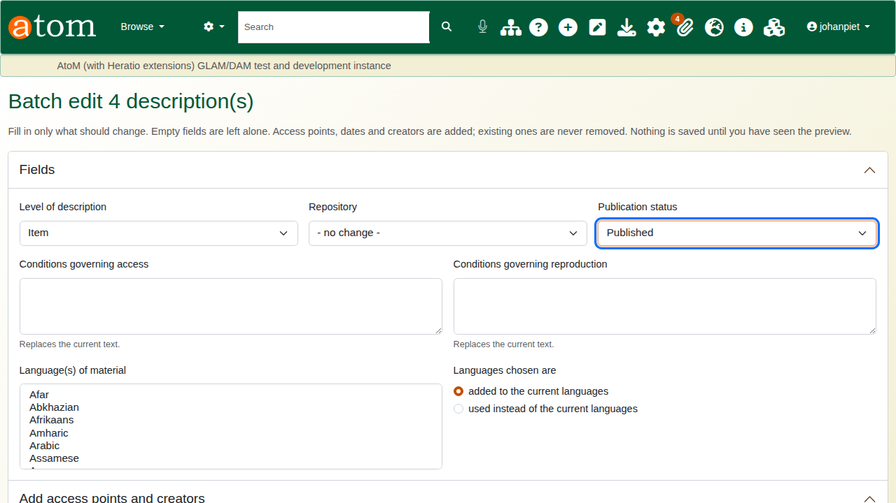
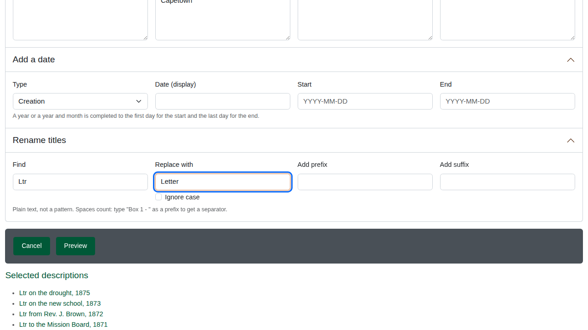
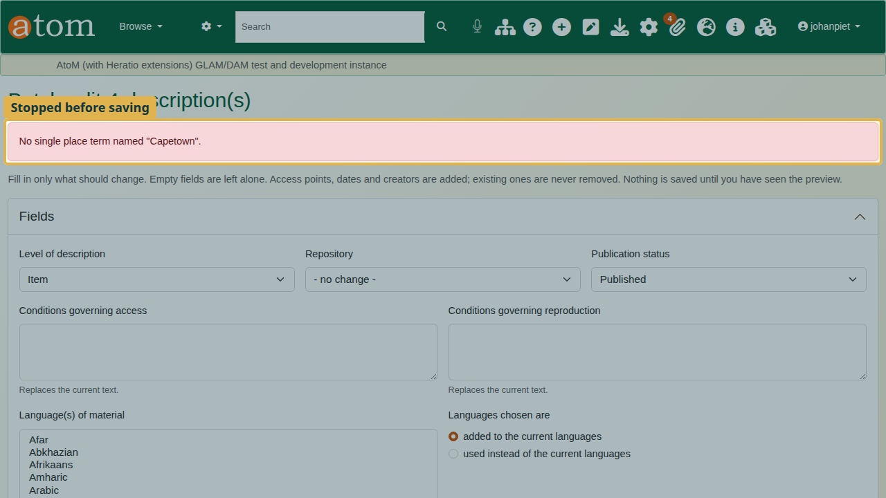
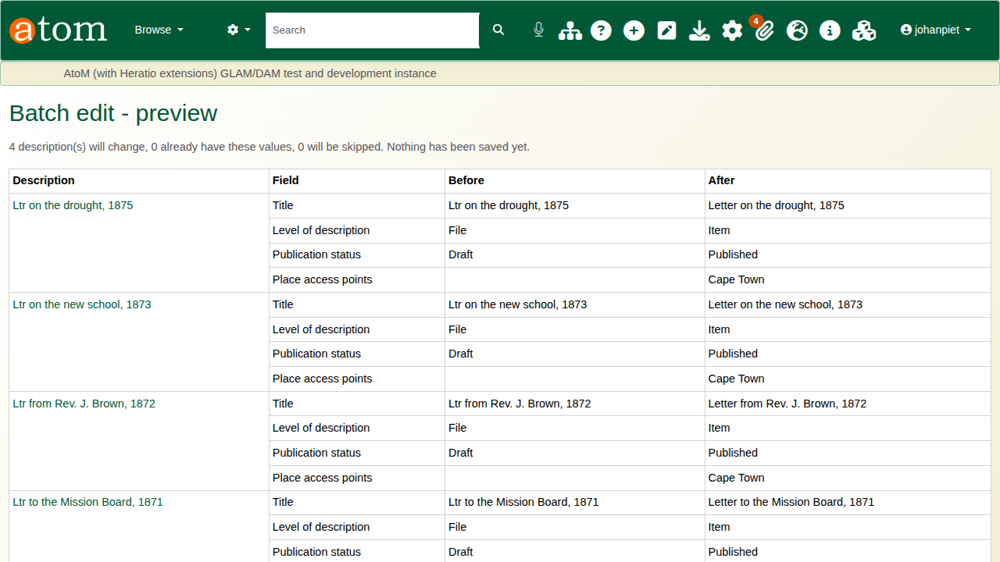
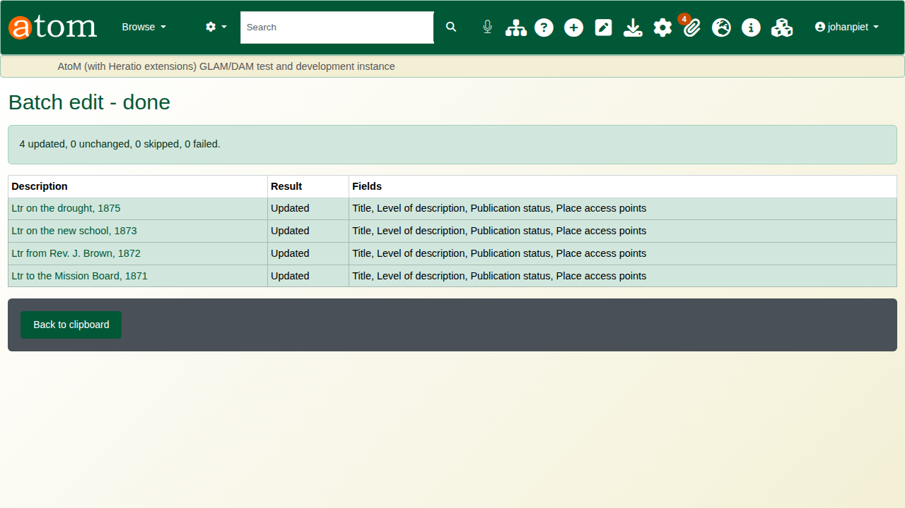
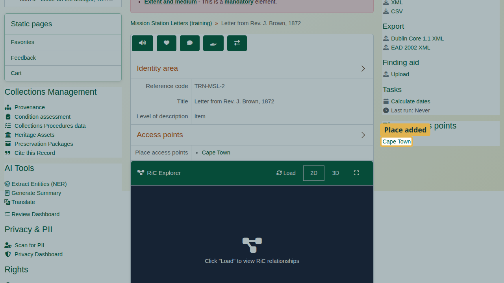

| Field | Value |
|---|---|
| Document title | Training: Batch Edit |
| Author | Dr Johan Pieterse |
| Owner | The Archive and Heritage Group (Pty) Ltd |
| Version | 1.0 |
| Status | Released |
| Date | 9 October 2026 |
| Prepared for | AtoM users of the AHG extensions |
| Classification | Public |
| Reference | AHG-TRN-DESC-01 |

: Document control

This guide goes with the training video of the same name. Batch edit applies one set of changes to every description on the clipboard: level of description, repository, publication status, access and reproduction conditions, languages, access points and creators, a date, and title renaming. A preview shows every change before anything is saved.

You will put four draft letters on the clipboard, set their level, publish them, add a place, rename their titles, and fix one deliberate mistake. Allow about 15 minutes.

## Before you start

| What | Notes |
|---|---|
| An editor or administrator account | Batch edit is open to editors and administrators. |
| Up to 500 descriptions at a time | Larger selections are refused; split them. |
| The practice file | `mission-station-letters-practice.csv` in `docs/training-files/` of the AHG extensions catalogue: a fonds with four draft letters whose titles say "Ltr". Import it with Data Ingest, choosing "Use hierarchy from CSV" (see the hierarchical CSV training). |

: What you need before you start

## 1. Put the descriptions on the clipboard

1. Open the **Browse** menu and choose **Archival descriptions**. The newest are listed first; open **Mission Station Letters (training)**.
2. Click **Browse as list**. The fonds and its four letters are listed.
3. Click the paperclip button on each letter. The count on the **Clipboard** menu (paperclip icon in the top bar) goes up with each one.

4. Open the **Clipboard** menu and choose **Go to clipboard**. Check that exactly the descriptions you want are listed, and nothing else; batch edit changes everything on the clipboard.

## 2. Fill in the batch form

Click **Batch edit**. One form applies to every description on the clipboard. The rule at the top of the form:

> Fill in only what should change. Empty fields are left alone. Access points, dates and creators are added; existing ones are never removed. Nothing is saved until you have seen the preview.

1. **Level of description**: Item. **Publication status**: Published.

2. **Add access points and creators**, Place access points: type the place exactly as it appears in the places taxonomy, one per line. The deliberate mistake: type `Capetown` as one word.
3. **Rename titles**: Find `Ltr`, Replace with `Letter`.

Find and replace is plain text, never a pattern. It matches case unless you tick **Ignore case**. **Add prefix** and **Add suffix** put text before or after every title.

## 3. Preview and fix

Click **Preview**. Nothing is saved yet. Batch edit stops with "No single place term named "Capetown"": no place has that exact name, and batch edit never creates a new term by accident.

Correct the place to `Cape Town`, two words, as it is in the taxonomy, and click **Preview** again.

The preview lists every description and every field that will change, with what it has now (Before) and what it will have (After). Descriptions that already have the new values are skipped. Read it before you apply.

Use **Back** to change the form; your entries are kept.

## 4. Apply

Click **Apply to 4 description(s)**. Each description is saved exactly as the edit form would save it, so the search index and the audit trail stay in step. The result lists each description as Updated, Skipped or Error, with the fields changed.

## 5. Check the result

Open one of the letters. It has its full title, the level Item, the place Cape Town, and it is published.

## What each field does

| Field | Effect |
|---|---|
| Level of description, Repository, Publication status | Set to the value chosen |
| Conditions governing access, reproduction | Replace the current text |
| Language(s) of material | Added to, or used instead of, the current languages |
| Subject, place, genre access points; creators | Added; names must match exactly one existing term or authority record |
| Add a date | Adds a date of the chosen type; a year or year and month is completed to the first or last day |
| Rename titles | Plain-text find and replace, with optional prefix and suffix |

: Batch edit fields

## Recap

1. Put the descriptions on the clipboard, and check it.
2. Batch edit: fill in only what should change.
3. Access points and creators: exact names from the taxonomy or authority records.
4. Preview, and fix what it reports.
5. Apply, then check a record.

## Cleaning up

To remove the practice records, open the fonds and choose **Delete**. AtoM deletes the letters under it as well. Clear the clipboard from the Clipboard menu.
