| Field | Value |
|---|---|
| Document title | Training: CAAIS Accessions |
| Author | Dr Johan Pieterse |
| Owner | The Archive and Heritage Group (Pty) Ltd |
| Version | 1.0 |
| Status | Released |
| Date | 9 October 2026 |
| Prepared for | AtoM users of the AHG extensions |
| Classification | Public |
| Reference | AHG-TRN-ACC-01 |

: Document control

This guide goes with the training video of the same name ([watch on YouTube](https://youtu.be/LpKUEkOb-E4)). CAAIS, the Canadian Archival Accession Information Standard, version 1.0, defines what an accession record should hold. With the CAAIS profile switched on, AtoM's accession form gains a CAAIS section, the accession page checks the mandatory elements, and each record exports as CAAIS in JSON, CSV or XML.

You will switch CAAIS on, record an accession, find and fix a missing mandatory element, and export the result. Allow about 15 minutes.

## Before you start

| What | Notes |
|---|---|
| An editor or administrator account | Needed to add and edit accessions. |
| CAAIS switched on | Done once, for the whole site, by an administrator (step 1). |

: What you need before you start

Use a test or training instance if you have one; see "Cleaning up" at the end.

## 1. Switch CAAIS on (administrator, once)

1. Open the **AHG Plugins** menu (stacked cubes icon) and choose **AHG Settings**.
2. Open the **Accession Management** section.
3. Turn on **CAAIS 1.0 accession profile** and click **Save Settings**.

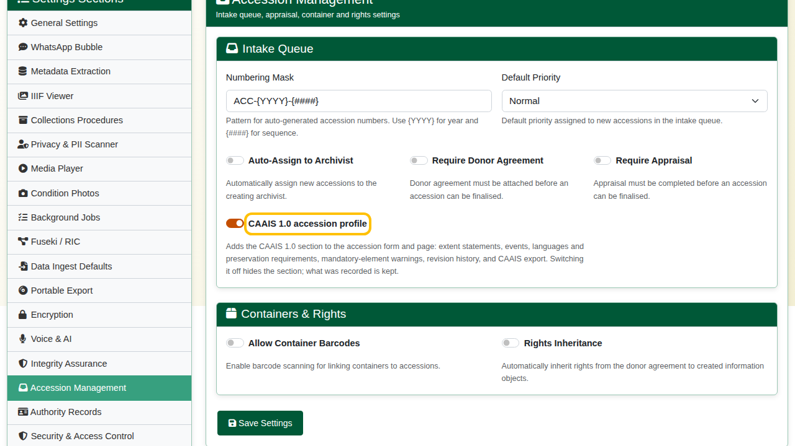

Switching it off later hides the CAAIS section again; everything already recorded is kept.

## 2. Record the accession

Open the **Add** menu (plus icon) and choose **Accession records**.

**Basic info.** The accession number is suggested for you and the acquisition date defaults to today. Fill in:

- **Immediate source of acquisition**: where the material came from ("Donated by Anna Malan, Wellington").
- **Location information**: where it is now stored ("Strongroom 2, bay 4").

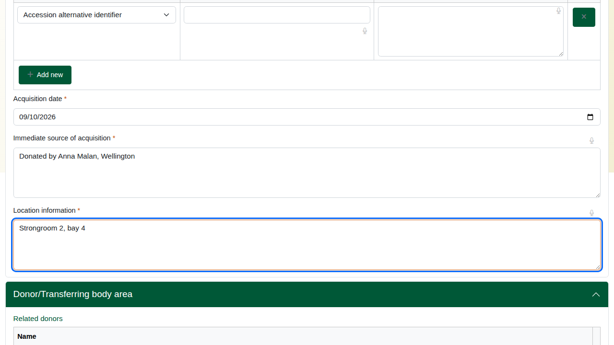

**Administrative area.** Choose the **Acquisition type** (Gift) and enter the **Title**.

**Date(s).** The date of the material itself. Enter the display date ("1890-1925") and the start and end dates as full dates, year first (1890-01-01 and 1925-12-31).

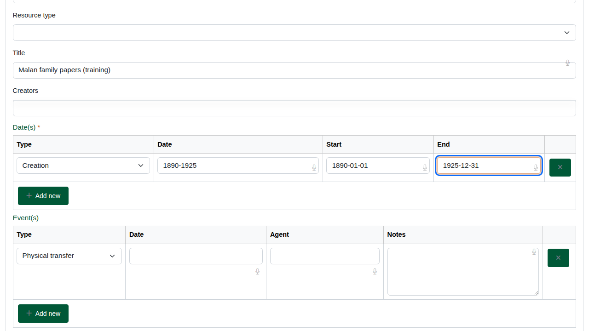

**Repository and CAAIS profile.** Open this section and choose:

- **Repository**: the institution that holds the accession (CAAIS 1.1).
- **Rules or conventions**: CAAIS 1.0 (CAAIS 7.1).

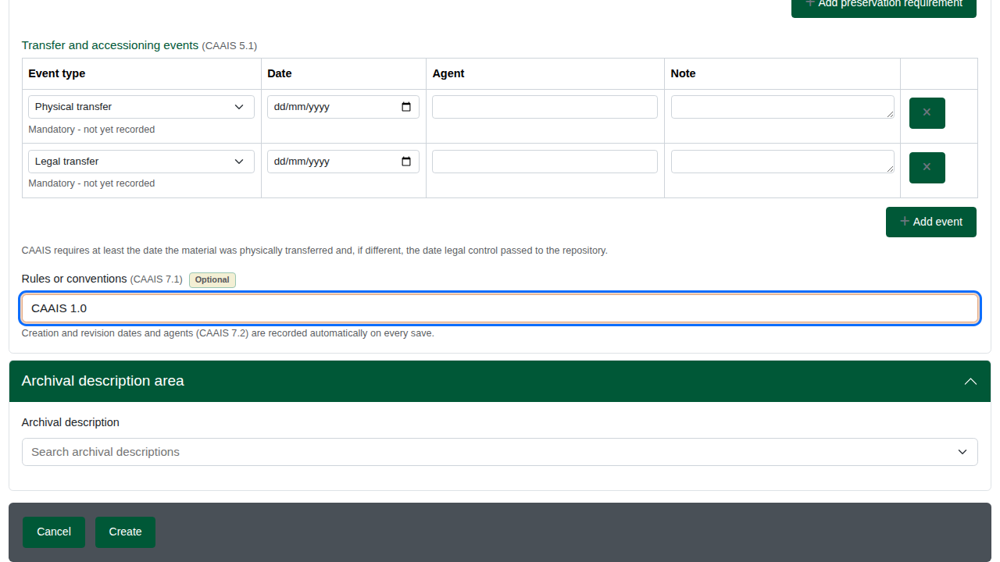

**Extent statements (CAAIS 3.2).** One row per type of extent: extent received, quantity 2, unit Boxes, content type textual records, carrier Paper. Add a row per material type if the accession mixes them.

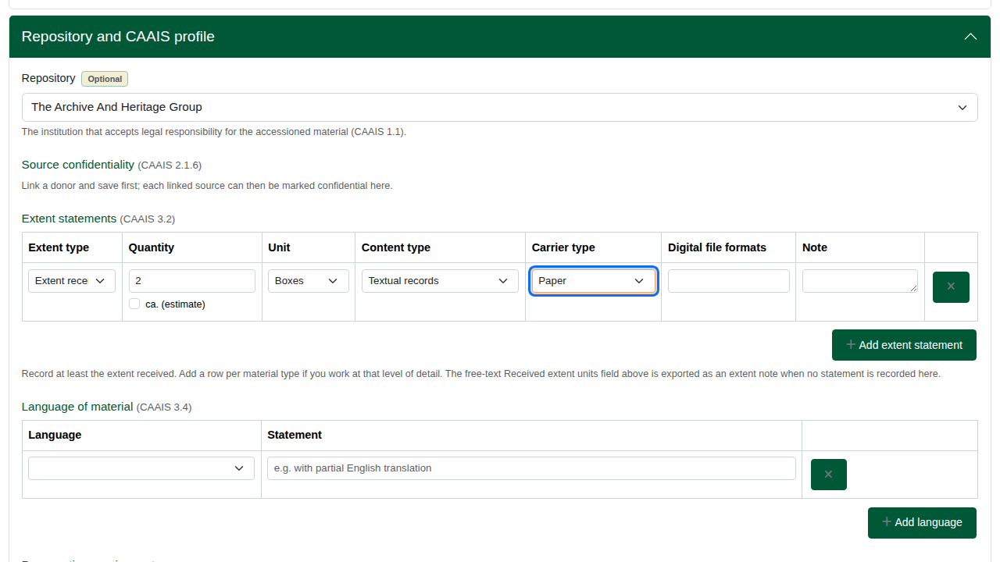

**Language of material (CAAIS 3.4).** Choose English. Add a row for each further language.

**Transfer and accessioning events (CAAIS 5.1).** CAAIS requires two events:

- **Physical transfer**: when the material arrived.
- **Legal transfer**: when ownership passed to the institution.

The form suggests both rows. A suggested row left empty is not saved.

This is the table CAAIS reads. The **Event(s)** table higher up, in the Administrative area, is AtoM's own and is not part of the CAAIS check.

The deliberate mistake: fill in the legal transfer (date and agent) and leave the physical transfer empty.

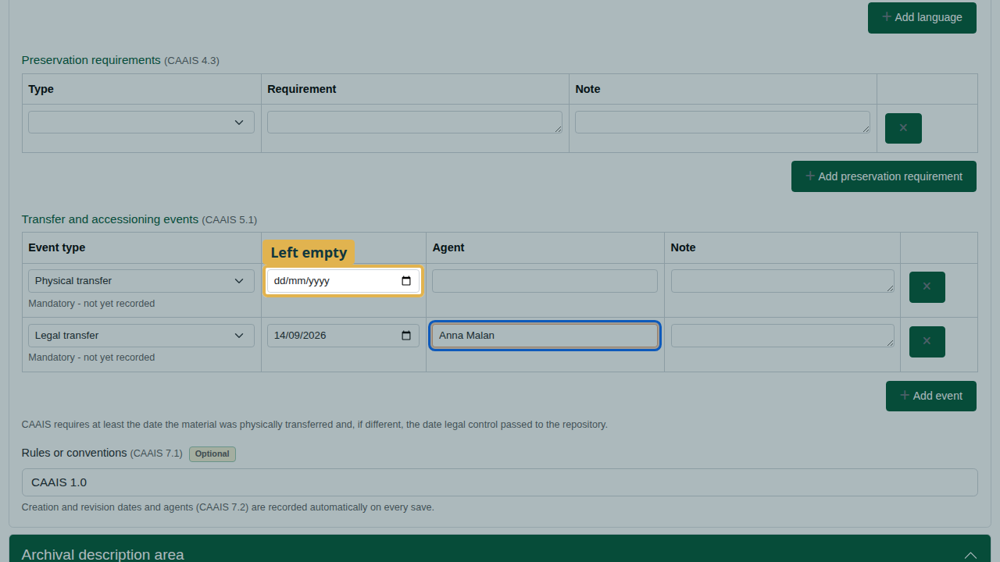

Click **Create**. The accession page opens.

## 3. Check and fix

Scroll to the CAAIS area of the accession page. It lists the CAAIS elements recorded and, in a yellow box, any mandatory element still missing: "5.1 - Event: physical transfer".

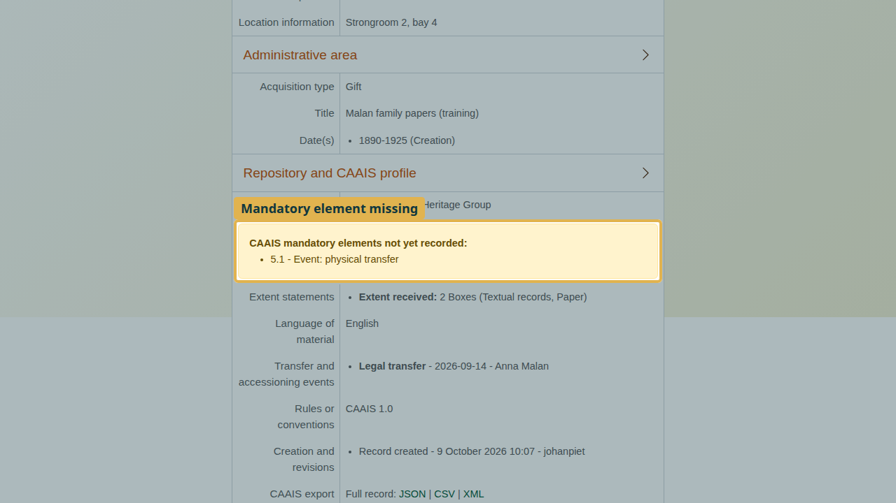

To fix it:

1. Click **Edit** and open the CAAIS section.
2. Give the **Physical transfer** row its date and agent.
3. Click **Save**.

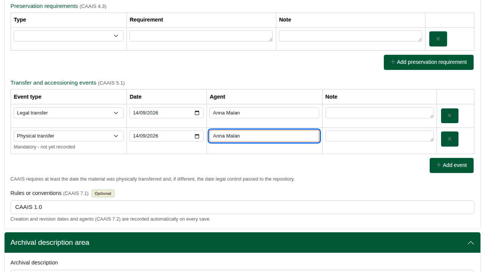

The warning is gone: the accession meets CAAIS at the mandatory level. Every save is kept as a dated revision under "Creation and revisions" (CAAIS 7.2).

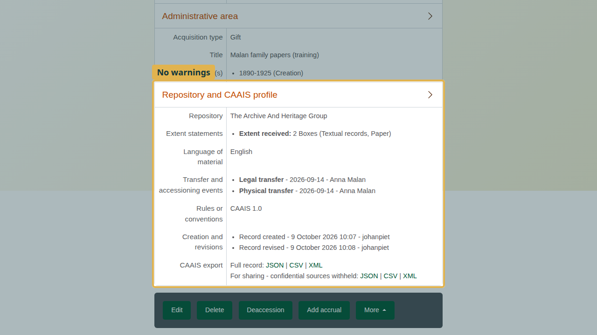

The mandatory elements the page checks:

| Element | Name | Where it comes from |
|---|---|---|
| 1.2 | Identifiers | Accession number |
| 2.1 | Source of material | Related donor, or Immediate source of acquisition |
| 3.1 | Date of material | Date(s) |
| 3.2 | Extent statement | Extent statements, or Received extent units |
| 5.1 | Event: physical transfer | Transfer and accessioning events |
| 7.2 | Date of creation | Recorded automatically on the first save |

: CAAIS mandatory elements checked on the accession page

## 4. Export

The CAAIS area offers the record in **JSON**, **CSV** or **XML**:

- **Full record** includes everything.
- **For sharing** withholds sources marked confidential (CAAIS 2.1.6).

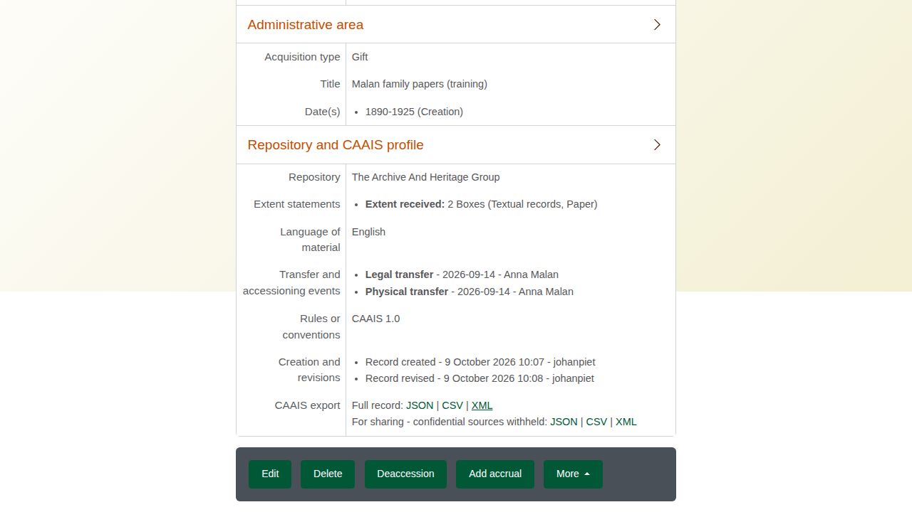

Each export carries a crosswalk naming the CAAIS element behind each field, so a receiving archive can map it without AtoM.

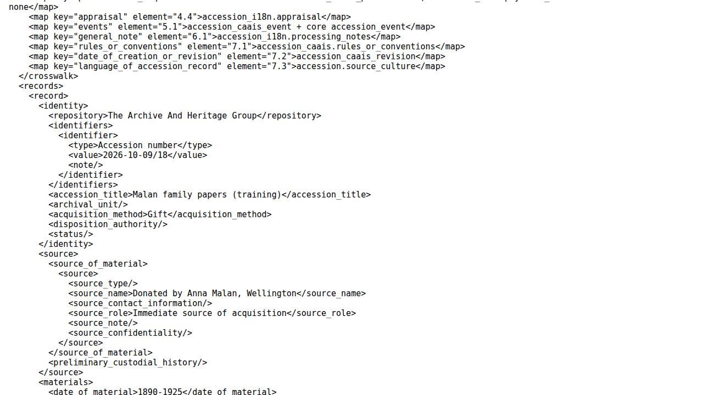

To export several accessions at once, open **Manage > Accessions** (the accession list), tick the accessions, and choose JSON, CSV or XML under the list. Tick "For sharing - withhold confidential sources" for the sharing version.

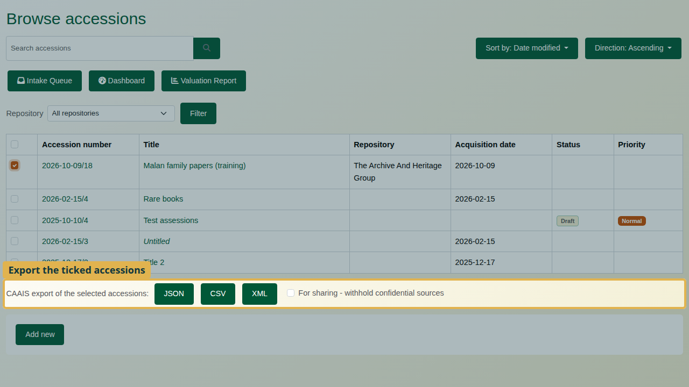

## Recap

1. An administrator switches CAAIS on: AHG Settings > Accession Management.
2. Record the accession as usual.
3. Complete the CAAIS section: repository, rules, extent, language.
4. Record both transfer events: physical and legal.
5. After saving, read the CAAIS warnings and edit until there are none.
6. Export as JSON, CSV or XML, full or for sharing.

## Cleaning up

To remove the practice accession, open it and choose **Delete**.
