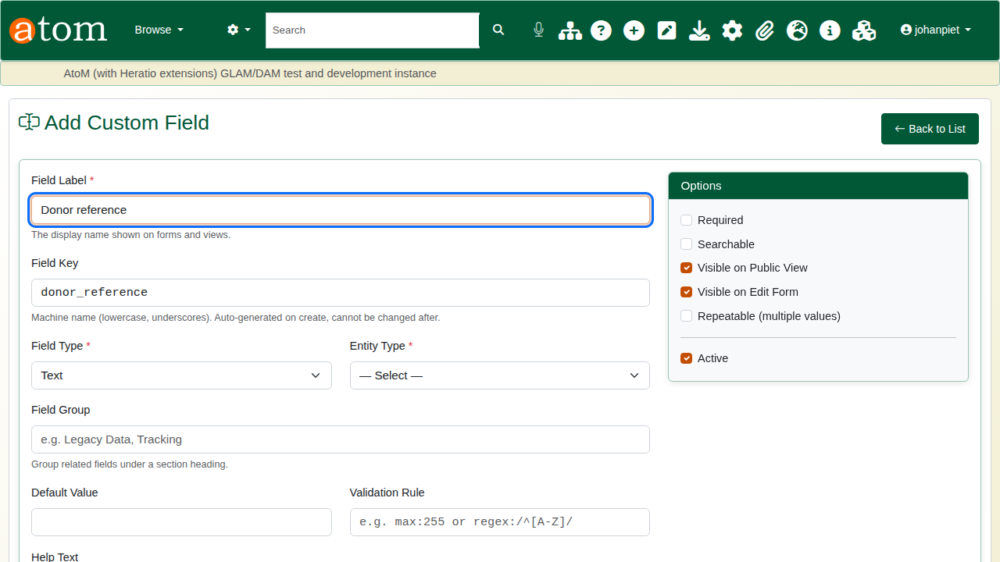
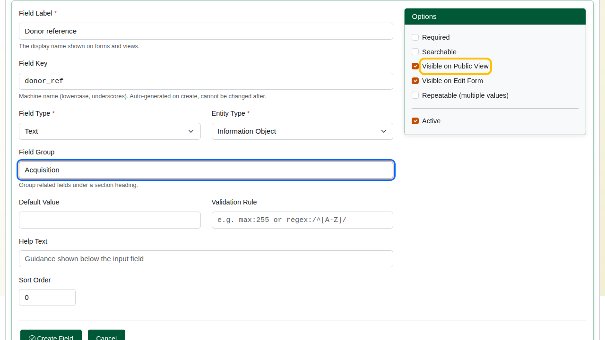
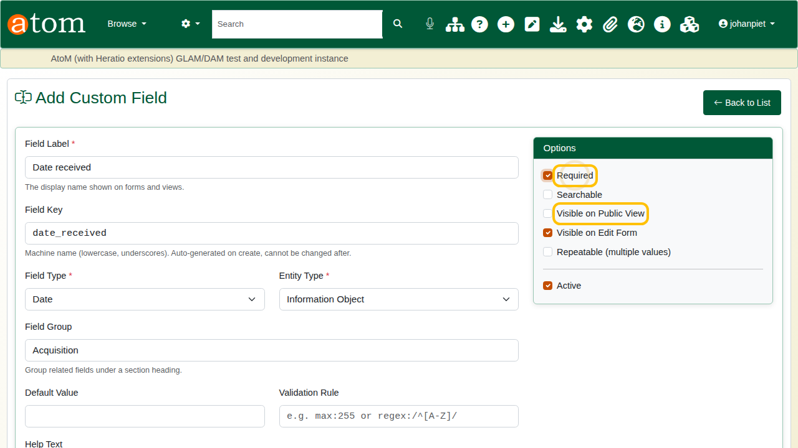
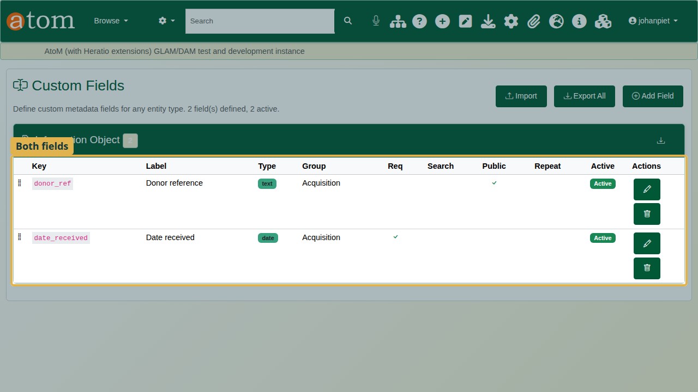
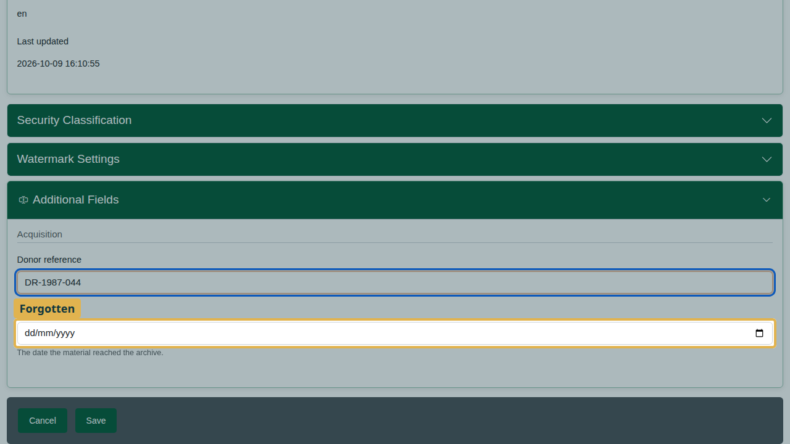
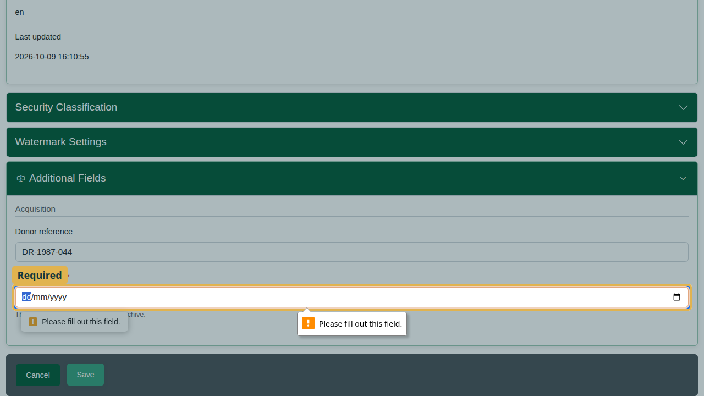
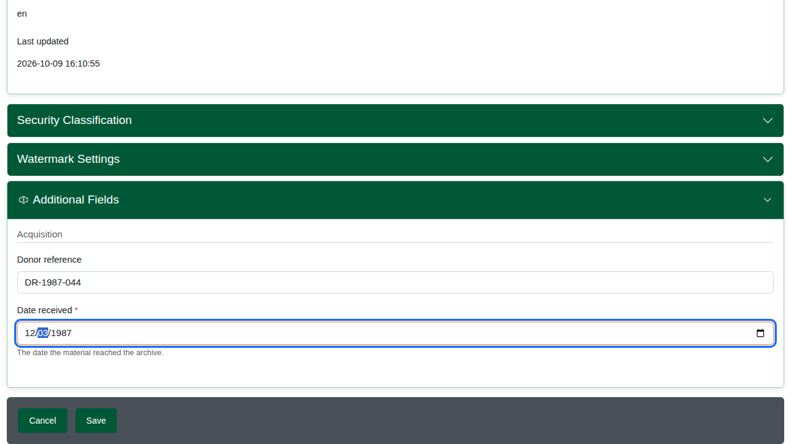
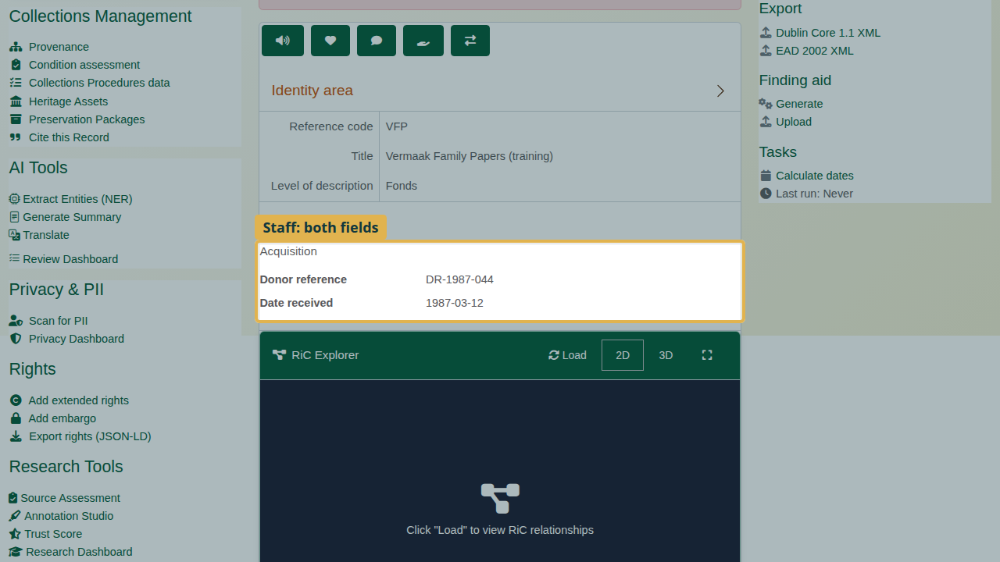
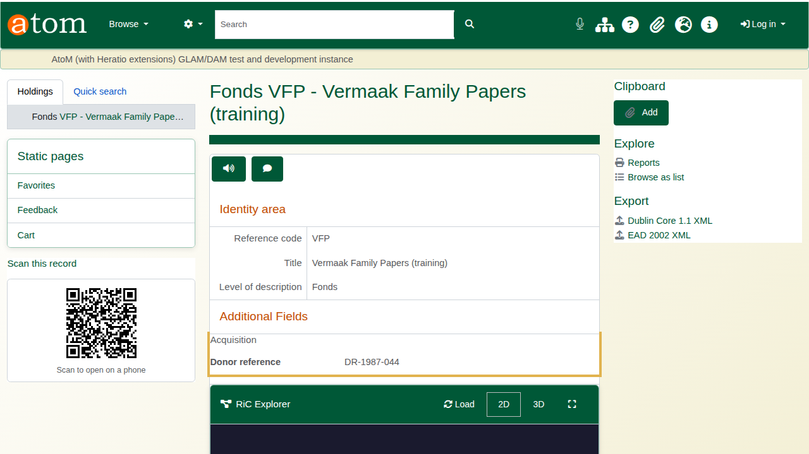
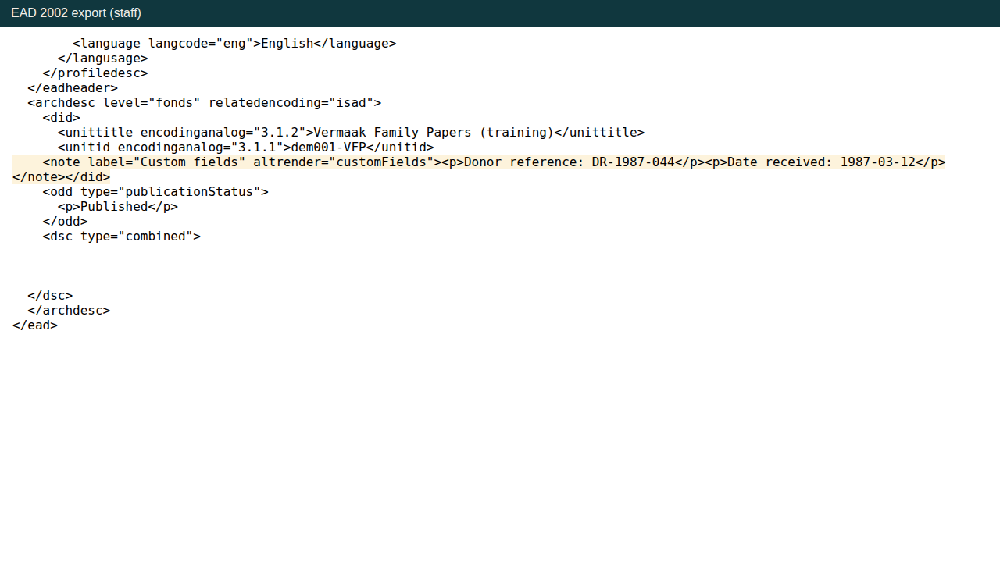

| Field | Value |
|---|---|
| Document title | Training: Custom Fields |
| Author | Dr Johan Pieterse |
| Owner | The Archive and Heritage Group (Pty) Ltd |
| Version | 1.0 |
| Status | Released |
| Date | 9 October 2026 |
| Prepared for | AtoM users of the AHG extensions |
| Classification | Public |
| Reference | AHG-TRN-CF-01 |

: Document control

This guide goes with the training video of the same name. Every institution records something the descriptive standards leave out. Custom fields add it without any code: an administrator defines the field once, editors fill it in on the edit form, and the field appears on the record and in every export.

You will define two fields, one public and one for staff only, fill them in on a fonds, and meet the warning AtoM gives when a required field is left empty. Allow about 15 minutes.

## Before you start

| What | Notes |
|---|---|
| An administrator account | Administrators define custom fields. Editors fill them in. |
| The practice file | `vermaak-family-papers-practice.csv` in `docs/training-files/` of the AHG extensions catalogue: one published fonds. Import it with Data Ingest, choosing "Use hierarchy from CSV" (see the hierarchical CSV training). |

: What you need before you start

## 1. Define the fields

Open the **Manage** menu and choose **Custom Fields** (under **Extensions**). The list shows every custom field by the kind of record it belongs to. Click **Add Field**.

| Setting | What it does |
|---|---|
| Field Label | What people read on the form and the record |
| Field Key | The field's fixed name in exports and the API: lower case, digits and underscores. It cannot be changed later. |
| Field Type | Text, long text, date, number, yes/no, dropdown (from a dropdown list) or URL |
| Entity Type | The kind of record: archival description, authority record, accession, repository, donor or function |
| Field Group | A heading that groups related fields on the form and the record |
| Required | The record cannot be saved with this field empty |
| Visible on Public View | Visitors see it; when unticked, only staff see it |
| Repeatable | More than one value per record |
| Validation Rule | Optional, for example `max:255` |

: Field settings

The first field:

- **Donor reference**: key `donor_ref`, type Text, entity Information Object (archival descriptions), group `Acquisition`, **Visible on Public View** ticked. Save.

The second field:

- **Date received**: key `date_received`, type Date, same group, **Required** ticked, **Visible on Public View** unticked (staff only). Save.

## 2. Fill them in

Open the practice fonds and click **Edit**. The custom fields appear near the end of the form, under **Additional Fields**, grouped under **Acquisition**.

Type the donor reference `DR-1987-044`. The deliberate mistake: leave **Date received** empty.

Click **Save**. Nothing is saved: Date received is required, so the form opens the custom fields and points at the empty field.

Choose the date received with the date picker (12 March 1987) and save again. The description saves, with both fields.

## 3. Where the fields appear

On the description, staff see the Acquisition group with both fields.

Visitors (signed out) see only the donor reference, because the date received is not visible on the public view.

Custom fields travel with the record. The EAD export carries them in a note labelled "Custom fields", and so do the PDF finding aid, the clipboard CSV export (one column per field), the REST API and GraphQL. Every export follows the same rule: visitors get public fields only, staff get them all.

## Recap

1. Manage > Custom Fields > Add Field.
2. Set the label, key, type, group, and who may see it.
3. Fill it in on the edit form.
4. Read any warning when you save, and correct the value.
5. The field appears on the record and in every export.

## Cleaning up

Open the fonds and choose **Delete**. To remove the practice fields, open Manage > Custom Fields and delete them, or untick **Active** to hide a field while keeping its values.
