| Field | Value |
|---|---|
| Document title | Training: Excel Import and Grid Entry |
| Author | Dr Johan Pieterse |
| Owner | The Archive and Heritage Group (Pty) Ltd |
| Version | 1.0 |
| Status | Released |
| Date | 9 October 2026 |
| Prepared for | AtoM users of the AHG extensions |
| Classification | Public |
| Reference | AHG-TRN-INGEST-02 |

: Document control

This guide goes with the training video of the same name ([watch on YouTube](https://youtu.be/kcp3qgratMY)). It covers two ways to add many descriptions at once. Part one imports an Excel workbook under a new fonds. Part two adds more records to that fonds through Grid entry, by typing, pasting from Excel, and duplicating rows. On the way you meet one deliberate mistake, a date typed day first, and fix it.

Allow about 20 minutes with the practice files.

## Before you start

| What | Where to check |
|---|---|
| An administrator account | The AHG Plugins menu (stacked cubes icon in the top bar) only appears for administrators. Grid entry itself is open to editors, but its menu entry is in the AHG Plugins menu. |
| Data Ingest enabled | AHG Plugins menu > Data Ingest. If the section is missing, ask your system administrator to enable ahgIngestPlugin. |
| The practice workbooks | `rosch-family-papers-practice.xlsx` and `rosch-grid-rows-practice.xlsx`, in `docs/training-files/` of the AHG extensions catalogue. |

: What you need before you start

Use a test or training instance if you have one; see "Cleaning up" at the end.

## 1. The workbook

Open `rosch-family-papers-practice.xlsx`. Each row is one record. The heading row uses AtoM's own field names, which is how Data Ingest recognises the columns without any mapping work.

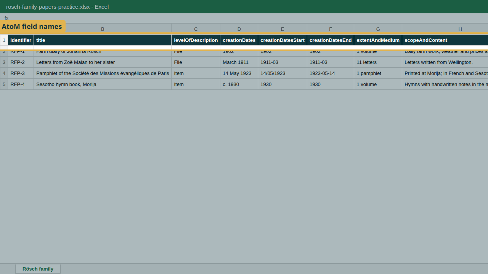

| Column | What it holds | Required |
|---|---|---|
| identifier | The reference code segment | Recommended |
| title | Title of the description | Yes |
| levelOfDescription | Fonds, Series, File, Item and so on | Yes |
| creationDates | The date as people should read it, any wording ("March 1911", "c. 1930") | No |
| creationDatesStart | Start date for sorting and searching: YYYY, YYYY-MM or YYYY-MM-DD | No |
| creationDatesEnd | End date, same formats | No |
| extentAndMedium | Extent and medium | No |
| scopeAndContent | Scope and content | No |

: Columns in the practice workbook

Two points worth knowing:

- **Accents are safe in a workbook.** Rösch, Zoë and Société arrive exactly as typed. There is no need to save as CSV first; upload the .xlsx itself.
- **Start and end dates are always year first.** A year (1902) becomes the whole year, a year and month (1911-03) the whole month. On import, 1902 is stored as 1 January to 31 December 1902.

The deliberate mistake: on the pamphlet row (RFP-3), the start date was typed day first, `14/05/1923`. AtoM cannot be sure what that means, so it warns you.

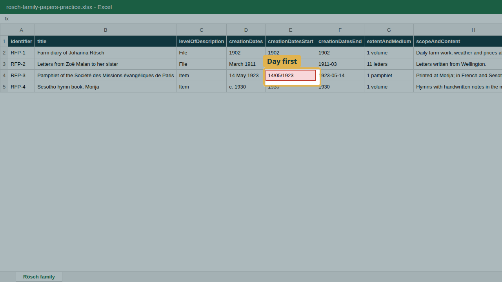

## 2. Import the workbook

1. Open the **AHG Plugins** menu and, under **Data Ingest**, choose **New Ingest**.
2. Enter a **Session Title**, choose the **Sector** (Archive), the **Descriptive Standard** (ISAD(G)) and the **Repository**.
3. Under **Hierarchy Placement**, choose **Create a new parent record**. Enter the **New parent title** ("Rösch Family Papers (training)") and the **Level of description** (Fonds). Every row in the workbook is placed under this new fonds.

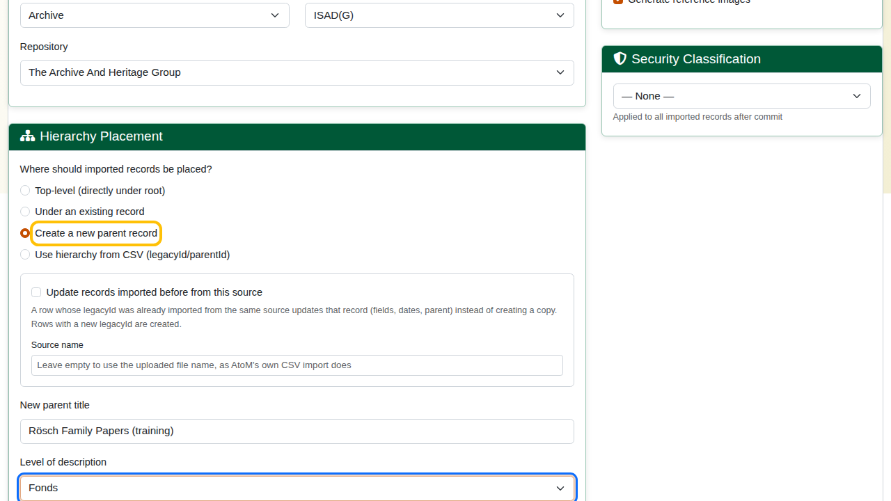

If the records belong under a description that already exists, choose **Under an existing record** instead and search for it.

4. Click **Next: Upload Files**, choose the workbook and click **Upload**.
5. Check the **Column Mapping**: every column maps itself. Click **Save Mappings & Validate**.

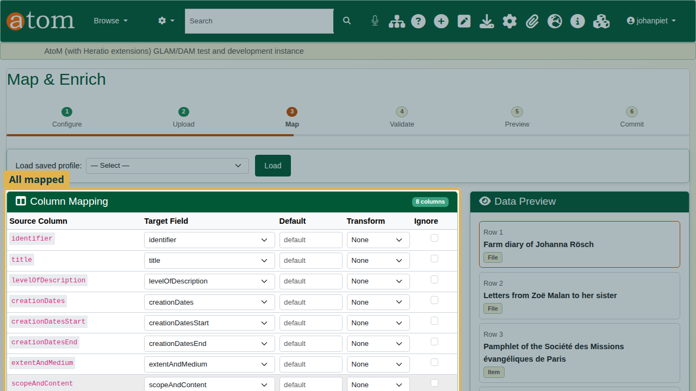

## 3. Validate and fix the warning

Validation reports 4 rows, 4 valid, and 1 warning on row 3, field creationDatesStart: "Date '14/05/1923' may not be in a recognized format (YYYY-MM-DD preferred)".

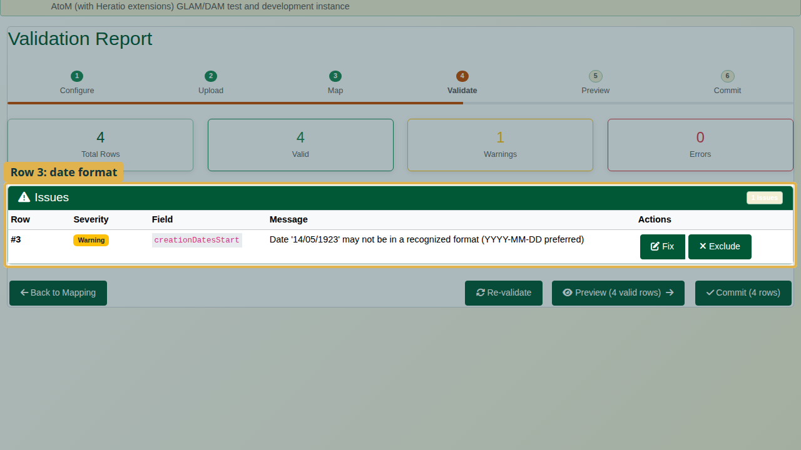

A warning does not stop the import, but always read it. Imported unchanged, an ambiguous date can be stored wrongly, or not at all.

1. Click **Fix** on the row.
2. Type the date year first: `1923-05-14`.
3. Click **Apply Fix**. The warning is gone.

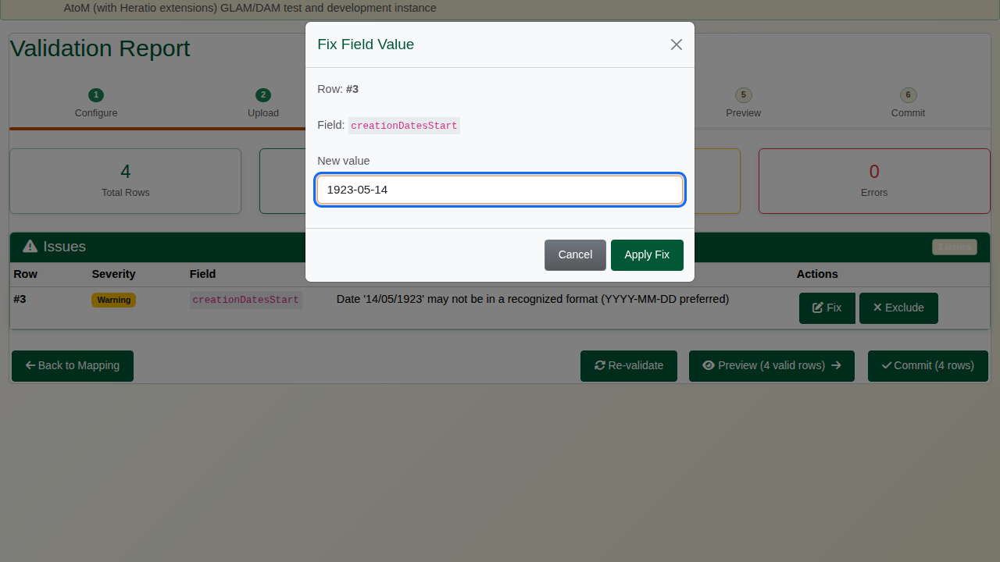

Correct the workbook as well, so that the next import is clean.

## 4. Preview and commit

Click **Preview** and **Expand All**. The new fonds holds the four records; check the titles and their accents.

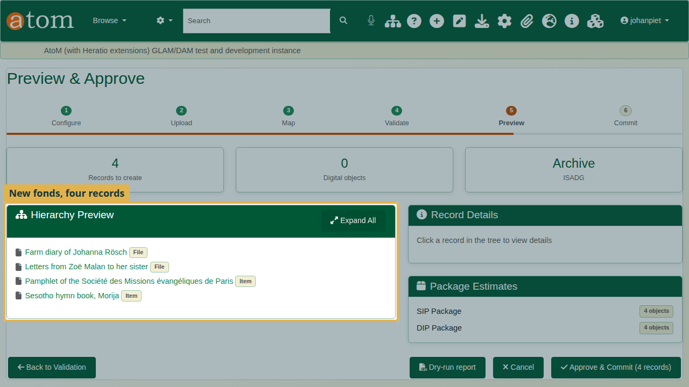

Click **Approve & Commit**, then **Start Commit**. The completion report shows the records created.

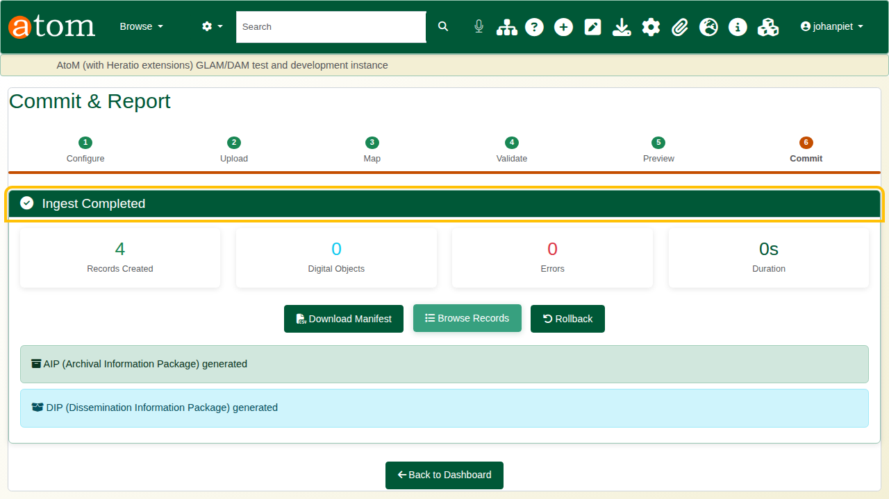

## 5. Grid entry

For a handful of records, Grid entry is quicker than preparing a file.

1. Open the **AHG Plugins** menu and, under **Data Ingest**, choose **Grid entry**.
2. **Choose the parent.** Type at least two letters of its title and pick the fonds you have just imported. Its existing records are listed under "Existing descriptions under this parent", so you can see what is already there.

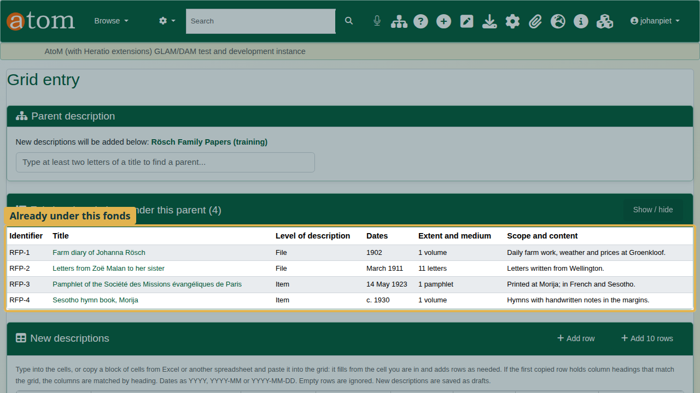

3. **Type a row.** Each grid row is one new record. Click a cell and type; press Tab to move to the next cell.

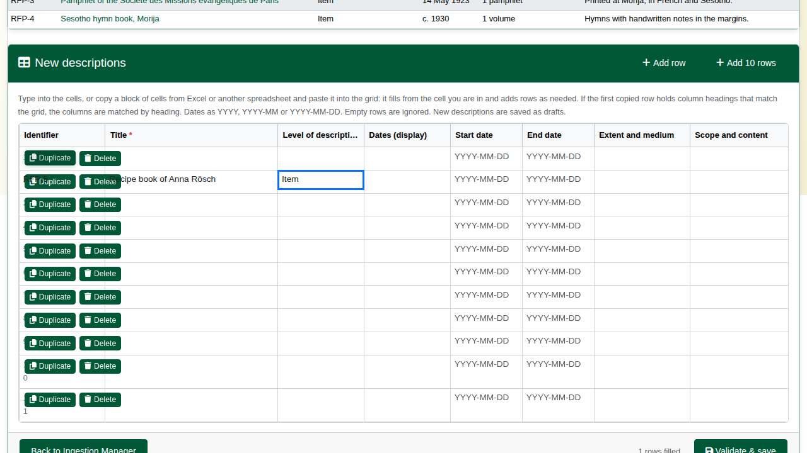

4. **Paste from Excel.** Open `rosch-grid-rows-practice.xlsx`, select the cells including the heading row, and copy. In the grid, click the first cell of an empty row and paste (Ctrl+V). Each column lands in its own field, because the heading row tells the grid which column is which.

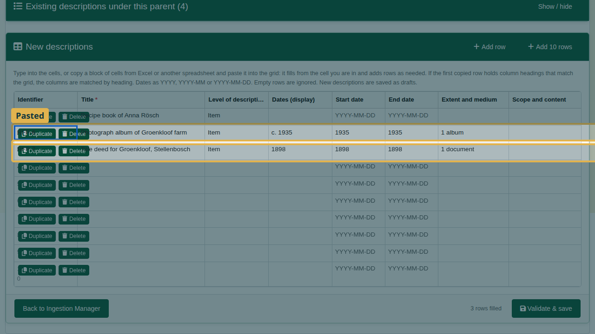

5. **Duplicate** copies a row below itself, which saves typing when records are alike. Change what differs; in the video, the identifier (RFP-8) and the title.

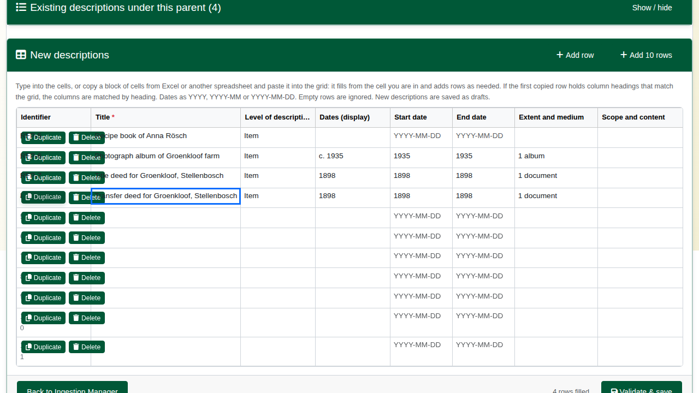

6. **Delete** removes a row you do not need. Empty rows are ignored anyway.
7. Click **Validate & save**. Nothing is saved before this. The rows go through the same checks and the same commit as an import.

## 6. Check the result

On the completion page, click **Browse Records**. Descriptions are listed newest first, so the fonds is at the top. Open it: the tree shows the four imported records and the four added in the grid.

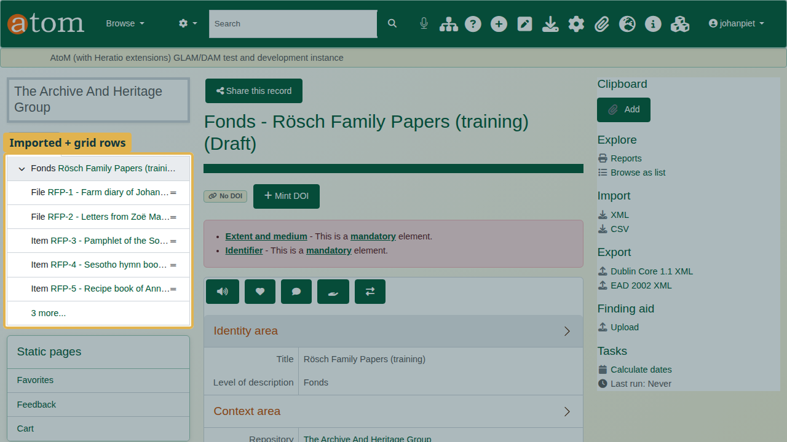

Like every import, the records are drafts until you publish them: on the fonds, choose More > Update publication status and apply it to the descendants as well.

## Common warnings

| Message | Cause | What to do |
|---|---|---|
| Date '...' may not be in a recognized format | A date not written year first | Fix it as YYYY, YYYY-MM or YYYY-MM-DD |
| Level of description '...' may not be recognized | A typo, or a level your site does not use | Fix it; otherwise the record is saved with no level of description |
| Required field 'title' is empty | A row with no title | Fix it, or Exclude the row |

: Common validation warnings

## Recap

1. Headings are AtoM field names; start and end dates are written year first.
2. Import the workbook with New Ingest, under a new or an existing parent.
3. Read every warning; fix it at validation and in your file.
4. For a few records, use Grid entry: choose the parent, then type or paste.
5. Duplicate and Delete rows as needed, then Validate & save.

## Cleaning up

To remove the practice records, open the fonds and choose **Delete**. AtoM deletes the records under it as well.
