| Field | Value |
|---|---|
| Document title | Training: Importing a Hierarchy from CSV |
| Author | Dr Johan Pieterse |
| Owner | The Archive and Heritage Group (Pty) Ltd |
| Version | 1.0 |
| Status | Released |
| Date | 9 October 2026 |
| Prepared for | AtoM users of the AHG extensions |
| Classification | Public |
| Reference | AHG-TRN-INGEST-01 |

: Document control

This guide goes with the training video of the same name. It takes you through one complete import: a small fonds with two series, three files and an item, built from a single CSV file. You make one deliberate mistake on the way and fix it, so that you know what to do when it happens with your own data.

Allow about 20 minutes to work through it with the practice file.

## Before you start

You need three things.

| What | Where to check |
|---|---|
| An administrator account | The AHG Plugins menu (the stacked cubes icon in the top bar) only appears for administrators. |
| Data Ingest enabled | AHG Plugins menu > Data Ingest section. If the section is missing, ask your system administrator to enable ahgIngestPlugin. |
| The practice file | `groenkloof-farm-records-practice.csv`, in `docs/training-files/` of the AHG extensions catalogue. |

: What you need before you start

Use a test or training instance if you have one. The import creates real records; you can delete them afterwards (see "Cleaning up").

## 1. Prepare the CSV

Open the practice file in Excel, LibreOffice Calc or any spreadsheet.

The first row holds the column names. They must be spelt exactly as AtoM spells them, including capitals, because that is how Data Ingest recognises each column. The practice file uses these:

| Column | What it holds | Required |
|---|---|---|
| legacyId | A short name for this row, unique in the file | Yes, for a hierarchy |
| parentId | The legacyId of the row this one sits under; empty for the top | Yes, for a hierarchy |
| identifier | The reference code segment | Recommended |
| title | The title of the description | Yes |
| levelOfDescription | Fonds, Series, File, Item and so on | Yes |
| creationDates | Display date, free text | No |
| creationDatesStart | Start date, YYYY or YYYY-MM or YYYY-MM-DD | No |
| creationDatesEnd | End date, same formats | No |
| extentAndMedium | Extent and medium | No |

: Columns in the practice file

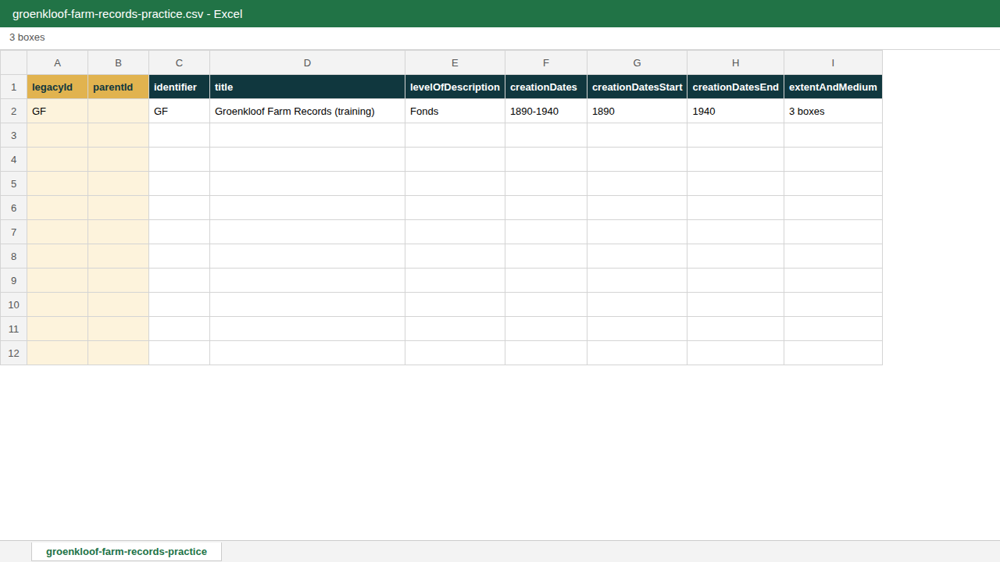

How the hierarchy works:

1. The fonds (row 2) has an empty parentId.
2. The Accounts series (row 3) has parentId `GF`, the legacyId of the fonds.
3. Rows do not have to be in order. The rent receipt (row 4) points to `GF-A1`, a file that only appears on row 5. Data Ingest creates parents first whatever the order of the file.
4. The remaining rows follow the same pattern.

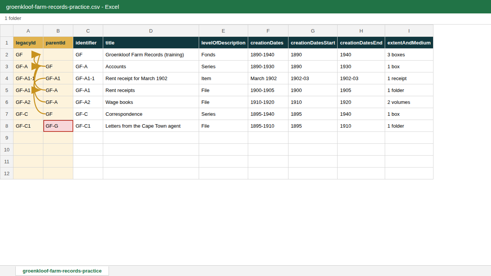

Look at the last row. The letters belong under Correspondence (`GF-C`), but the parentId says `GF-G`. Leave the mistake in for now; you fix it in step 5.

Save the file as **CSV UTF-8 (comma delimited)**. In Excel: File > Save As > CSV UTF-8. Other CSV types can garble accented characters.

## 2. Start a new ingest

1. In the top bar, open the **AHG Plugins** menu (stacked cubes icon).
2. Under **Data Ingest**, choose **New Ingest**.

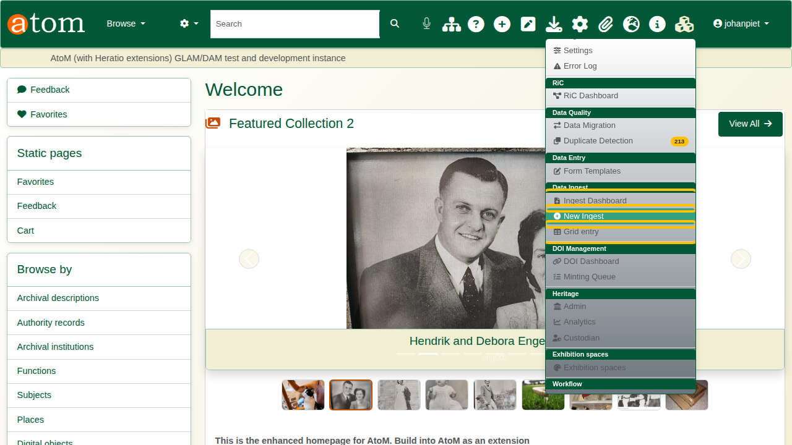

3. Enter a **Session Title** you will recognise later on the Ingest Dashboard, for example "Groenkloof Farm Records - training".
4. Leave **Record Type** on Archival Descriptions.
5. Choose the **Sector** (Archive) and the **Descriptive Standard** (ISAD(G)).
6. Choose the **Repository** that will hold the records.

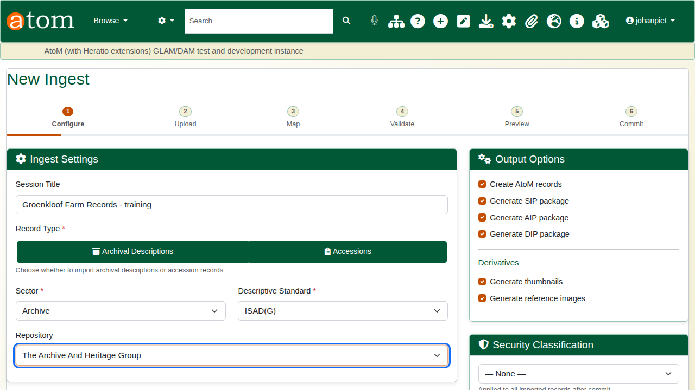

7. Under **Hierarchy Placement**, choose **Use hierarchy from CSV (legacyId/parentId)**. This is the important choice: "Top-level" would put every row directly at the top of the tree.

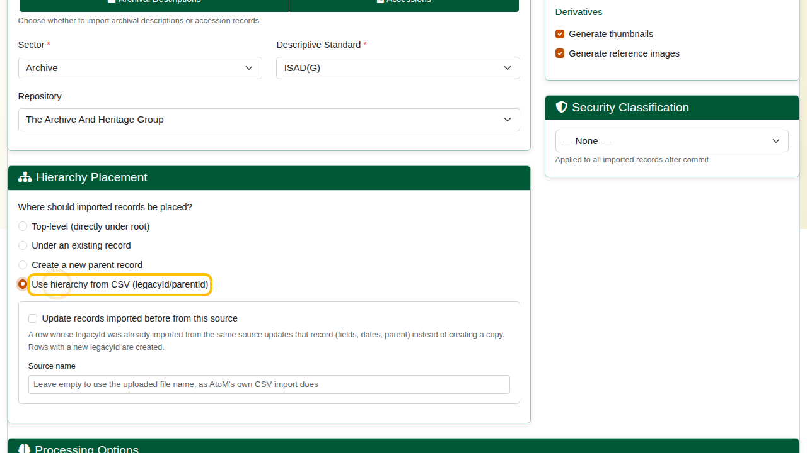

8. Leave the output and processing options as they are and click **Next: Upload Files**.

## 3. Upload the file

Click **Choose File**, select your CSV and click **Upload**.

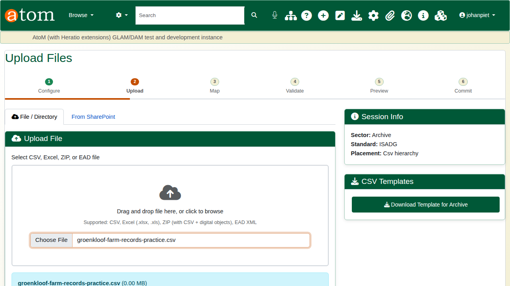

## 4. Check the mapping

The Map step pairs each column in your file (Source Column) with a field in AtoM (Target Field). Because the practice file uses AtoM's own column names, every column maps itself.

Check that **legacyId** and **parentId** map to legacyId and parentId. A column that has not mapped is shown in red; choose its field from the list, or tick Ignore.

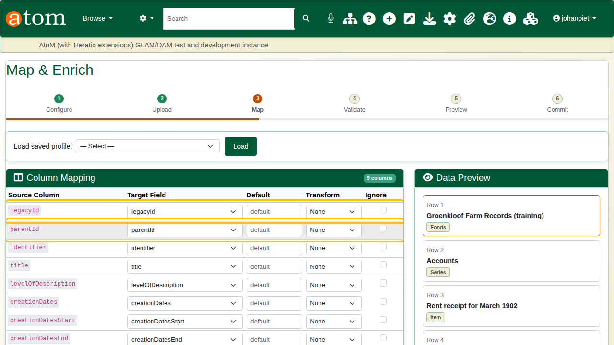

Click **Save Mappings & Validate**.

## 5. Validate and fix errors

Validation checks every row before anything is created. With the practice file, the summary shows 7 rows: 6 valid and 1 error.

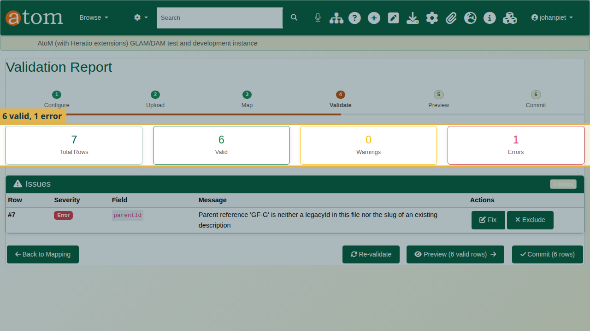

The Issues table says what is wrong: row 7, field parentId, "Parent reference 'GF-G' is neither a legacyId in this file nor the slug of an existing description".

Row numbers count data rows, so row 7 is the seventh row after the heading (row 8 in the spreadsheet).

To fix it:

1. Click **Fix** on the row.
2. Enter the correct value, `GF-C`.
3. Click **Apply Fix**.

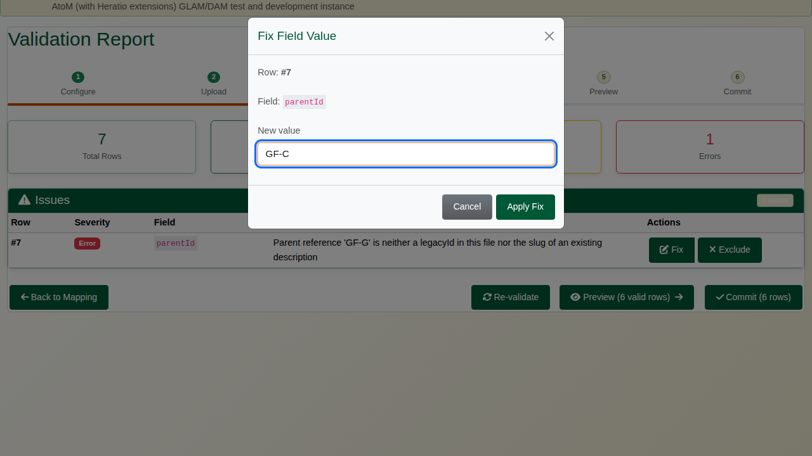

The row is checked again and all 7 rows are valid.

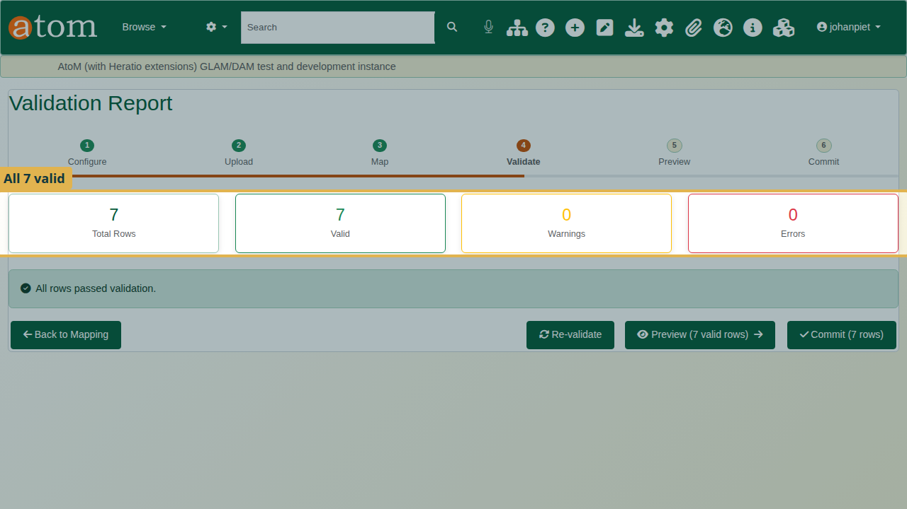

If a row cannot be fixed, **Exclude** leaves it out of the import instead.

Fix changes the value only in this ingest session, not in your file. Correct the CSV as well, so that the next import of the same file is clean.

Other hierarchy errors you may see at validation:

| Message | Cause | What to do |
|---|---|---|
| Parent reference 'X' is neither a legacyId in this file nor the slug of an existing description | A typo in parentId, or the parent row is missing | Fix the parentId, or add the parent row |
| Row is its own parent | parentId equals the row's own legacyId | Correct the parentId |
| Parent chain loops back to this row | A is under B and B is under A, possibly through other rows | Find the loop and break it |

: Hierarchy validation messages

## 6. Preview and dry run

Click **Preview**. Click **Expand All** and check that every record sits where you expect. The letters are now under Correspondence.

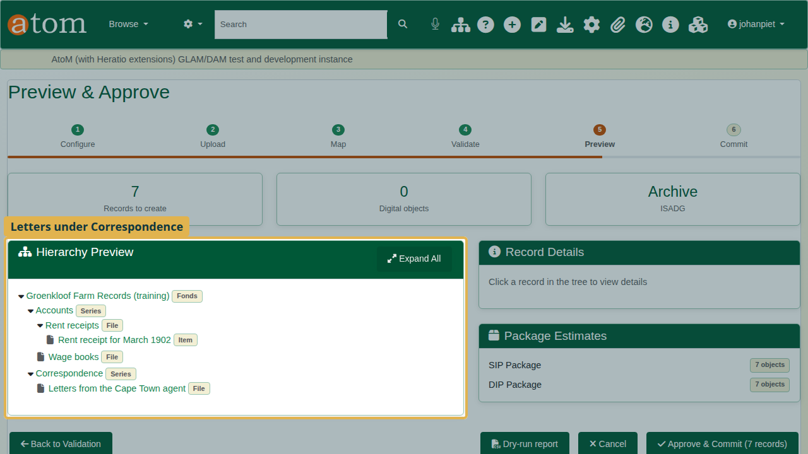

Click **Dry-run report** to download a report of exactly what the commit will do, row by row, without creating anything. Parents come first, whatever the order of your file. Keep the report with your accession paperwork.

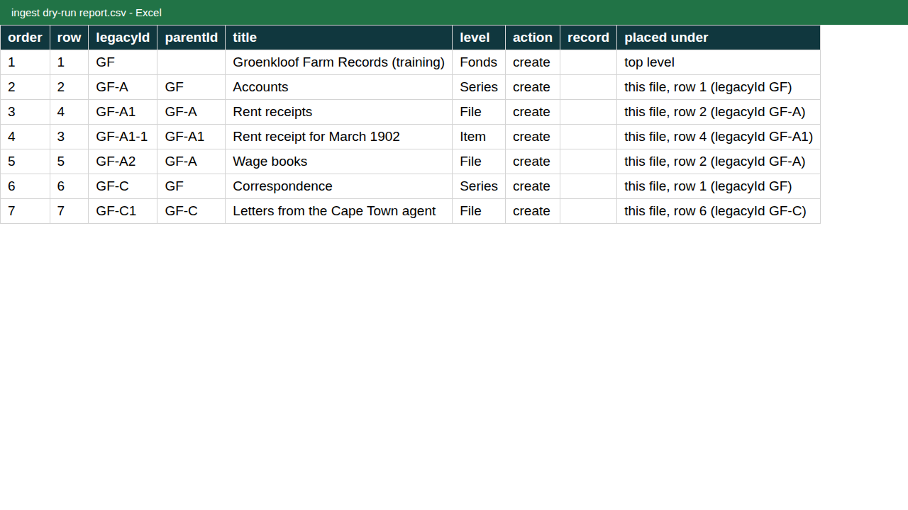

## 7. Commit

Click **Approve & Commit**, then **Start Commit**. The records are created in the background; you can leave the page and return to it from the Ingest Dashboard.

When the job finishes, the completion report shows how many records were created, and any errors.

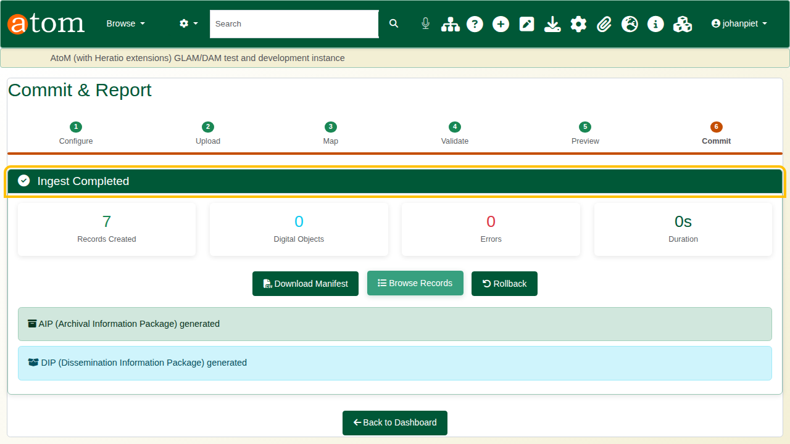

## 8. Check the result

1. Search for **Groenkloof** and open the fonds.
2. The tree on the left shows the fonds with its two series. Open **Correspondence** from the tree: the letters file is under it.

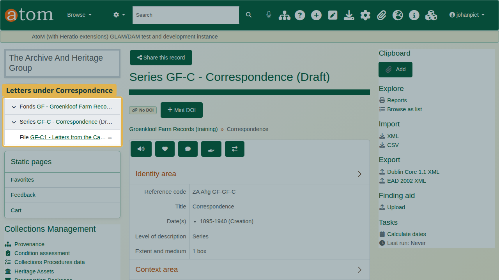

3. Note **(Draft)** after the title. Imported records are saved as drafts, so the public cannot see them yet. Check the descriptions, then publish them when they are ready: on the fonds, choose More > Update publication status, and apply it to the descendants as well.

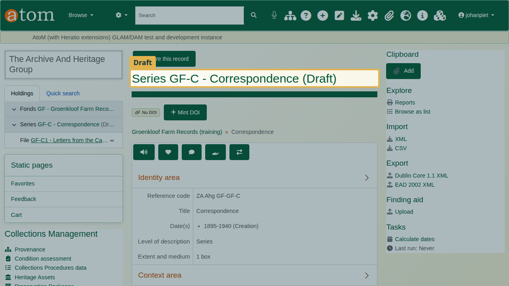

## Recap

1. Build the CSV with AtoM's column names, using legacyId and parentId for the hierarchy.
2. AHG Plugins > Data Ingest > New Ingest, and choose Use hierarchy from CSV.
3. Upload the file and check the mapping.
4. Fix errors at validation, and in your file.
5. Preview, run a dry run, and commit.
6. Check the tree, then publish.

## Cleaning up

To remove the practice records, open the fonds and choose **Delete**. AtoM deletes the series, files and item under it as well.
