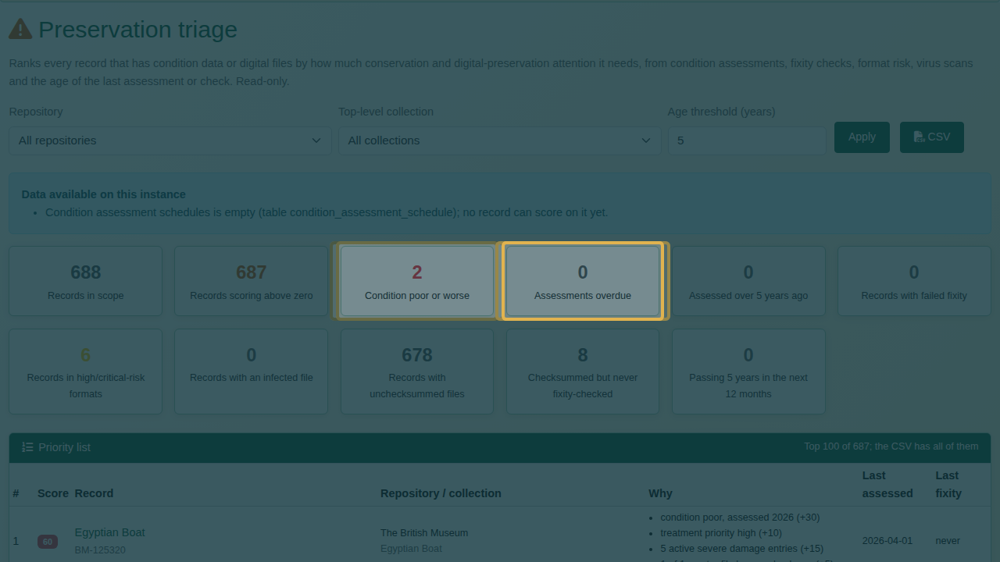
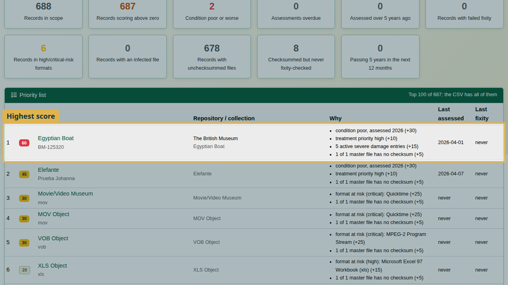
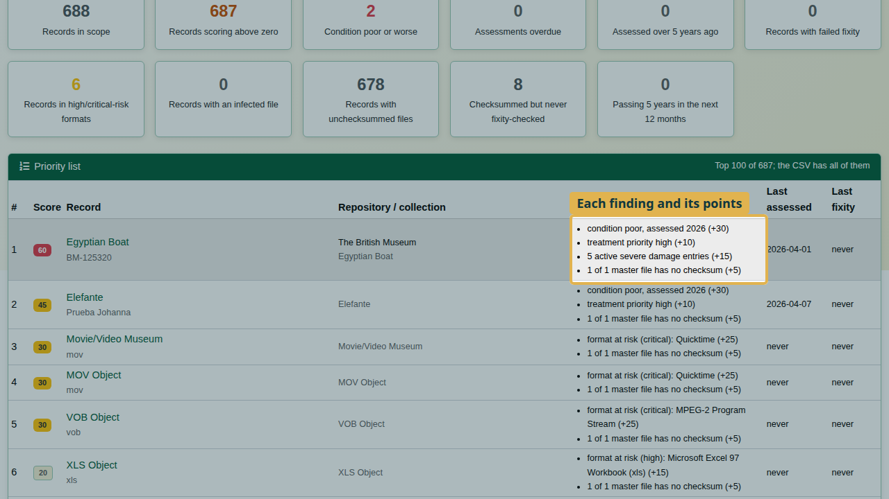
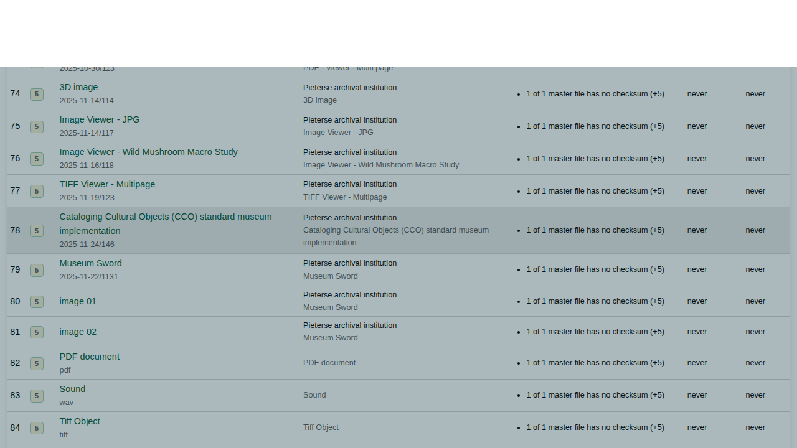
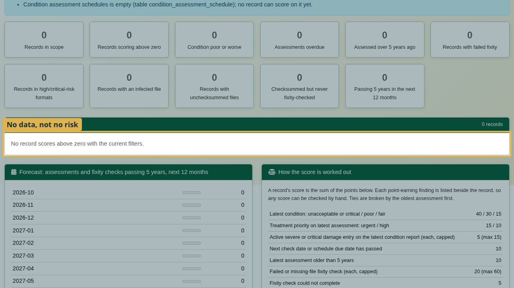
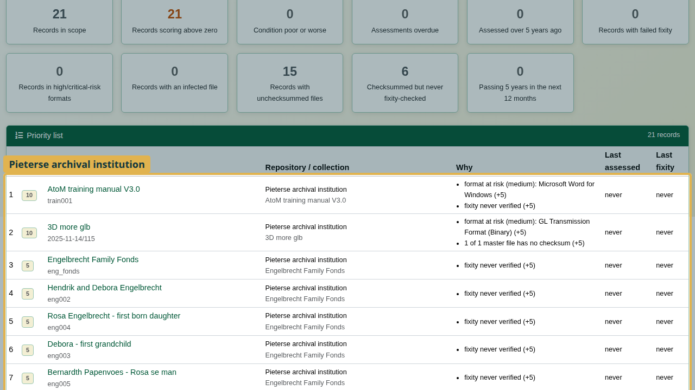
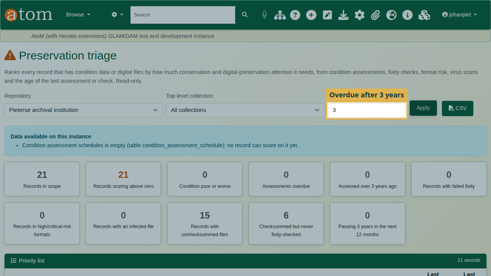
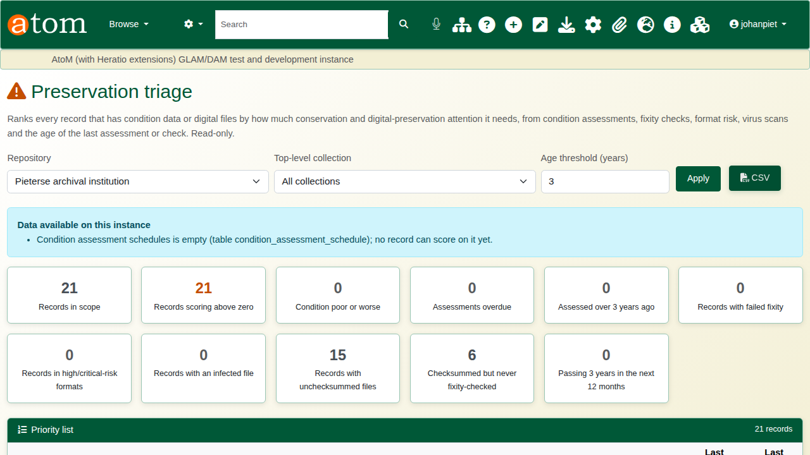
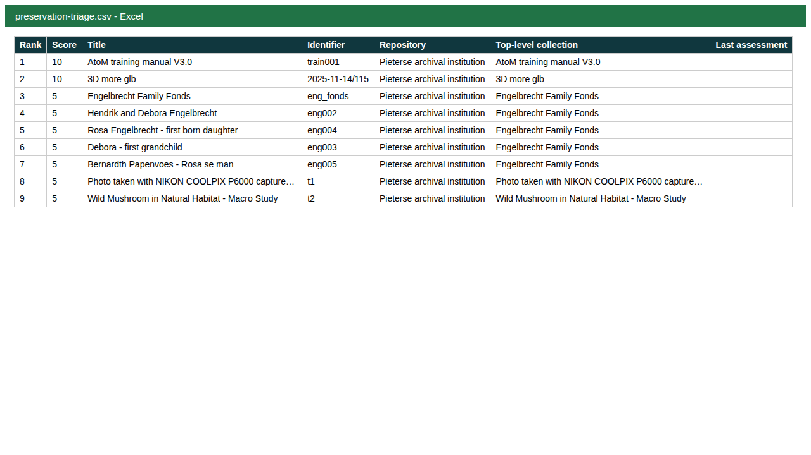

| Field | Value |
|---|---|
| Document title | Training: Preservation Triage |
| Author | Dr Johan Pieterse |
| Owner | The Archive and Heritage Group (Pty) Ltd |
| Version | 1.0 |
| Status | Released |
| Date | 9 October 2026 |
| Prepared for | AtoM users of the AHG extensions |
| Classification | Public |
| Reference | AHG-TRN-PRES-01 |

: Document control

This guide goes with the training video of the same name. **Preservation triage** ranks every record that has condition data or digital files by how much conservation and digital-preservation attention it needs. It works from data AtoM already holds: condition assessments, fixity checks, format risk, virus scans and the age of the last assessment or check. It only reads; it changes nothing.

You will read the summary and the ranked list, narrow it, meet one deliberate mistake (a filter that returns nothing) and export the list. Allow about 10 minutes.

## Before you start

| What | Notes |
|---|---|
| An editor or administrator account | Triage is a staff tool: it lists drafts and conservation findings. |
| Your own data | Triage reads your condition reports and preservation data; no practice file is needed. |

: What you need before you start

## 1. Open triage

Open the **Manage** menu and, under **Extensions**, choose **Preservation triage**.

## 2. Read the summary

The tiles at the top show where the risk lies: records in scope and scoring above zero, records in poor condition or worse, assessments overdue, records in high- or critical-risk formats, files with no checksum, failed fixity checks and infected files.

**Data available on this instance** says which sources triage could read. A source that is empty or not installed cannot add to any score.

## 3. Read the priority list

Below the summary, every record is ranked by score, highest first. These need attention before anything else.

Each score is explained beside the record under **Why**, finding by finding, with the points each adds. Nobody has to trust a number they cannot check.

**How the score is worked out** lists the weight behind every finding.

| Finding | Points |
|---|---|
| Latest condition: unacceptable or critical / poor / fair | 40 / 30 / 15 |
| Treatment priority on the latest assessment: urgent / high | 15 / 10 |
| Active severe or critical damage entry (each) | 5, max 15 |
| Next check date or schedule due date has passed | 10 |
| Latest assessment older than the age threshold | 10 |
| Failed or missing-file fixity check (each) | 20, max 60 |
| Fixity check could not complete | 5 |
| Latest virus scan: threat found / scan error | 50 / 5 |
| Worst format risk among the files: critical / high / medium | 25 / 15 / 5 |
| A master file has no stored checksum | 5 |
| Checksummed but never fixity-checked, or last checked over the threshold | 5 |

: Triage weights (as shown on the page)

## 4. Narrow it down

Use **Repository**, **Top-level collection** and **Age threshold (years)** above the summary, then click **Apply**.

The deliberate mistake: choose a repository whose holdings have no condition reports or preserved files, and apply. The list is empty: "No record scores above zero with the current filters."

An empty list does not mean those holdings are safe. It means triage has nothing to read for them. **An empty list means no data, not no risk.**

Choose the repository whose holdings you manage and apply again; its own records are ranked.

The **age threshold** sets how many years may pass before an assessment counts as overdue. It defaults to the AHG setting `preservation_triage_age_years`, else 5 years; changing it here affects this view only.

## 5. Export

**CSV** downloads the ranked list with the current filters, for planning the work or reporting to management. The page shows the top 100; the CSV holds every record.

## Recap

1. Manage > Extensions > Preservation triage.
2. Read the summary, then the ranked list.
3. Check why each record scores.
4. Narrow by repository or collection; an empty list means no data, not no risk.
5. Export as CSV.
