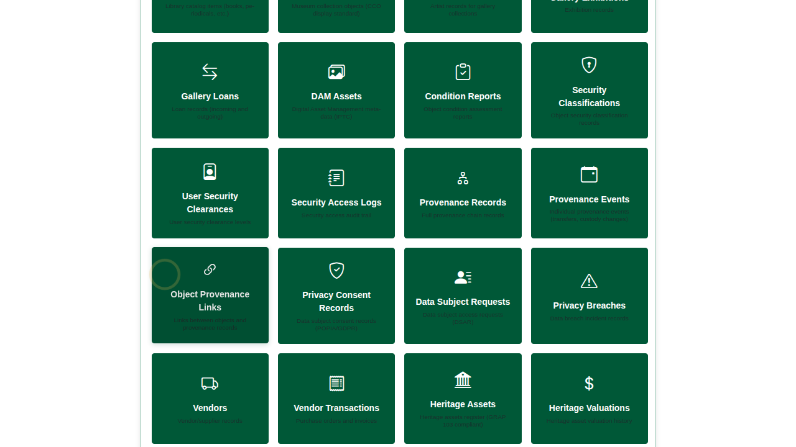
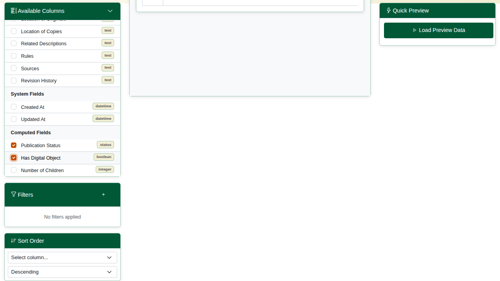
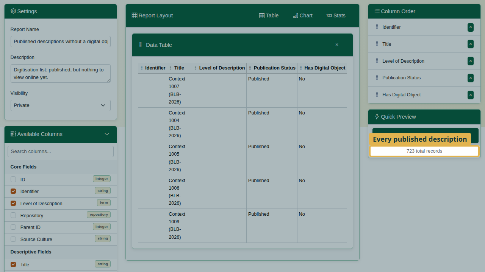
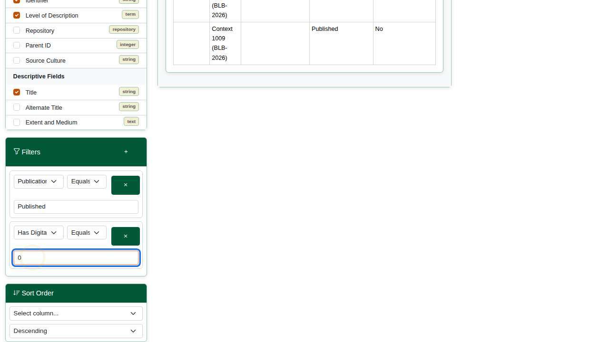
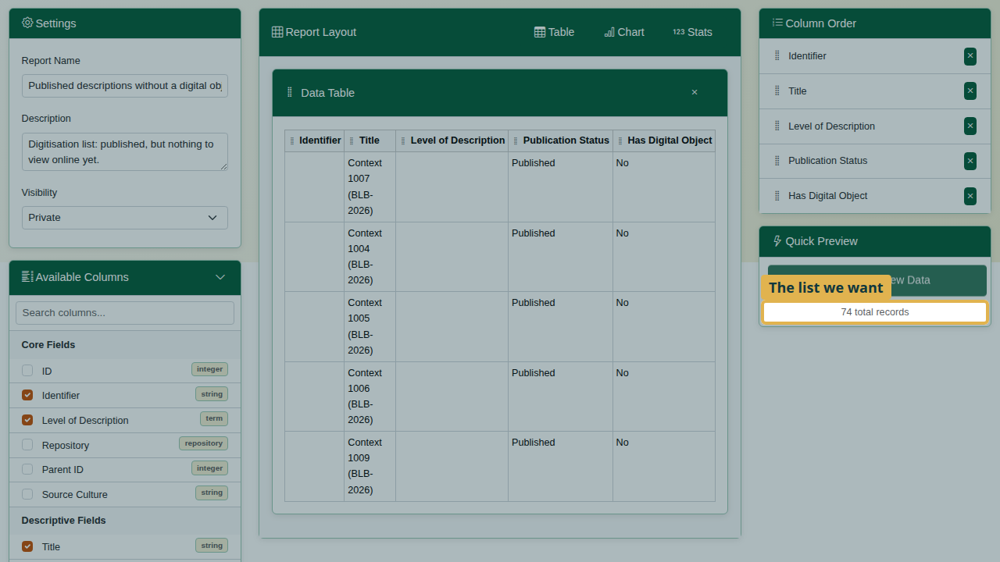
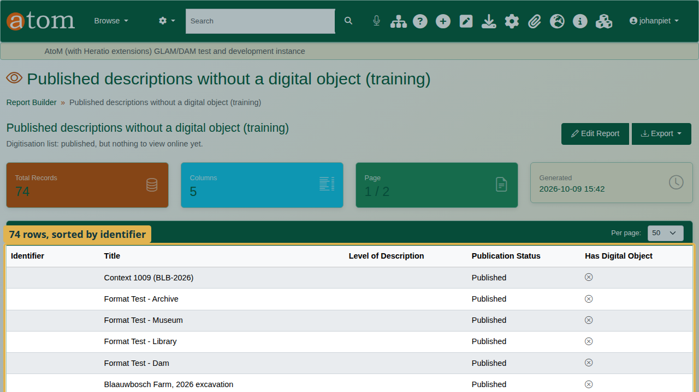
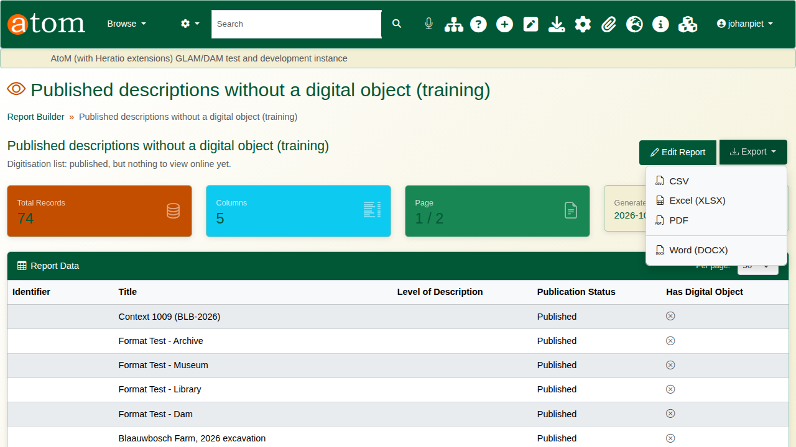
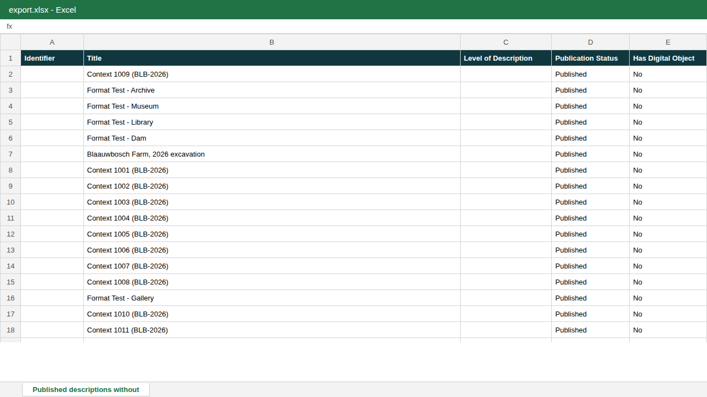

| Field | Value |
|---|---|
| Document title | Training: Report Builder |
| Author | Dr Johan Pieterse |
| Owner | The Archive and Heritage Group (Pty) Ltd |
| Version | 1.0 |
| Status | Released |
| Date | 9 October 2026 |
| Prepared for | AtoM users of the AHG extensions |
| Classification | Public |
| Reference | AHG-TRN-REP-01 |

: Document control

This guide goes with the training video of the same name. You will build one practical report from scratch: **published descriptions that have no digital object yet**, a ready-made digitisation list. On the way you add a filter that answers only half of the question, notice it from the count, and add the missing half. Allow about 15 minutes.

## Before you start

| What | Notes |
|---|---|
| An administrator account | The report builder is open to administrators. |
| Your own catalogue | The report runs on live data; no practice file is needed. Your counts will differ from the ones in this guide. |

: What you need before you start

## 1. Create the report

1. Open the **Manage** menu and choose **Central Dashboards**. On the reports dashboard, choose **Report Builder**. (Report Builder is also listed under **Extensions** in the Manage menu.)
2. The report builder lists every saved report. Click **Create New Report**.
3. Enter a **Report Name** and a short **Description**, so others know what it is for.
4. Under **Data Source**, choose **Archival Descriptions**.
5. Click **Continue to Designer**.

## 2. Choose the columns

The designer opens. **Available Columns** on the left lists every column the data source offers, grouped as core, descriptive, system and computed fields. Tick the ones the report should show:

| Column | Group | Notes |
|---|---|---|
| Identifier | Core fields | |
| Title | Descriptive fields | |
| Level of Description | Core fields | Empty for descriptions that have no level |
| Publication Status | Computed fields | Draft or Published |
| Has Digital Object | Computed fields | 1 (yes) or 0 (no) when filtering; shown as Yes or No |

: Columns for the digitisation list

Untick **ID**, which only the database needs. Columns appear in the order you tick them; drag them in **Column Order** to change it.

## 3. Filter, and check the count

1. Under **Filters**, click **+** and set: **Publication Status**, **equals**, `Published`.
2. Click **Load Preview Data** under **Quick Preview**. Quick Preview runs what is on screen against the live catalogue, before you save.

Check the count. In the video it is 723: every published description, digitised or not. The report answers only half of the question.

3. Add a second filter: **Has Digital Object**, **equals**, `0` (0 means no, 1 means yes). Every filter must match, so this keeps only published descriptions with no digital object.

4. Run **Quick Preview** again. In the video the count drops to 74: the list we want.

Always check the count against what you expect before you save or send a report.

## 4. Sort, save and export

1. Under **Sort Order**, choose **Identifier**, **Ascending**, so the list follows the arrangement.
2. Click **Save**. Nothing in the designer is kept until you save; leaving with unsaved changes asks for confirmation.
3. Click **Preview**. The report opens in a new tab and runs the saved report with every row, with its total.

4. **Export** offers PDF, Word (DOCX), Excel (XLSX) and CSV.

## 5. Share and schedule

In the designer's **Settings**, **Visibility** keeps a report **Private**, **Shared** with colleagues, or **Public**. **Schedule** runs the report on a timetable. **History** keeps earlier versions of the report's design.

## Recap

1. Manage > Central Dashboards > Report Builder.
2. Create New Report; choose the data source.
3. Tick the columns.
4. Add filters; check the count with Quick Preview.
5. Sort, Save, then Preview and Export.

## Cleaning up

To remove the practice report, open the report list and choose **Delete** on its row.
