| Field | Value |
|---|---|
| Document title | Training: Research Portal, Part 1 - Becoming a Researcher |
| Author | Dr Johan Pieterse |
| Owner | The Archive and Heritage Group (Pty) Ltd |
| Version | 1.0 |
| Status | Released |
| Date | 10 October 2026 |
| Prepared for | Researchers and reading-room staff using the AHG extensions |
| Classification | Public |
| Reference | AHG-TRN-RES-01 |

: Document control

This guide goes with part 1 of the research portal training videos. A visitor registers as a researcher, an archivist reviews and approves the application, and the researcher signs in to the research dashboard. Everything else in the series - the reading room, the workspace, projects, reproductions - starts here. Allow about 10 minutes.

## Before you start

| What | Notes |
|---|---|
| Nothing, to register | Anyone can apply from the sign-in page. |
| An administrator account, to approve | Applications are reviewed under Manage > Researchers. |

: What you need before you start

## 1. Register

Open the site and choose **Log in**. Below the sign-in form, choose **Register as a researcher**.

The form begins with the account: a username, the email address the archive will write to, and a password of at least eight characters, typed twice.

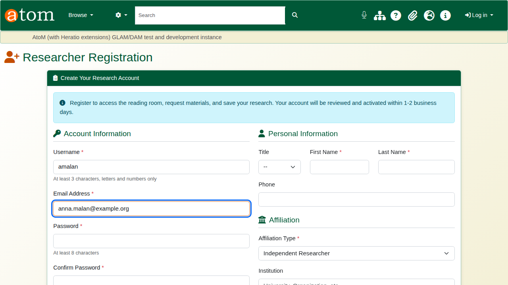

Then identification and name. The archive uses the ID to confirm who is visiting the reading room. After that come affiliation and research: institution, research interests and current project. The archivist reads these when deciding, and later uses them to find the right material.

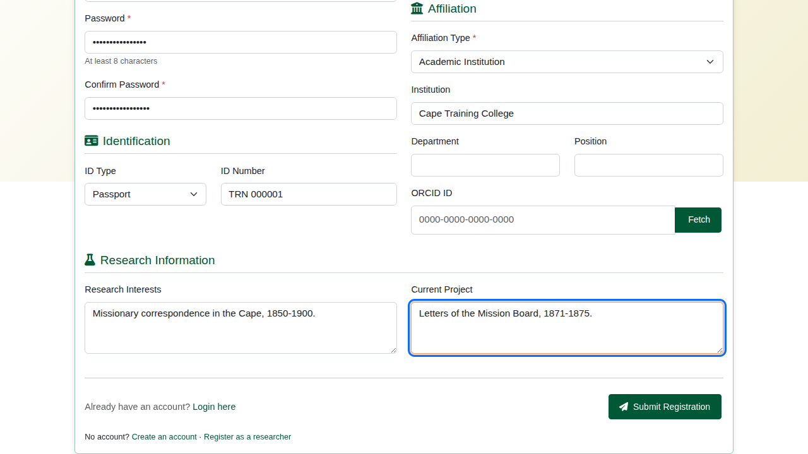

The deliberate mistake: the two password boxes do not match. Submit, and the form comes back with the error. Nothing has been created, and everything typed is still there except the passwords.

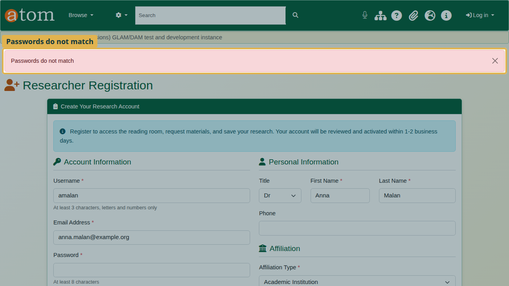

Type the password into both boxes again and submit. Registration is complete and the application is **pending**. The archive emails the applicant to say so.

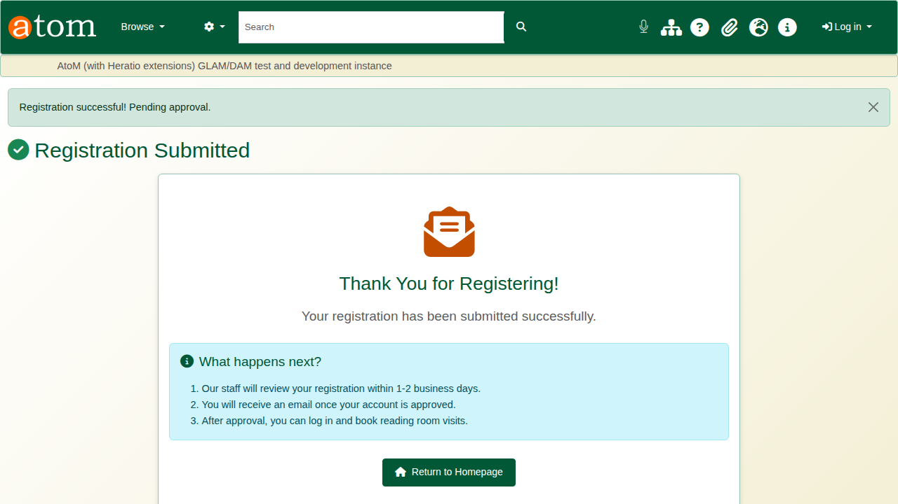

## 2. While the application is pending

Signing in now is refused, with a plain message: the registration is awaiting approval, and the applicant will be emailed when it is approved. The account stays closed until an archivist approves it.

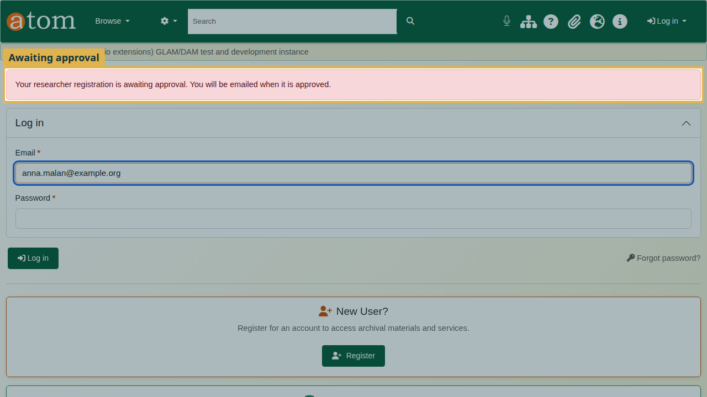

## 3. Review and approve (staff)

The archivist's user menu shows **Pending Researchers**, with a count. The same list is under **Manage > Researchers**. The **Pending** tab lists every application waiting.

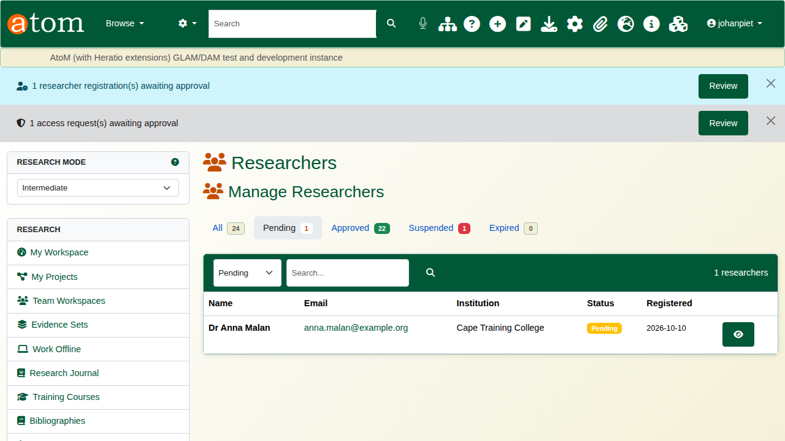

Open the application and check identity, affiliation and research.

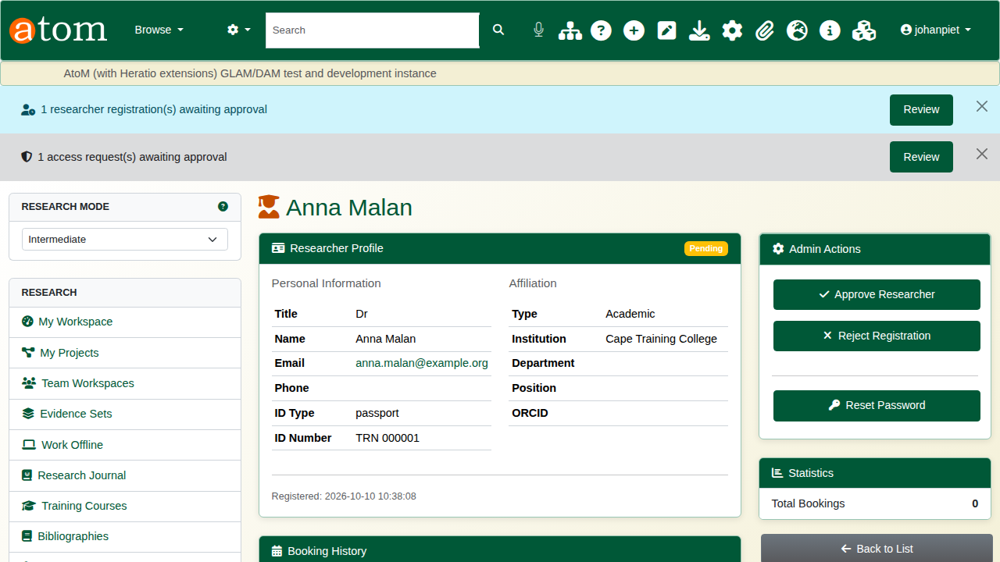

| Decision | What happens |
|---|---|
| Approve Researcher | The account opens for one year and the researcher is emailed. |
| Reject | A reason is required and is emailed to the applicant. The decision is kept in the audit trail, and the person may apply again. |

: Approve or reject

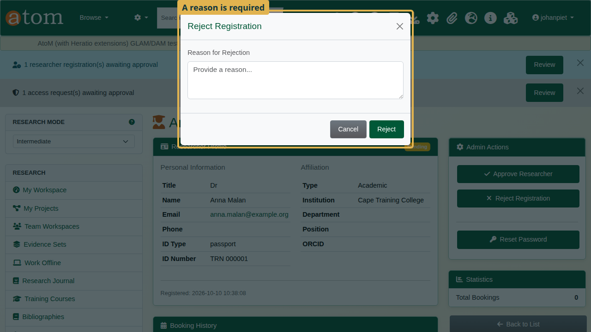

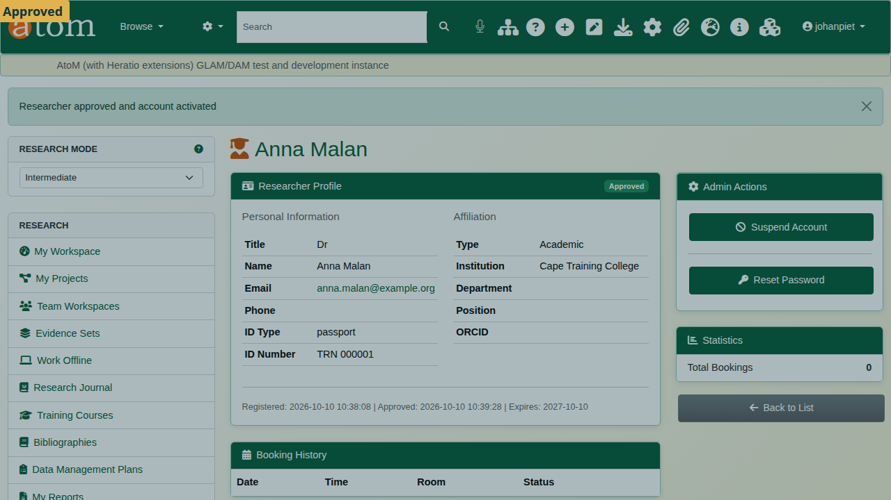

## 4. Sign in as a researcher

The researcher signs in with email address and password and lands on the **research dashboard**. Its sidebar leads to everything the portal offers: the reading room, collections, saved searches, projects and reproduction requests.

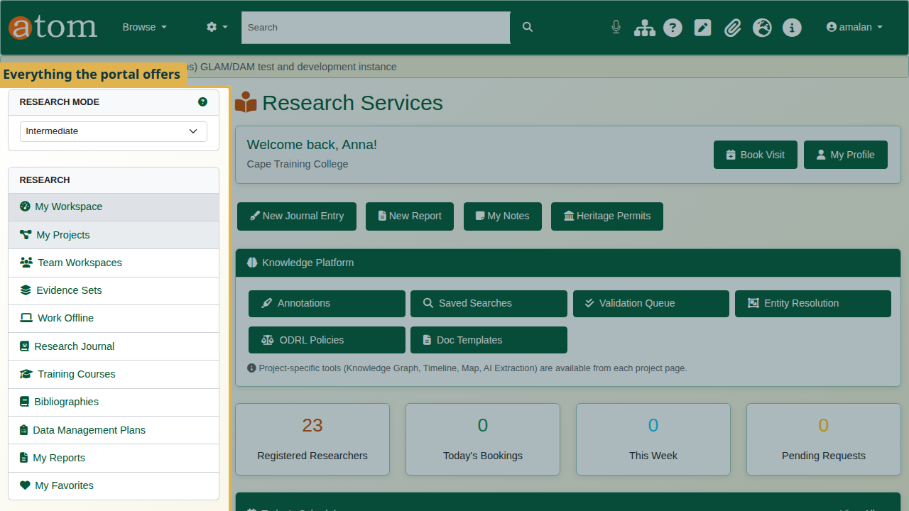

Under **My Profile** the researcher keeps their details current, links an ORCID iD, and asks for renewal when the year of access is nearly over.

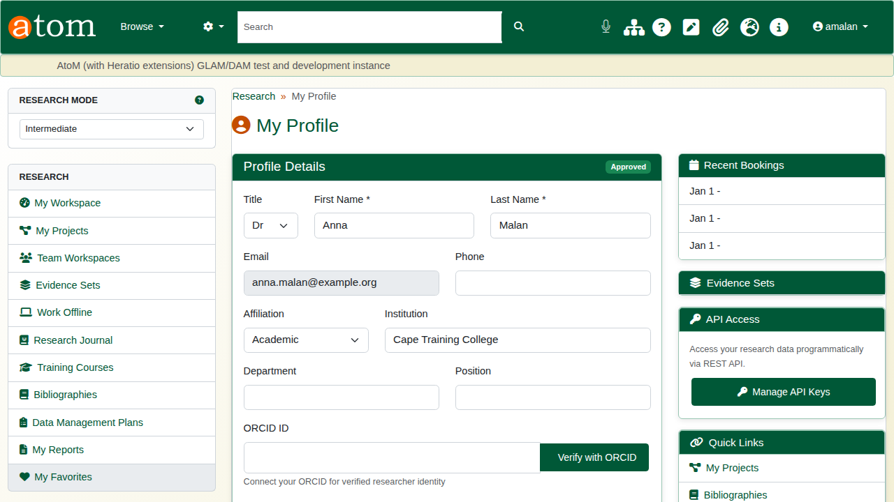

## Recap

1. Register from the sign-in page: Log in > Register as a researcher.
2. The application is pending and the account stays closed.
3. An administrator reviews it under Manage > Researchers.
4. Approve (one year of access) or reject with a reason.
5. The researcher signs in to the research dashboard.

Part 2 covers the reading room.
