| Field | Value |
|---|---|
| Document title | Training: Research Portal, Part 2 - The Reading Room |
| Author | Dr Johan Pieterse |
| Owner | The Archive and Heritage Group (Pty) Ltd |
| Version | 1.0 |
| Status | Released |
| Date | 10 October 2026 |
| Prepared for | Researchers and reading-room staff using the AHG extensions |
| Classification | Public |
| Reference | AHG-TRN-RES-02 |

: Document control

This guide goes with part 2 of the research portal training videos. Staff set up a reading room. A researcher books a visit and requests records. Staff then confirm the booking, fetch the material and check the researcher in and out, and register a walk-in visitor. Allow about 15 minutes.

## Before you start

| What | Notes |
|---|---|
| An approved researcher | See part 1. |
| A staff account | An administrator or editor. Only staff see bookings and the retrieval queue, and check visitors in and out; a researcher who opens those pages is refused. |

: What you need before you start

## 1. Set up a reading room (staff)

Open the **AHG Plugins** menu and, under Research, choose **Rooms**. The existing rooms are listed. Click **Add Reading Room**.

Give the room a name, a code, its location and its capacity.

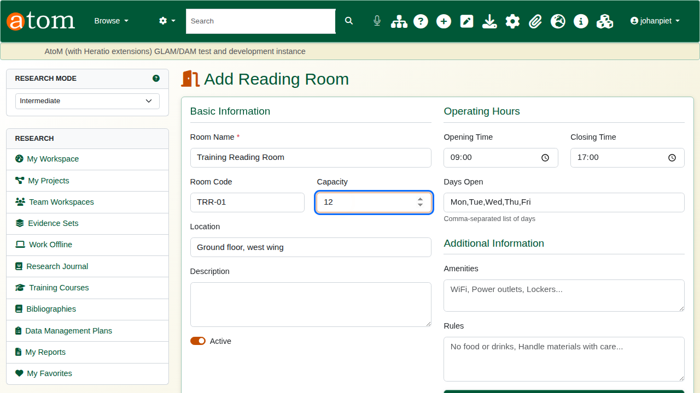

The hours and limits matter, because every booking is checked against them:

| Field | Example | Effect |
|---|---|---|
| Opening / Closing Time | 09:00 / 16:00 | A booking must start and end within these hours. |
| Days Open | Mon,Tue,Wed,Thu,Fri | A booking on any other day is refused. |
| Advance Booking (days) | 30 | How far ahead a visit may be booked. |
| Max Hours per Booking | 4 | The longest single booking. |

: Reading room hours and limits

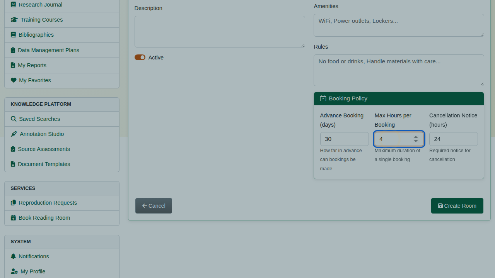

Click **Create Room**. It appears in the list and is open for bookings.

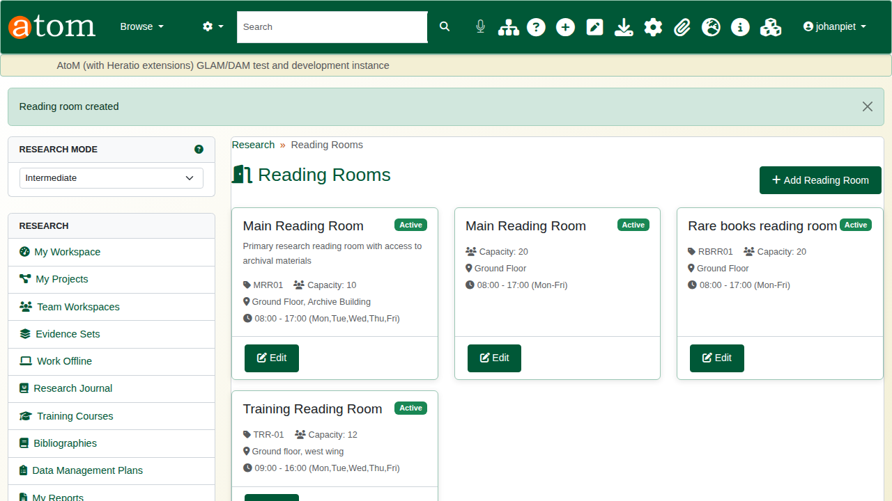

## 2. Book a visit (researcher)

On a record she wants to see, the researcher clicks **Request this Item** in the left-hand column. Without a booking, the answer is: no active booking found, please book a reading room visit first. Material is fetched for a visit, not on its own.

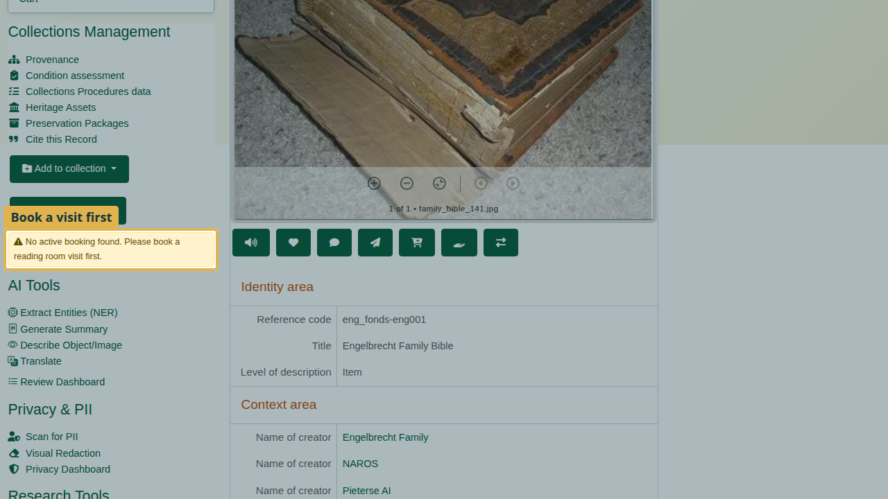

From the research sidebar, choose **Book Reading Room**. Choose the room, the date, the start and end times, and the purpose of the visit.

The deliberate mistake: a Saturday. On submit, the booking is refused - the room is closed on Saturdays and open Monday to Friday - and everything typed is kept.

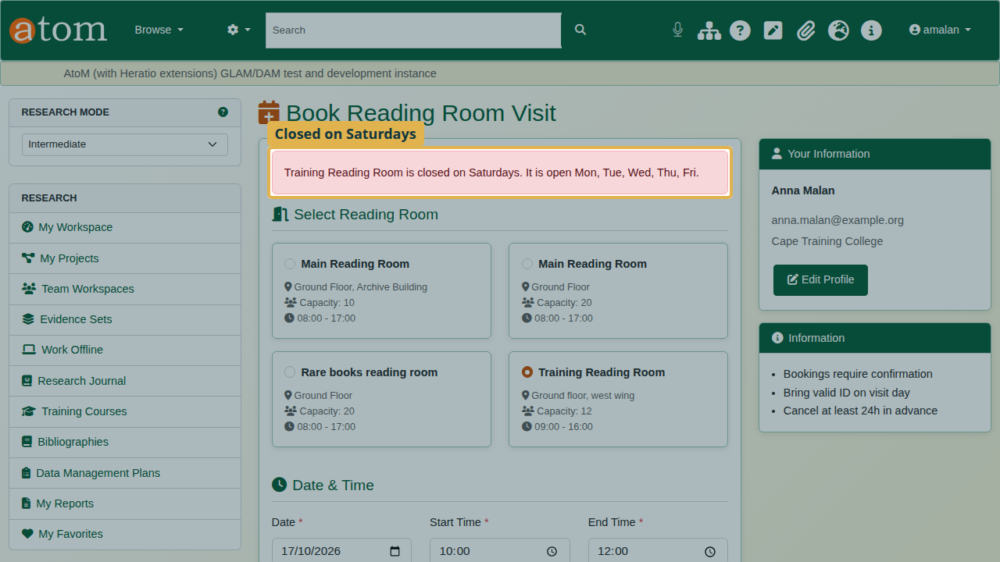

Change the date to a weekday and submit again. The booking is **pending** until the archive confirms it.

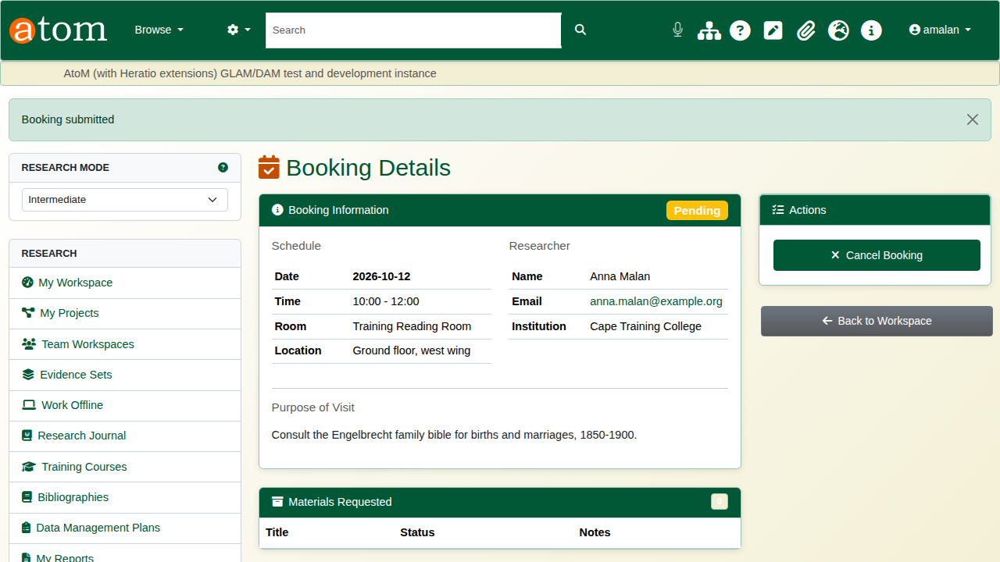

Back on the record, **Request this Item** now works, and the request is attached to the booking.

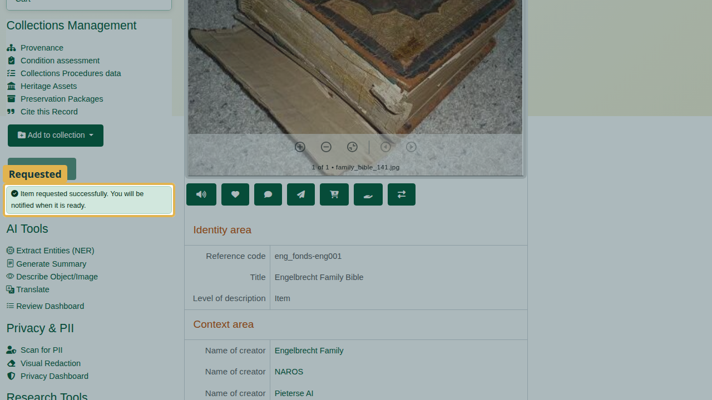

## 3. Confirm and fetch (staff)

Open **AHG Plugins > Bookings**. New bookings wait under Pending Confirmation.

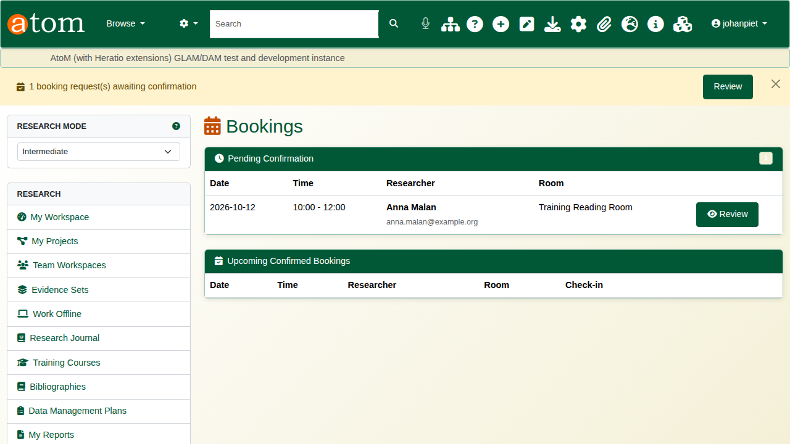

Open the booking, check it, and click **Confirm**. The researcher is emailed that the visit is confirmed.

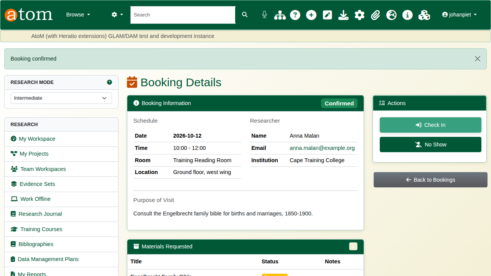

The **retrieval queue** lists every requested item. **Print Call Slip** produces the slip for the staff who fetch the material from the stores.

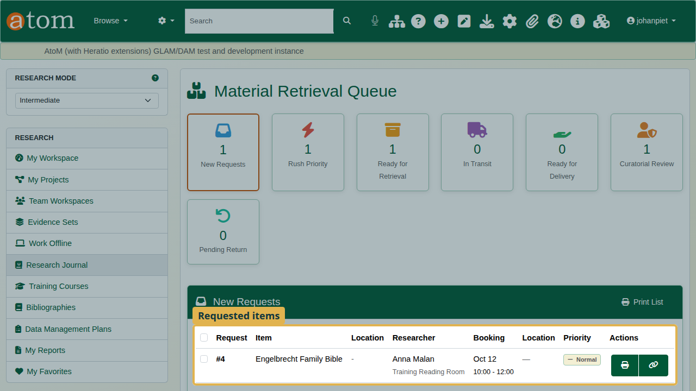

When an item is fetched, tick it, set **Update Status** to Retrieved, and click **Update Selected**. Each item moves through requested, retrieved, delivered, in use and returned, and the queue shows where it is.

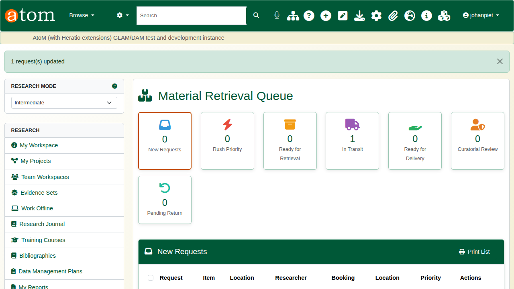

## 4. On the day

From the booking, click **Check In** when the researcher arrives.

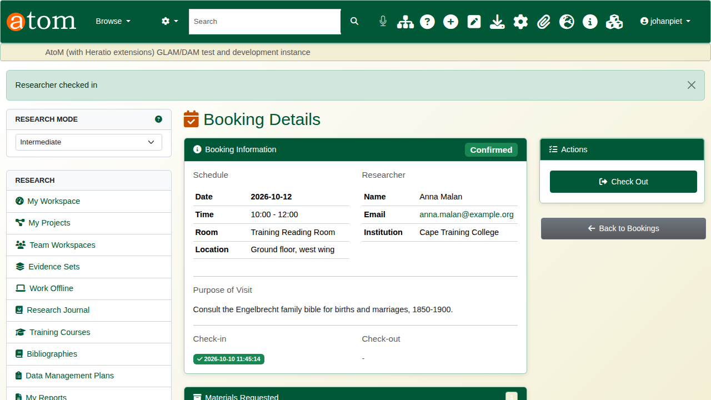

When the researcher leaves, click **Check Out**. Any material still out on that booking is marked returned, so nothing is left unaccounted for.

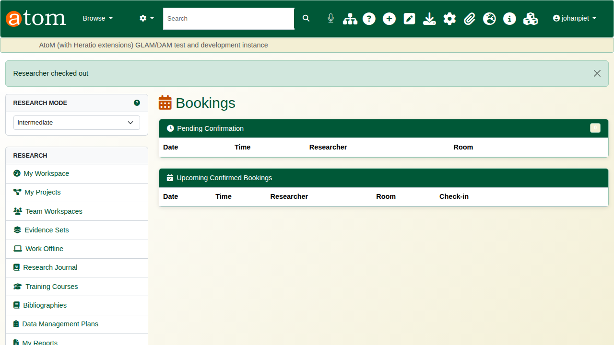

## 5. Walk-in visitors

A visitor without a booking is registered under **Walk-In**: choose the room, then enter their name, ID and purpose. They must accept the reading room rules. Walk-ins see open-access material only, cannot request material in advance, and can later be converted to registered researchers.

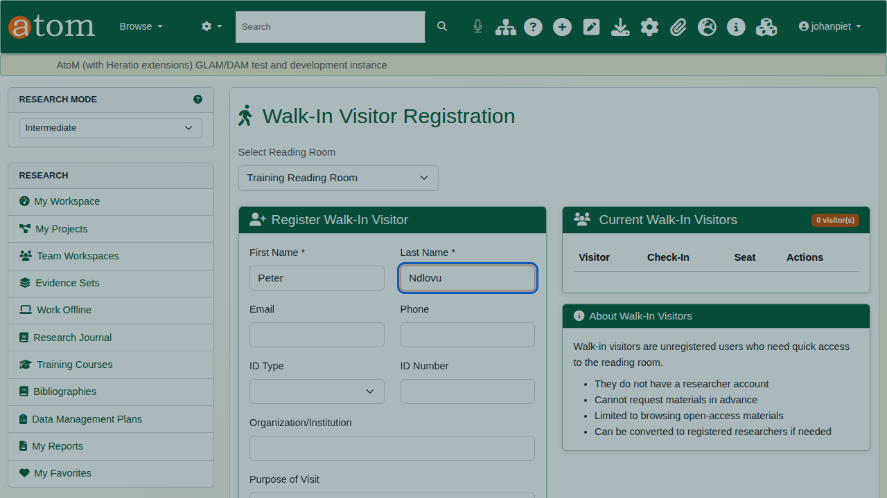

## Recap

1. Staff set up a room with its hours, days and limits.
2. The researcher books a visit, then requests records from the record pages.
3. Staff confirm the booking and fetch the material through the retrieval queue.
4. Check the researcher in and out on the day.
5. Register walk-ins on the spot.

Part 3 covers the research workspace.
