| Field | Value |
|---|---|
| Document title | Training: Research Portal, Part 3 - Workspace, Evidence Sets and Citing |
| Author | Dr Johan Pieterse |
| Owner | The Archive and Heritage Group (Pty) Ltd |
| Version | 1.0 |
| Status | Released |
| Date | 10 October 2026 |
| Prepared for | Researchers using the AHG extensions |
| Classification | Public |
| Reference | AHG-TRN-RES-03 |

: Document control

This guide goes with part 3 of the research portal training videos. The researcher gathers records into an evidence set and adds notes to them. Then she cites a record correctly and builds a bibliography she can take to a reference manager. Allow about 15 minutes.

## Before you start

| What | Notes |
|---|---|
| An approved researcher account | See part 1. |
| Privacy | Evidence sets, notes and bibliographies belong to the researcher. Other researchers cannot see them unless she shares them. |

: What you need before you start

## 1. My Workspace

Sign in and choose **My Workspace** from the user menu. It is the researcher's starting point: booking a visit, her profile, journal entries and notes, and the research tools in the sidebar.

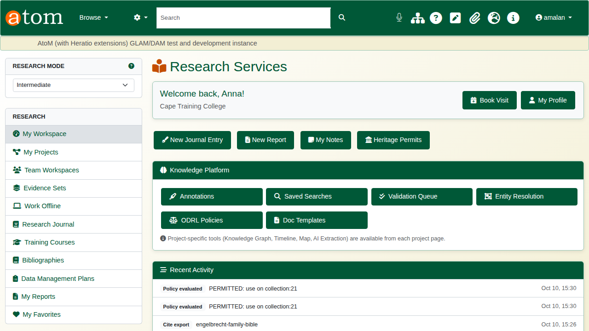

## 2. Evidence sets

An evidence set gathers the records that support one question.

On a record, open **Add to Evidence Set** in the left-hand column and choose **New Evidence Set...**. Give it a name and a short description, and click **Create and add**. The record is in the new set straight away.

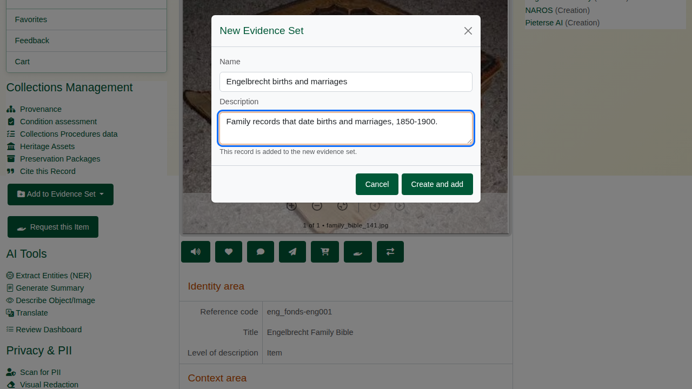

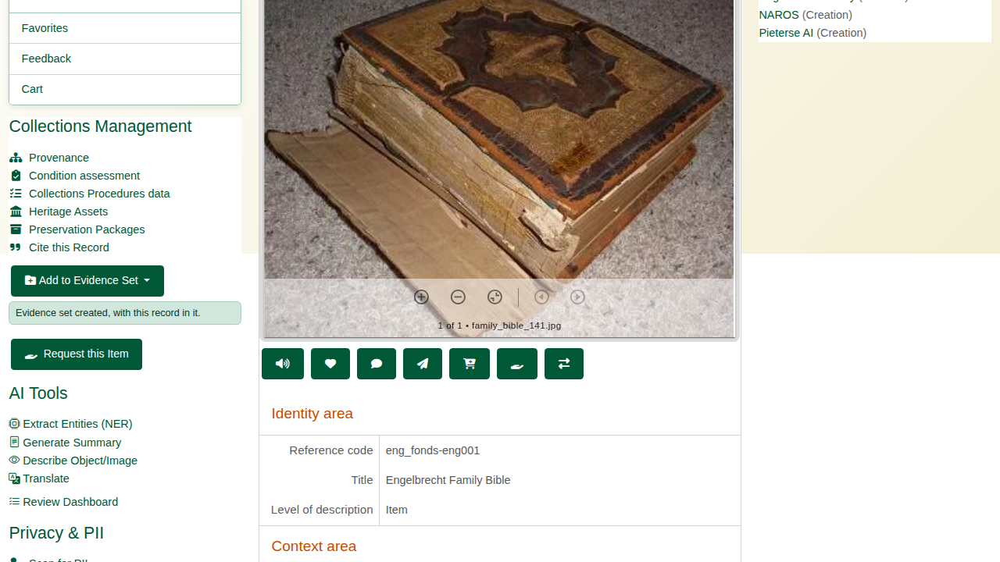

On the next record, the same button lists the set. One click adds the record.

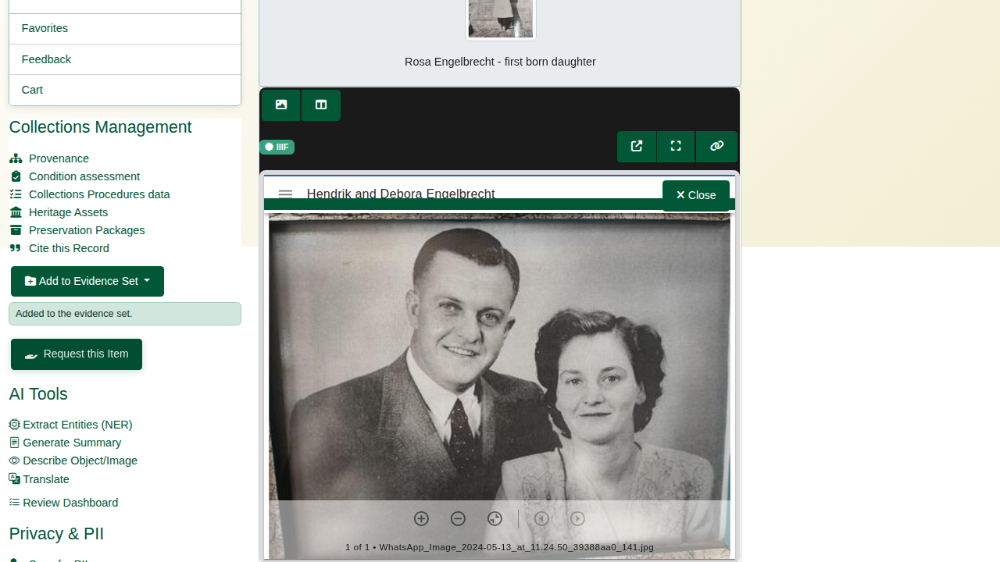

The deliberate mistake: add the first record to the same set again. The portal answers that the record is already in that evidence set. Nothing is duplicated.

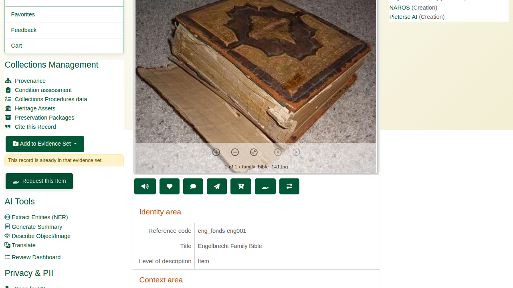

Open **Evidence Sets** from the research sidebar and choose **View Evidence Set**. The records are listed with their level of description and the date they were added. Records can also be added here, by searching, with **Include children** to bring in a whole branch of the hierarchy.

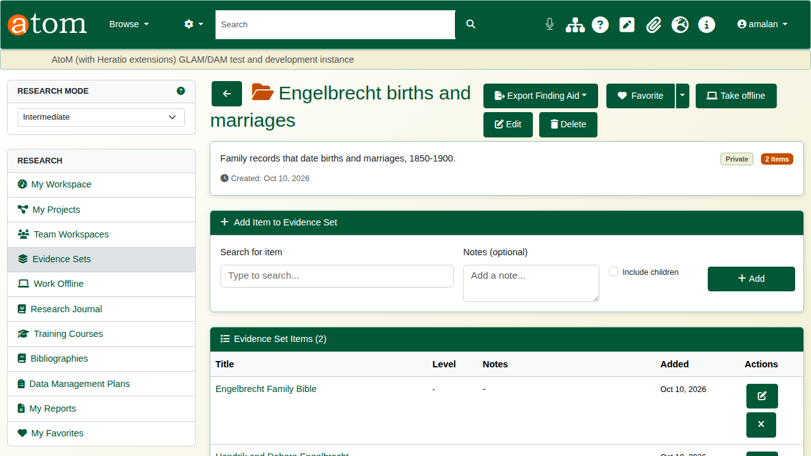

The edit button beside a record opens its note. Write what you found and save.

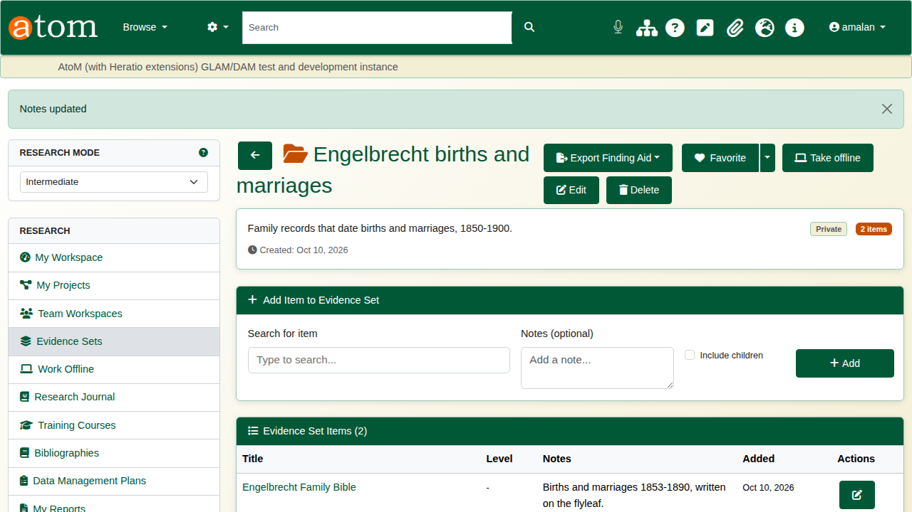

**Export Finding Aid** produces the set as PDF, Word (DOCX) or HTML, with the notes included. It is ready to share with a supervisor or colleague.

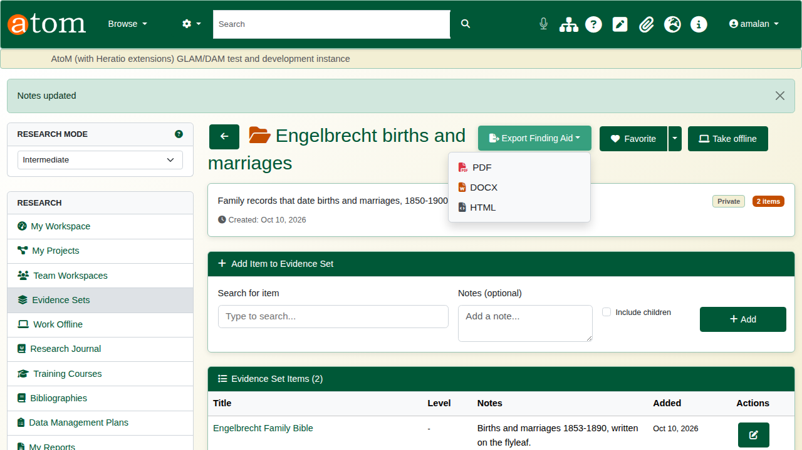

## 3. Cite a record

On a record, choose **Cite this Record**. The citation generator shows the record in six styles - Chicago, MLA, Turabian, APA, Harvard and UNISA Harvard - each with a **Copy** button.

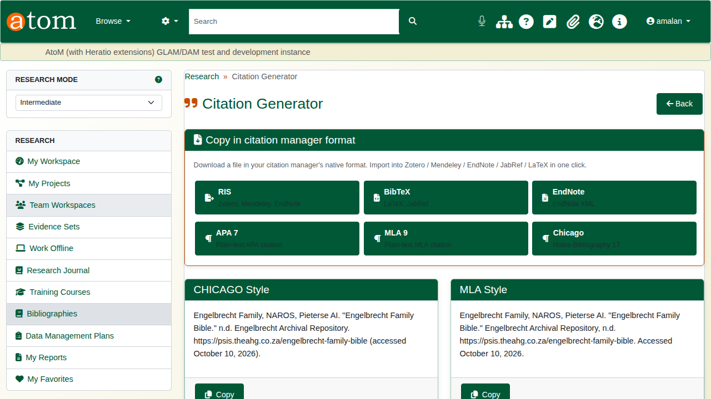

Names are handled with care. A creator recorded as a person is cited surname first, with initials. A family or an organisation is cited as written.

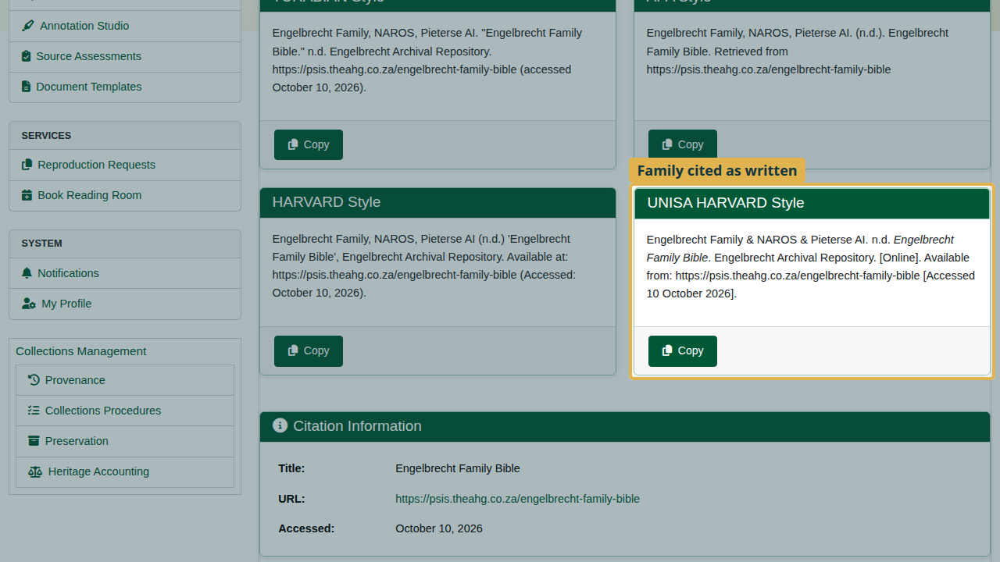

For a reference manager, download the citation in its own format:

| Button | For |
|---|---|
| RIS | Zotero, Mendeley, EndNote |
| BibTeX | LaTeX, JabRef |
| EndNote | EndNote XML |
| APA 7, MLA 9, Chicago | Plain-text citations |

: Citation downloads

Every creator of the record is included: RIS gives one author line each, and BibTeX joins them with "and".

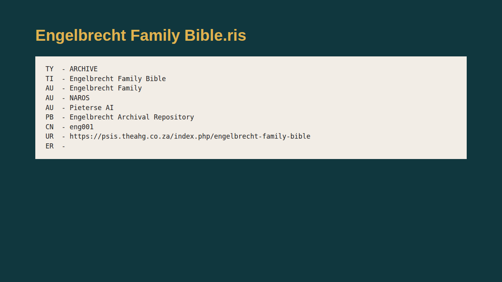

## 4. Bibliographies

A bibliography collects citations for a chapter or an article. Open **Bibliographies** from the research sidebar and click **New Bibliography**. Name it, choose the citation style, and click **Create**.

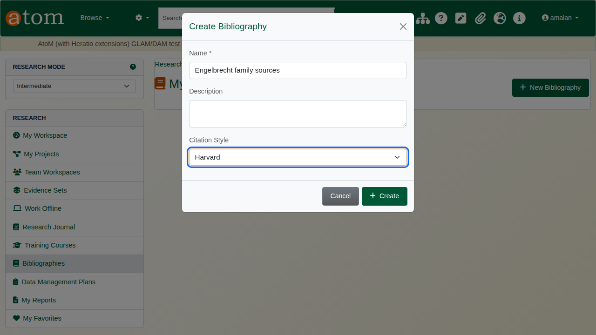

Click **Add Entry** and type part of a title or a reference code; matching archive records are offered as you type. Choose one and click **Add Entry**.

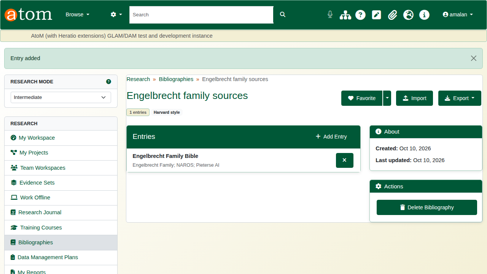

**Export** downloads the whole bibliography as RIS, BibTeX, Zotero RDF, Mendeley JSON or CSL-JSON. **Import** brings in citations from elsewhere, as a BibTeX or RIS file or pasted text; duplicate titles are skipped.

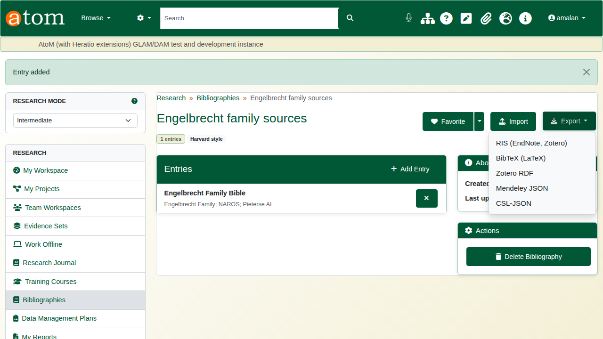

## Recap

1. My Workspace is the starting point.
2. Gather records into evidence sets from any record page.
3. Add a note to each record, and export the set as a finding aid.
4. Cite a record in the style you need, or download it for a reference manager.
5. Build a bibliography, and export it.

Part 4 covers research projects and writing.
