| Field | Value |
|---|---|
| Document title | Training: Research Portal, Part 4 - Projects and Writing |
| Author | Dr Johan Pieterse |
| Owner | The Archive and Heritage Group (Pty) Ltd |
| Version | 1.0 |
| Status | Released |
| Date | 10 October 2026 |
| Prepared for | Researchers using the AHG extensions |
| Classification | Public |
| Reference | AHG-TRN-RES-04 |

: Document control

This guide goes with part 4 of the research portal training videos. The researcher sets up a research project, plans it with milestones and attaches the records she works from. She keeps a research journal along the way, then drafts a report from a template and exports it. Allow about 20 minutes.

## Before you start

| What | Notes |
|---|---|
| An approved researcher account | See part 1. |
| Privacy | Projects, journal entries and reports belong to the researcher and stay private until she shares them. |

: What you need before you start

## 1. Create a project

Open **My Projects** from the research sidebar and click **New Project**.

| Field | Example |
|---|---|
| Project Title | The Engelbrecht family, 1850-1950 |
| Description | Births, marriages and land of the Engelbrecht family in the Cape. |
| Project Type | Genealogy (also thesis, dissertation, publication, exhibition, documentary, institutional, personal, other) |
| Institution | Cape Training College |
| Start Date / Expected End Date | 1 November to 31 October the following year |

: New project fields

The deliberate mistake: an expected end date before the start date.

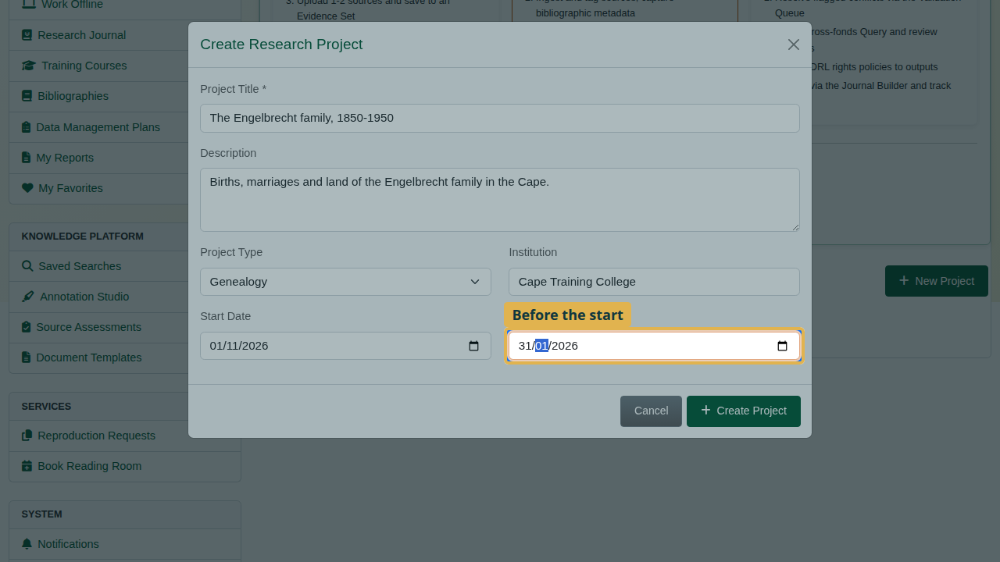

On **Create Project** the dialog stays open with the message "The expected end date is before the start date". Everything typed is kept. Correct the end date and create the project.

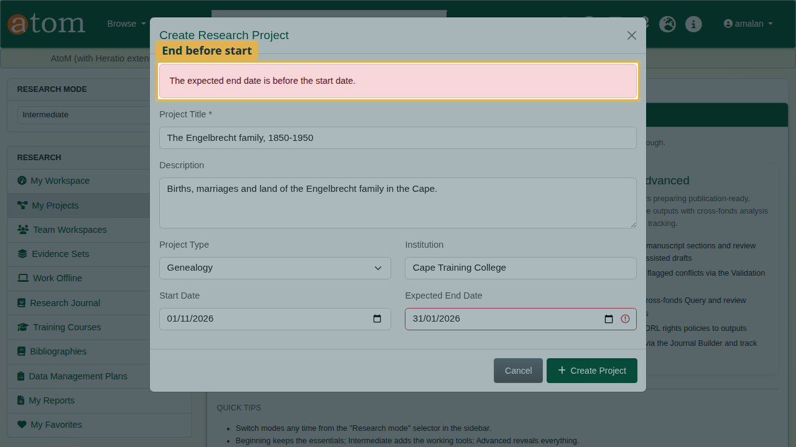

## 2. The project page

The project page brings the work together: description and timeline, milestones, linked resources, external sources and documents, collaborators, and analysis tools such as the knowledge graph and timeline builder.

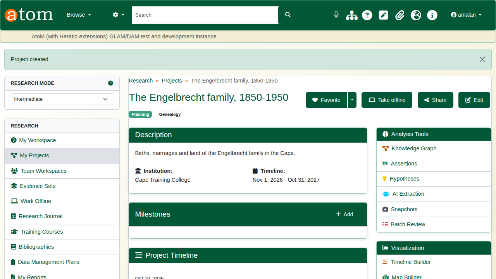

Under **Milestones**, click **Add**, give the step a title and a due date, and click **Save Milestone**. It also appears on the project timeline.

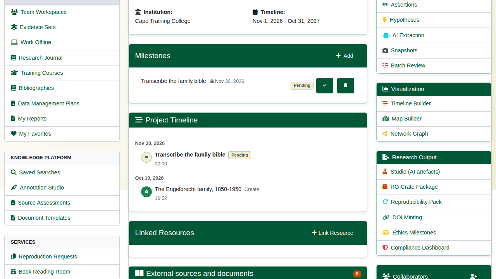

Under **Add Items to Project**, type part of a title. Choose the record, add an optional note, and click **Add to Project**.

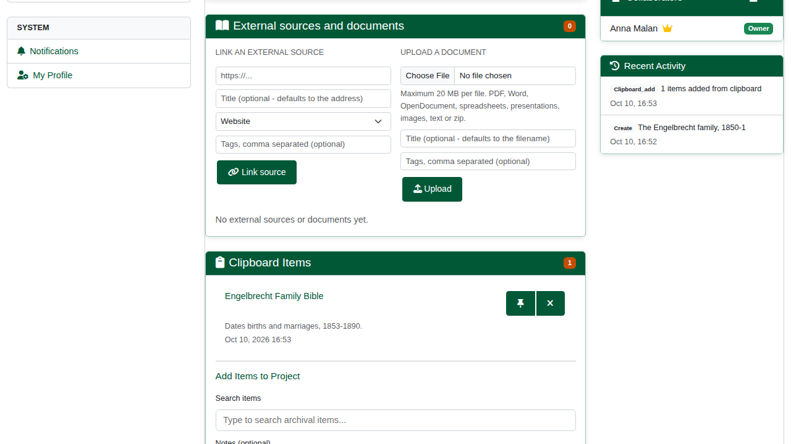

## 3. The research journal

Open **Research Journal**. It keeps a dated record of the work. Some entries are written automatically, such as reading room bookings.

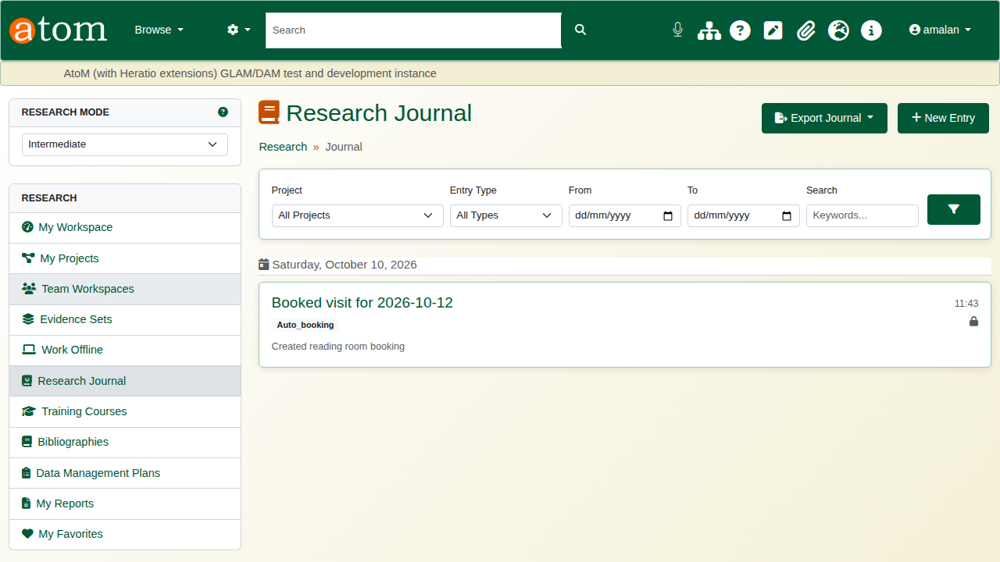

Click **New Entry**. Give it a title and write the entry, then choose the project and the entry type (note, observation, finding, question). You can also log the time spent and add tags. **Private** keeps the entry to yourself.

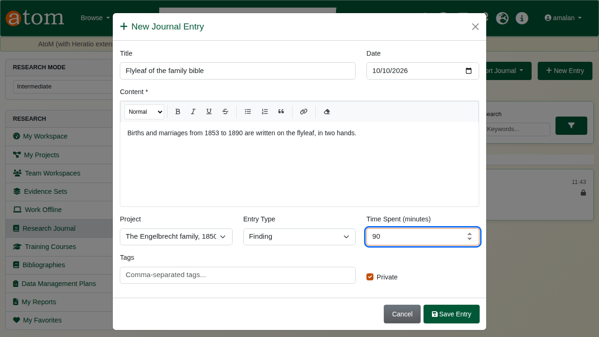

Click **Save Entry**. The entry is listed under its date with its project, type and time. **Export Journal** downloads the journal as PDF or Word (DOCX). The filters narrow it by project, type and dates.

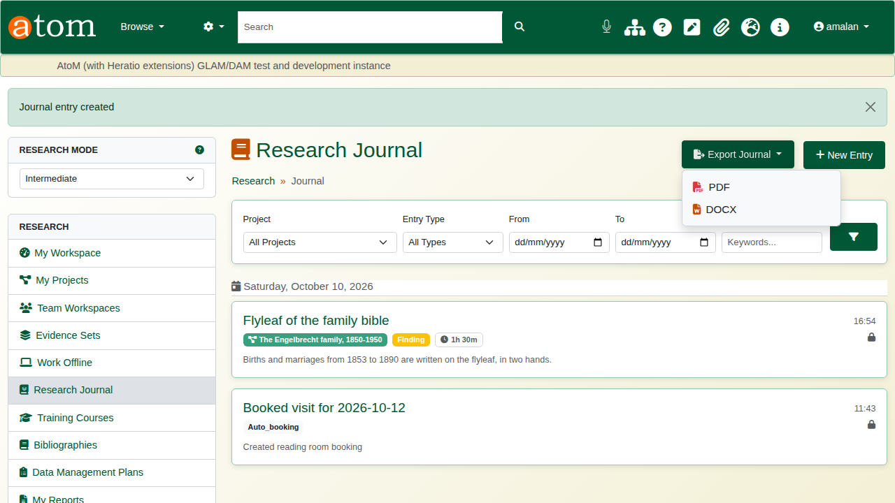

## 4. Reports

Open **My Reports** and click **New Report**. Choose a template, give the report a title, and link it to the project.

| Template | Sections |
|---|---|
| Research Summary | Introduction, methodology, findings, conclusions |
| Genealogical Report | Title page, contents, family overview, origins, timeline, notable members, records consulted, bibliography |
| Historical Analysis | Context, primary sources, chronological narrative |
| Source Analysis | Provenance, reliability, interpretation |
| Finding Aid | Scope, arrangement, access conditions, container list |
| Custom Report | Blank: add your own sections |

: Report templates

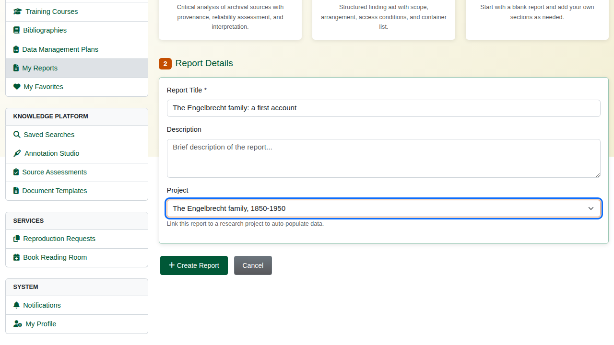

The template lays out the sections. Each can be moved up or down, edited or removed, and new sections are added at the foot of the page.

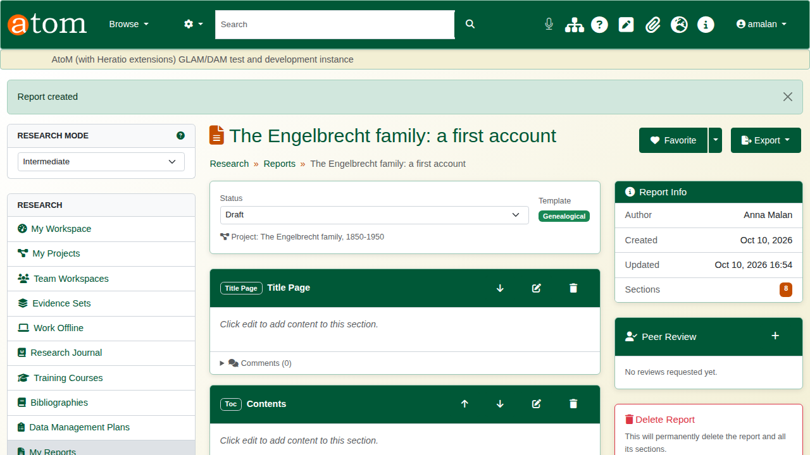

Click the edit button on a section, write in the editor, and click **Save**.

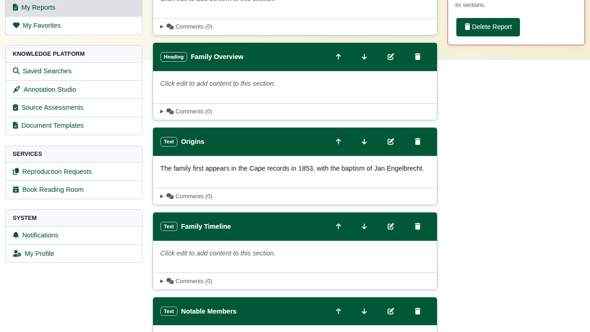

**Export** produces the report as PDF or Word (DOCX).

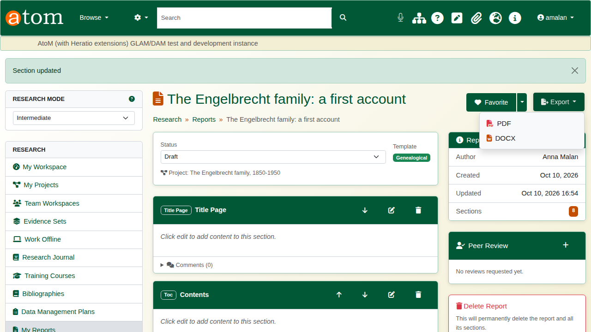

## Recap

1. Create a project; the portal checks the dates.
2. Plan milestones and attach the records you work from.
3. Keep a research journal as you go.
4. Draft a report from a template and write it section by section.
5. Export it as PDF or Word.

Part 5 covers reproduction requests.
