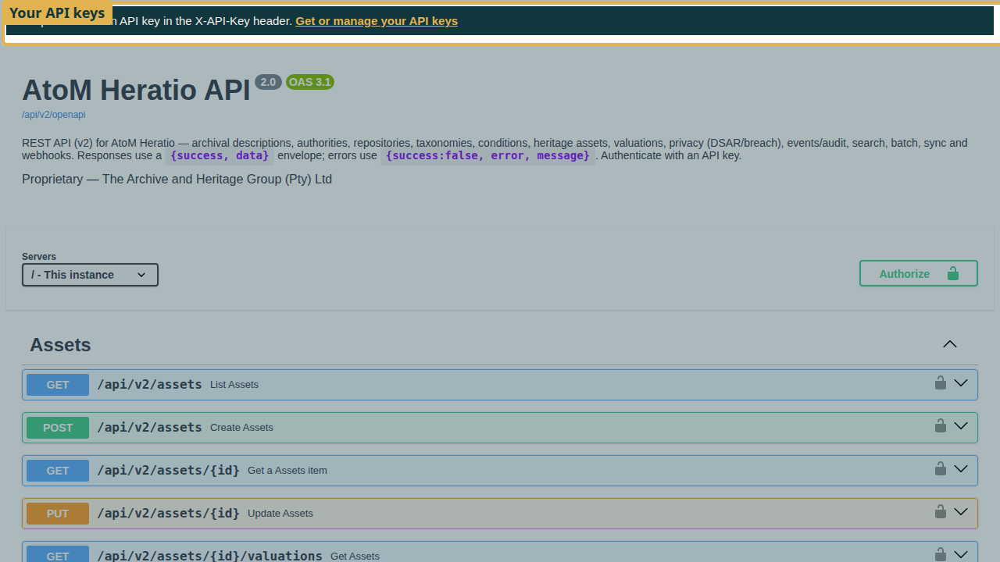
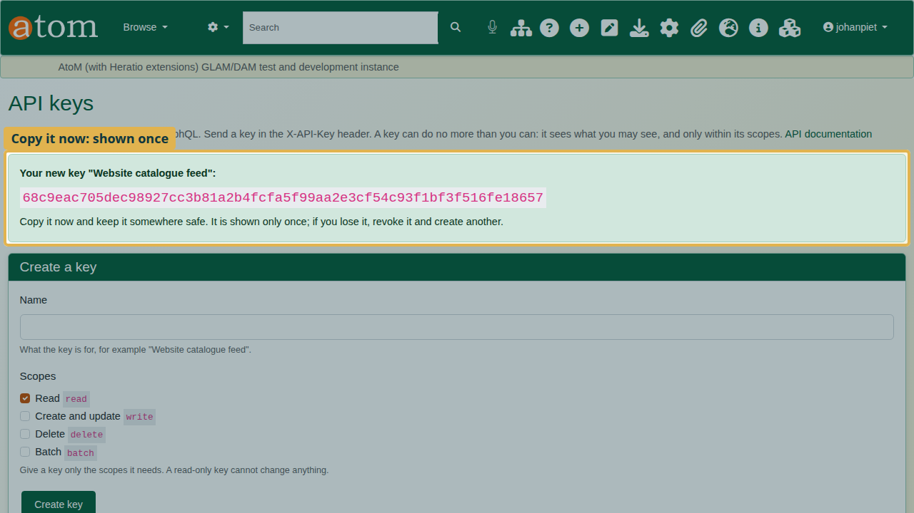
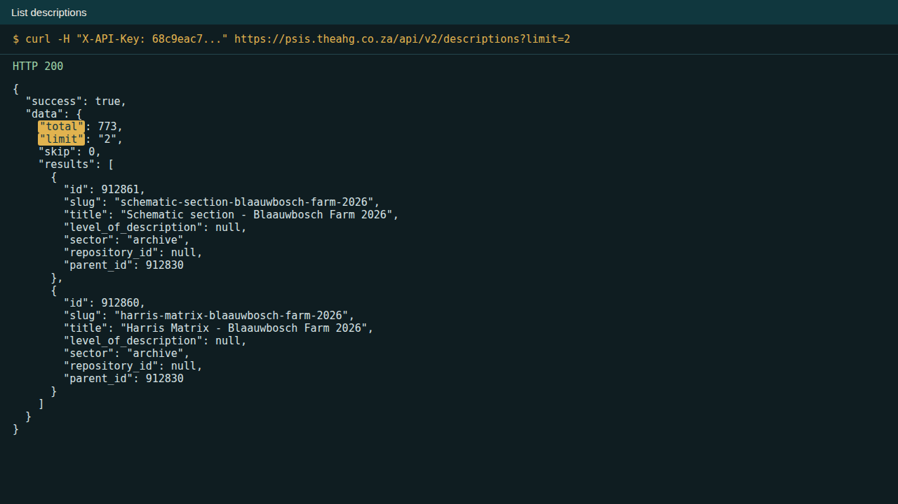
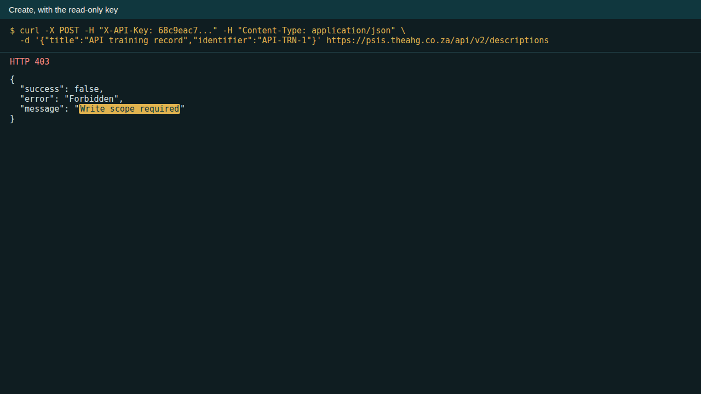
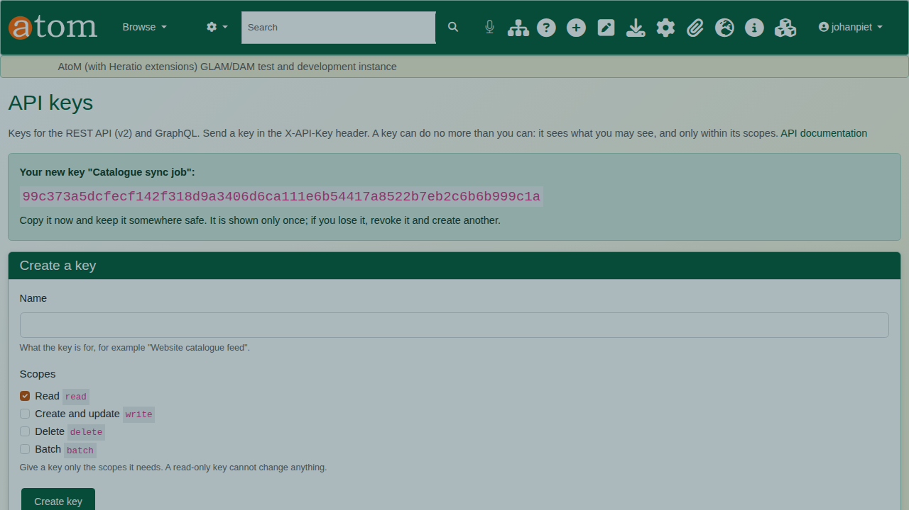
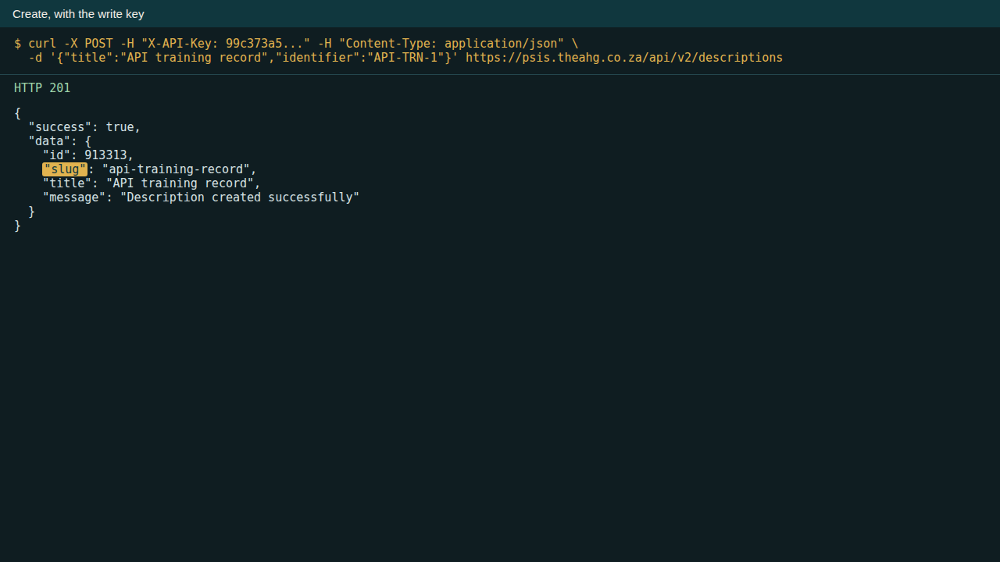
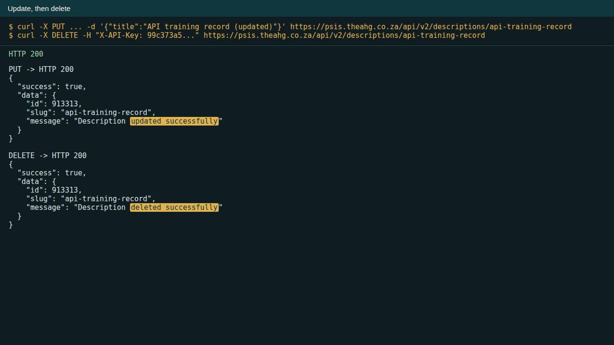
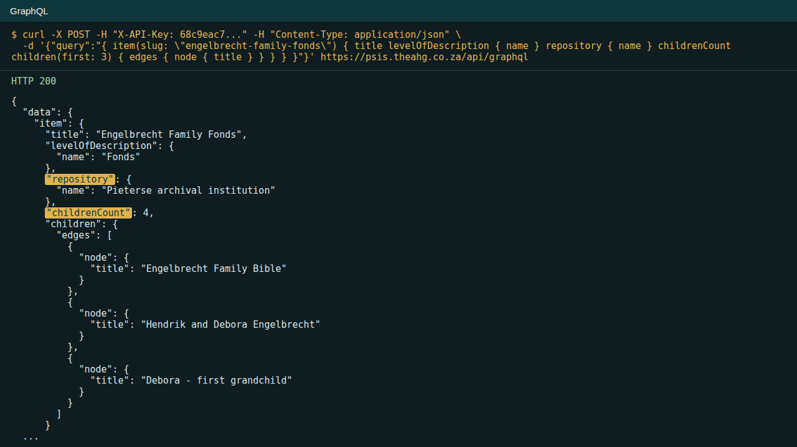
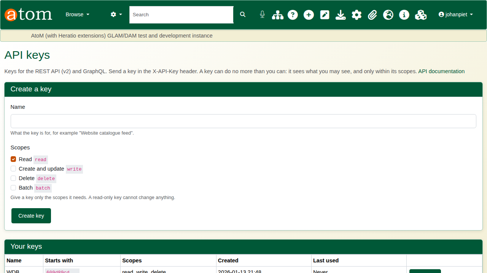

| Field | Value |
|---|---|
| Document title | Training: REST API and GraphQL |
| Author | Dr Johan Pieterse |
| Owner | The Archive and Heritage Group (Pty) Ltd |
| Version | 1.0 |
| Status | Released |
| Date | 10 October 2026 |
| Prepared for | Developers integrating with AtoM and the AHG extensions |
| Classification | Public |
| Reference | AHG-TRN-API-01 |

: Document control

This guide goes with the training video of the same name. It is for developers. You will issue an API key, read records, try a write with a read-only key and see it refused, issue a second key with the right scopes, create, update and delete a record, run a GraphQL query, and revoke both keys. Allow about 20 minutes.

## Before you start

| What | Notes |
|---|---|
| An AtoM account | A key belongs to you and can do no more than you can: it sees what you may see, and only within its scopes. |
| An HTTP client | curl, Postman, or your own code. The examples use curl. |
| The documentation | `/api/v2/docs` on your own site: every endpoint, with its parameters and responses. |

: What you need before you start

## 1. Get a key

Open `/api/v2/docs` on your site. The bar at the top links to **Get or manage your API keys** (`/api/keys`).



On the **API keys** page, under **Create a key**, give the key a **Name** that says what it is for and tick only the **Scopes** it needs:

| Scope | Allows |
|---|---|
| read | Listing and reading records (GET) |
| write | Creating and updating records (POST, PUT) |
| delete | Deleting records (DELETE) |
| batch | Batch operations |

: API key scopes

Click **Create key**. The key is shown **once**: copy it now and store it safely. The site keeps only a fingerprint of it; if you lose it, revoke it and create another.



## 2. Read records

Send the key in the `X-API-Key` header with every request.

```
curl -H "X-API-Key: YOUR_KEY" https://your-site/api/v2/descriptions?limit=2
```

The response is JSON, with `total`, `limit` and `skip` for paging.



Read one description by its slug, including dates, access points and `custom_fields`:

```
curl -H "X-API-Key: YOUR_KEY" https://your-site/api/v2/descriptions/SLUG
```

## 3. Write, and the right scope

The deliberate mistake: try to create a description with the read-only key.

```
curl -X POST -H "X-API-Key: READ_KEY" -H "Content-Type: application/json" \
  -d '{"title":"API training record","identifier":"API-TRN-1"}' https://your-site/api/v2/descriptions
```

The API answers **403**, `Write scope required`. A read-only key cannot change anything; that is the point of scopes.



Create a second key for the job that needs it, with **read**, **write** and **delete**. Use one key per job, so each can be revoked on its own.



With the write key, the same request answers **201 Created** with the new record's `id` and `slug`. New records are drafts unless `"publication_status": "published"` is sent; `parent_slug` places the record under an existing description.



**PUT** to `/api/v2/descriptions/SLUG` changes fields; **DELETE** to the same address removes the record and needs the **delete** scope.



## 4. GraphQL

GraphQL, at `/api/graphql`, asks for exactly the fields you need, nested, in one request, with the same key:

```
curl -X POST -H "X-API-Key: YOUR_KEY" -H "Content-Type: application/json" \
  -d '{"query":"{ item(slug: \"SLUG\") { title levelOfDescription { name } repository { name } childrenCount children(first: 3) { edges { node { title } } } } }"}' \
  https://your-site/api/graphql
```



## 5. Revoke

When a key is no longer needed, or may have leaked, click **Revoke** beside it on the API keys page. It stops working at once.



## Recap

1. Create a key on the API keys page, with only the scopes it needs; copy it once.
2. Send it in the X-API-Key header with every request.
3. Read with read, change with write, delete with delete.
4. Use GraphQL for exactly the fields you want.
5. Revoke keys you no longer use.
