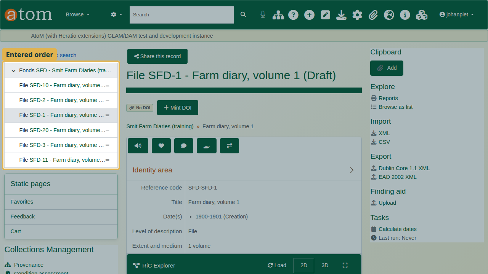
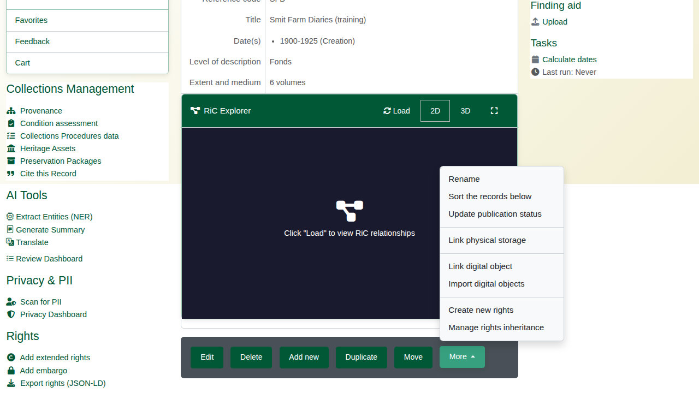
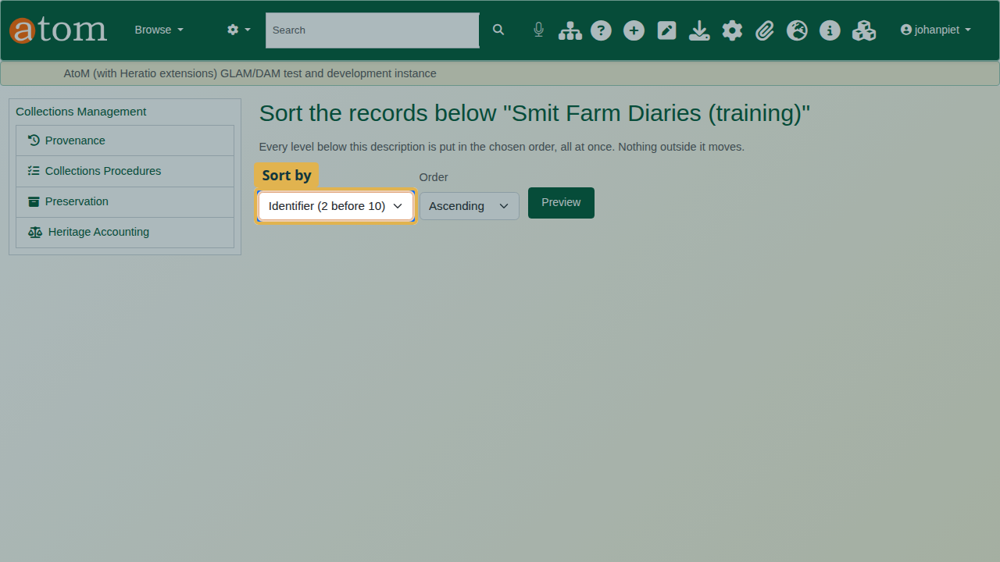
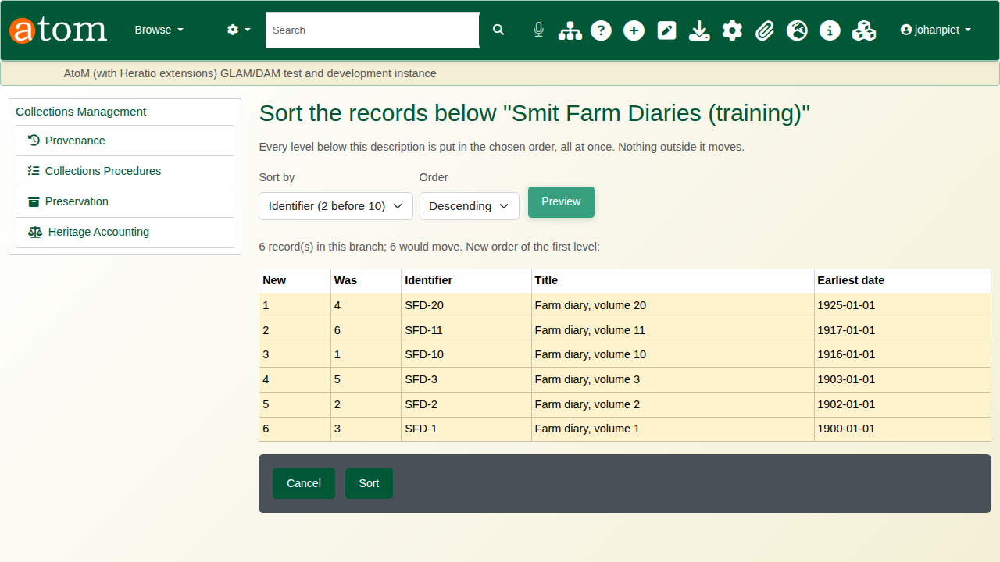
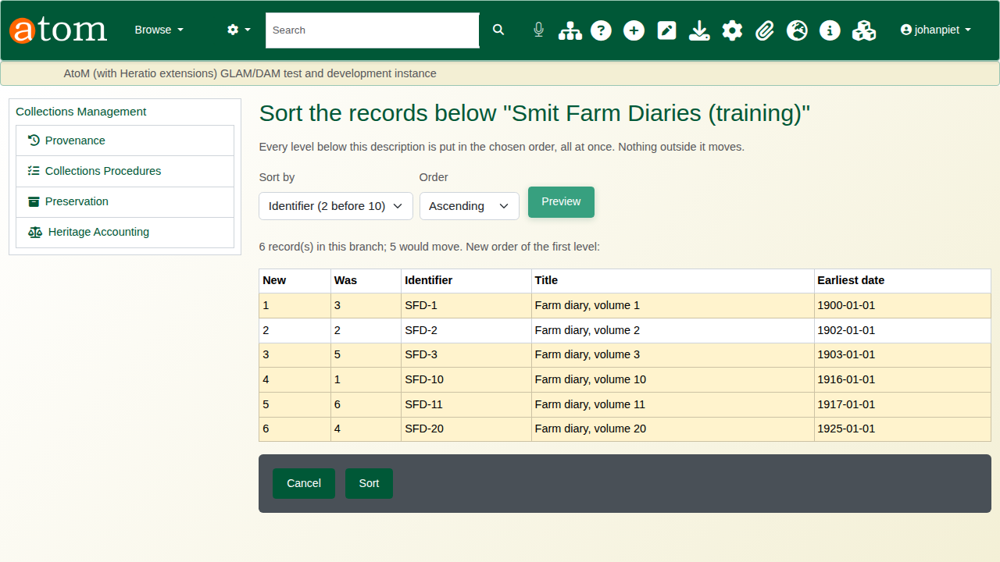
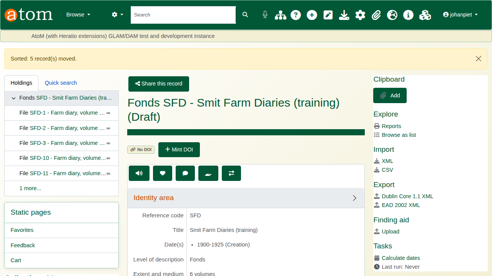
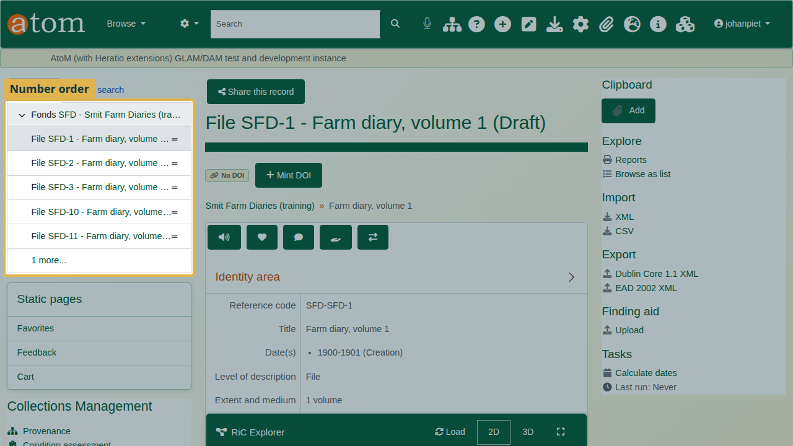

| Field | Value |
|---|---|
| Document title | Training: Sort the Records Below |
| Author | Dr Johan Pieterse |
| Owner | The Archive and Heritage Group (Pty) Ltd |
| Version | 1.0 |
| Status | Released |
| Date | 9 October 2026 |
| Prepared for | AtoM users of the AHG extensions |
| Classification | Public |
| Reference | AHG-TRN-DESC-02 |

: Document control

This guide goes with the training video of the same name. AtoM keeps the records below a description in the order they were entered, until someone moves each one by hand. **Sort the records below** puts every level below a description into order in one step: by identifier, title or earliest date. A preview shows the new order before anything moves.

You will sort six farm diaries that were entered out of order, catch one deliberate mistake in the preview, and check the result. Allow about 10 minutes.

## Before you start

| What | Notes |
|---|---|
| An editor or administrator account | The More menu entry appears only for editors and administrators, and only on a description that has records below it. |
| The practice file | `smit-farm-diaries-practice.csv` in `docs/training-files/` of the AHG extensions catalogue: a fonds with six diary volumes entered as 10, 2, 1, 20, 3, 11. Import it with Data Ingest, choosing "Use hierarchy from CSV" (see the hierarchical CSV training). |

: What you need before you start

## 1. See the problem

Open one of the diaries. The tree on the left shows the volumes in the order they were entered: 10, 2, 1, 20, 3, 11.

## 2. Sort the records below

1. Open the fonds (click it in the tree).
2. In the **More** menu at the foot of the page, choose **Sort the records below**.

3. Under **Sort by**, choose the key:

| Key | Order |
|---|---|
| Identifier (2 before 10) | Identifiers compared as people read numbers: 2 comes before 10 |
| Title | Titles, also with numbers in natural order |
| Earliest date | The earliest date of each record; records without a date go last |

: Sort keys

Every level below the description is sorted, and nothing outside it moves. Branches move with their parent: a sorted series keeps its files.

## 3. Read the preview

The deliberate mistake: choose **Descending** under **Order** and click **Preview**. The preview lists the new order (New) and each record's current place (Was). Volume 20 comes first. Nothing has changed yet.

The choices stay above the preview. Change **Order** to **Ascending** and click **Preview** again. Now the volumes run 1, 2, 3, 10, 11, 20.

If the records are already in the chosen order, the page says so and there is nothing to sort.

## 4. Sort

Click **Sort**. Only the records whose place changes are moved, in one step, and the search index is updated. **Cancel** returns to the description without changing anything.

## 5. Check the result

Open a diary again. The tree shows the volumes in number order.

## Recap

1. Open the description whose records you want in order.
2. More > Sort the records below.
3. Choose the key and the order.
4. Read the preview.
5. Sort, then check the tree.

## Cleaning up

To remove the practice records, open the fonds and choose **Delete**. AtoM deletes the diaries under it as well.
