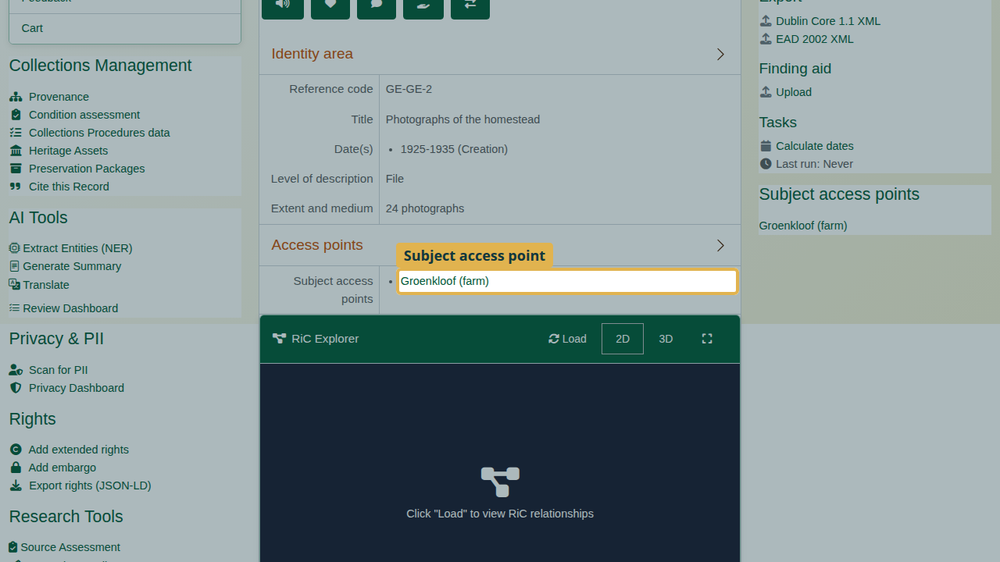
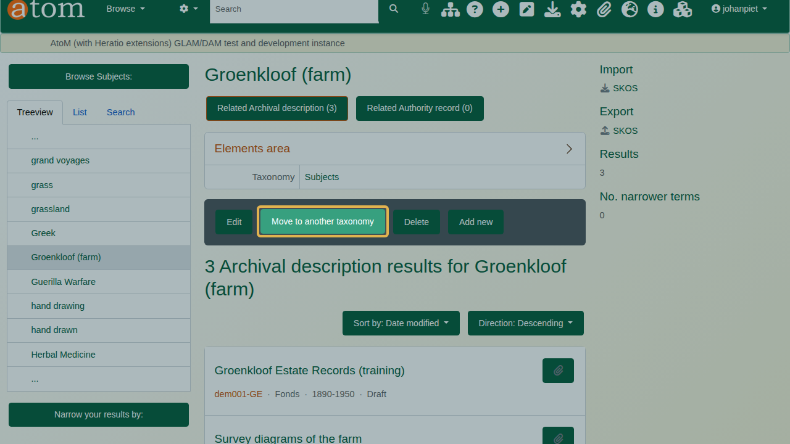
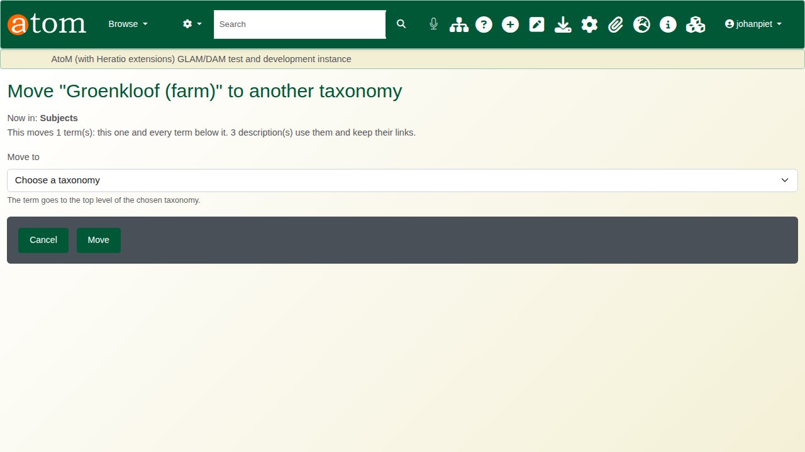
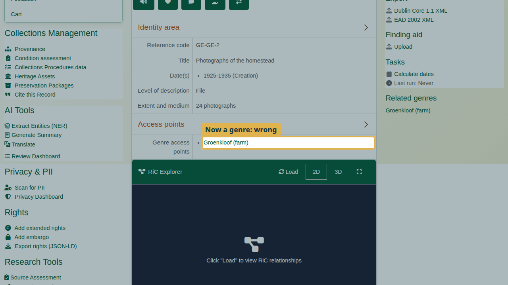

| Field | Value |
|---|---|
| Document title | Training: Move a Term to Another Taxonomy |
| Author | Dr Johan Pieterse |
| Owner | The Archive and Heritage Group (Pty) Ltd |
| Version | 1.0 |
| Status | Released |
| Date | 9 October 2026 |
| Prepared for | AtoM users of the AHG extensions |
| Classification | Public |
| Reference | AHG-TRN-TERM-01 |

: Document control

This guide goes with the training video of the same name. A term catalogued in the wrong taxonomy, such as a farm entered as a subject, used to mean creating the right term and re-linking every description by hand. **Move to another taxonomy** moves the term itself, with any terms below it. Every description keeps its link.

You will move a farm from Subjects to Places, by way of one deliberate wrong choice. Allow about 10 minutes.

## Before you start

| What | Notes |
|---|---|
| An administrator account | Moving a term is for administrators: only they see the Move to another taxonomy button. |
| The practice file | `groenkloof-estate-practice.csv` in `docs/training-files/` of the AHG extensions catalogue: three descriptions that list "Groenkloof (farm)" as a subject. Import it with Data Ingest, choosing "Use hierarchy from CSV" (see the hierarchical CSV training). |

: What you need before you start

## 1. Find the term

Open one of the descriptions, for example "Photographs of the homestead". Groenkloof is a farm, a place, but it is listed under **Subject access points**. Click the term to open its page.

## 2. Move the term

On the term's page, click **Move to another taxonomy**.

The page says what will move: this term, every term below it, and how many descriptions use them. Those descriptions keep their links. The term goes to the top level of the chosen taxonomy.

The deliberate mistake: choose **Genres** under **Move to** and click **Move**.

## 3. Check, and fix a wrong choice

Open the description again. Groenkloof is now listed under **Genre access points**. The move worked; the choice was wrong.

Moves can always be repeated. Open the term again, click **Move to another taxonomy**, choose **Places** and click **Move**.

Back on the description, Groenkloof is listed under **Place access points**. Nothing had to be re-linked, and search follows the move.

Some terms cannot be moved because AtoM relies on them or on their taxonomy (for example levels of description). Their page says so instead of offering the move.

## Recap

1. Open the term from any description that uses it.
2. Click Move to another taxonomy and read what will move.
3. Choose the taxonomy and click Move.
4. Check a description.
5. Wrong choice? Move it again.

## Cleaning up

To remove the practice records, open the fonds and choose **Delete**. Then open the term and delete it.
