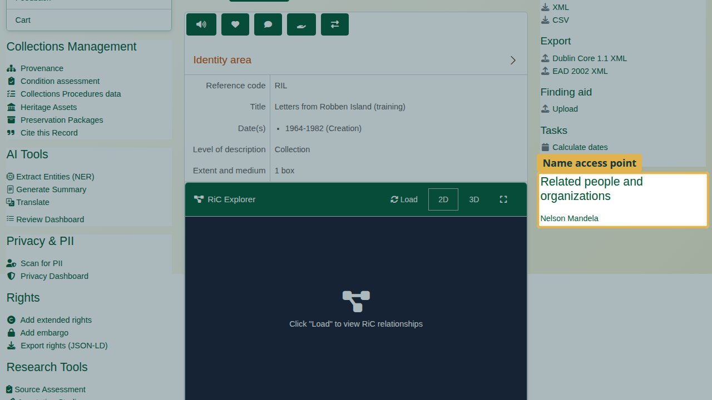
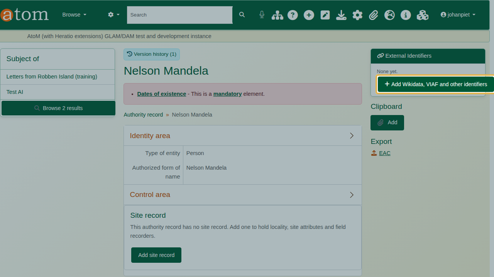
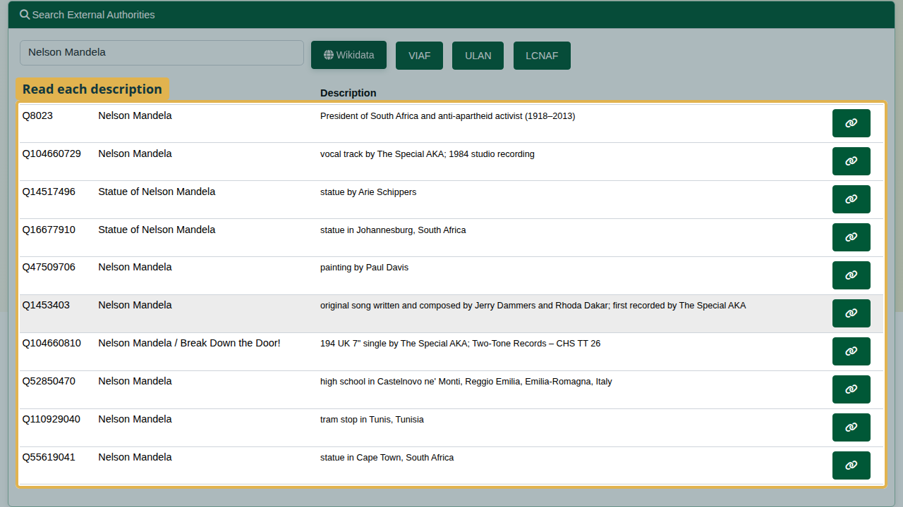
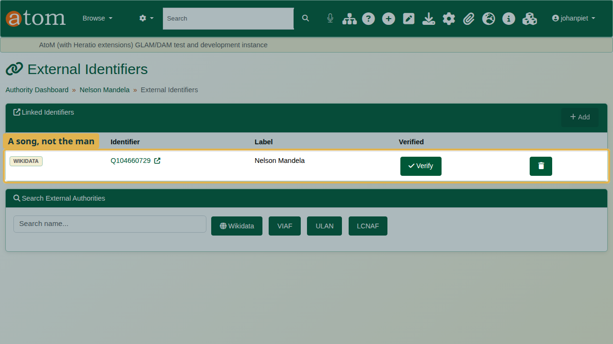
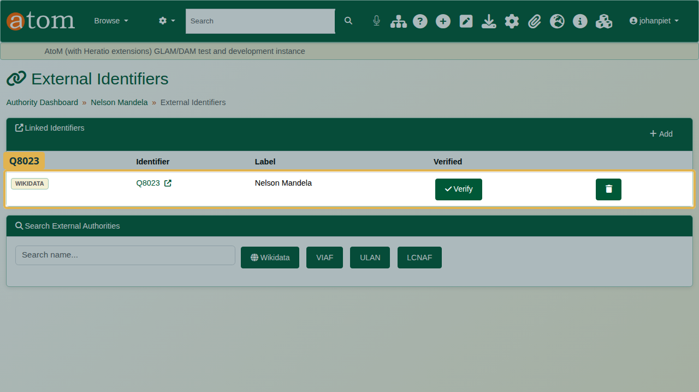
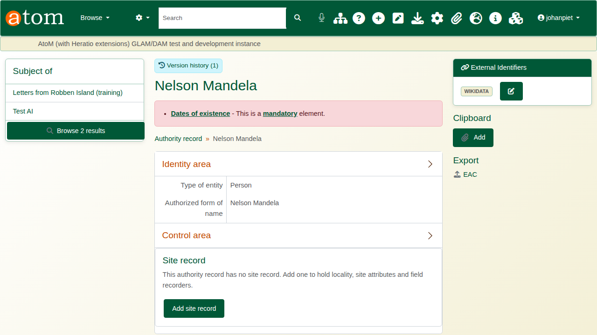
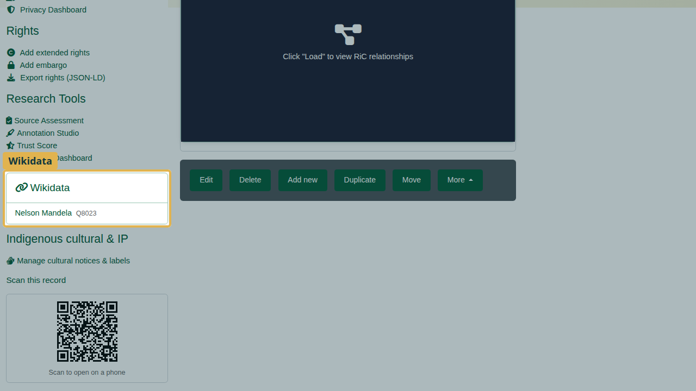

| Field | Value |
|---|---|
| Document title | Training: Wikidata Links |
| Author | Dr Johan Pieterse |
| Owner | The Archive and Heritage Group (Pty) Ltd |
| Version | 1.0 |
| Status | Released |
| Date | 9 October 2026 |
| Prepared for | AtoM users of the AHG extensions |
| Classification | Public |
| Reference | AHG-TRN-AUTH-01 |

: Document control

This guide goes with the training video of the same name. Wikidata is the open, linked database of people, places and organisations. Linking an authority record to its Wikidata item shows visitors the outside world's description of the same person, on the authority record and on every description that names them. VIAF, the Getty Union List of Artist Names (ULAN) and the Library of Congress Name Authority File (LCNAF) are linked the same way.

You will link Nelson Mandela's authority record to Wikidata, by way of one deliberate wrong link that you delete. Allow about 10 minutes.

## Before you start

| What | Notes |
|---|---|
| An editor or administrator account | Editors and administrators manage external identifiers. |
| The practice file | `robben-island-letters-practice.csv` in `docs/training-files/` of the AHG extensions catalogue: a collection with Nelson Mandela as a name access point. Import it with Data Ingest, choosing "Use hierarchy from CSV" (see the hierarchical CSV training). |
| Internet access from the server | The search asks Wikidata directly. |

: What you need before you start

## 1. Open the authority record

Open the collection "Letters from Robben Island (training)". Nelson Mandela is listed as a name access point. Click his name to open his authority record.

On the authority record, click **Add Wikidata, VIAF and other identifiers** (staff only). The External Identifiers page opens.

## 2. Search Wikidata

Under **Search External Authorities**, type the name and click **Wikidata**. Each match is listed with its ID, label and a short description. Several items share this name: the man, songs, statues and a painting. Read the descriptions.

The deliberate mistake: click the link button on the **second** result. The record is now linked to Q104660729, whose description reads "vocal track by The Special AKA; 1984 studio recording": a song, not the man.

Always read the description before you link.

## 3. Fix the link

1. Under **Linked Identifiers**, click the delete button on the wrong row and confirm.
2. Search again and link the first result: **Q8023**, "President of South Africa and anti-apartheid activist (1918-2013)".

**Verify** marks a link as checked by a person, for your own quality control.

## 4. Where the link appears

The authority record shows the Wikidata link to every visitor.

Every description that names him, as creator or as name access point, carries a Wikidata panel.

## Recap

1. Open the authority record and choose Add Wikidata, VIAF and other identifiers.
2. Search Wikidata by name; read each description.
3. Link the right item.
4. If a link is wrong, delete it and link again.

## Cleaning up

Open the collection and choose **Delete**. To remove the link, open the authority record's external identifiers and delete it.
